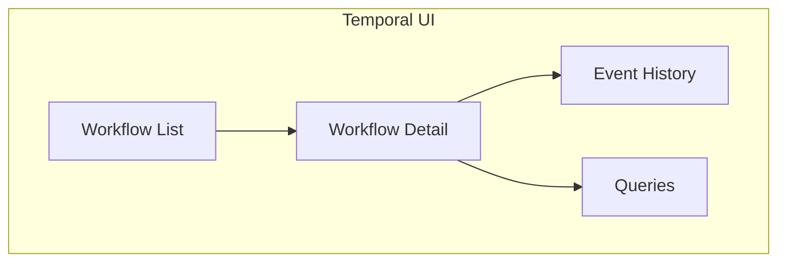

# Temporal

Temporal is the workflow orchestration engine for the WMS Platform.

## Configuration

### Server Address

```
temporal-frontend.temporal.svc.cluster.local:7233
```

### Namespace

```
wms
```

### Task Queue

```
orchestrator-queue
```

## Deployment

### Helm Chart

```bash
helm repo add temporal https://go.temporal.io/helm-charts
helm install temporal temporal/temporal \
  --set server.replicaCount=1 \
  --set web.enabled=true \
  -n temporal --create-namespace
```

### Create Namespace

```bash
kubectl exec -it temporal-admin-tools-0 -n temporal -- \
  tctl --ns wms namespace register
```

## Workflows

### OrderFulfillmentWorkflow

Main workflow for order processing:

```go
func OrderFulfillmentWorkflow(ctx workflow.Context, params OrderParams) error {
    // Workflow options
    ao := workflow.ActivityOptions{
        StartToCloseTimeout: 5 * time.Minute,
        RetryPolicy: &temporal.RetryPolicy{
            MaximumAttempts: 3,
        },
    }
    ctx = workflow.WithActivityOptions(ctx, ao)

    // Execute activities
    if err := workflow.ExecuteActivity(ctx, ValidateOrderActivity, params.OrderID).Get(ctx, nil); err != nil {
        return err
    }

    // Wait for wave signal
    var waveID string
    selector := workflow.NewSelector(ctx)
    selector.AddReceive(workflow.GetSignalChannel(ctx, "waveAssigned"), func(c workflow.ReceiveChannel, more bool) {
        c.Receive(ctx, &waveID)
    })

    // Continue with picking, packing, shipping...
    return nil
}
```

### Activity Configuration

| Activity | Timeout | Retries |
|----------|---------|---------|
| ValidateOrder | 5 min | 3 |
| ReserveInventory | 5 min | 3 |
| CreatePickTask | 5 min | 3 |
| CreatePackTask | 5 min | 3 |
| CreateShipment | 10 min | 3 |

## Signals

| Signal | Description | Sender |
|--------|-------------|--------|
| waveAssigned | Order assigned to wave | Waving Service |
| pickCompleted | Pick task completed | Picking Service |

## Temporal UI

Access the Temporal Web UI:

```bash
kubectl port-forward svc/temporal-web 8080:8080 -n temporal
```

URL: `http://localhost:8080`



## Visibility

Query workflows:

```bash
# List running workflows
tctl workflow list --query "ExecutionStatus='Running'"

# Get workflow history
tctl workflow show -w <workflow-id>
```

## Monitoring

Key metrics:
- `temporal_workflow_completed`
- `temporal_workflow_failed`
- `temporal_activity_execution_latency`
- `temporal_schedule_to_start_latency`

## Related Documentation

- [Orchestrator](/services/orchestrator) - Worker configuration
- [Order Fulfillment](/architecture/sequence-diagrams/order-fulfillment) - Workflow details

### Comprehensive Temporal Documentation

For detailed workflow and activity documentation, see:

**Workflow Documentation:**
- [Temporal Overview](/temporal/overview) - Architecture and patterns
- [Order Fulfillment Workflow](/temporal/workflows/order-fulfillment) - Main saga workflow
- [Planning Workflow](/temporal/workflows/planning) - Process path and wave assignment
- [WES Execution Workflow](/temporal/workflows/wes-execution) - Warehouse execution
- [All Orchestrator Workflows](/temporal/workflows/order-fulfillment) - 13 orchestrator workflows
- [Service Workflows](/temporal/workflows/service-picking) - 5 service-level workflows

**Activity Documentation:**
- [Activities Overview](/temporal/activities/overview) - Activity patterns
- [Order Activities](/temporal/activities/order-activities) - Order lifecycle
- [Inventory Activities](/temporal/activities/inventory-activities) - Inventory operations

**Reference Documentation:**
- [Signals & Queries](/temporal/signals-queries) - All signal payloads and query handlers
- [Task Queues](/temporal/task-queues) - Queue topology and routing
- [Retry Policies](/temporal/retry-policies) - Retry configuration and timeouts

**Visual Diagrams:**
- [Workflow Hierarchy](/temporal/diagrams/workflow-hierarchy) - Parent-child relationships
- [Order Flow](/temporal/diagrams/order-flow) - Complete order processing
- [Signal Flow](/temporal/diagrams/signal-flow) - Signal timing diagrams
