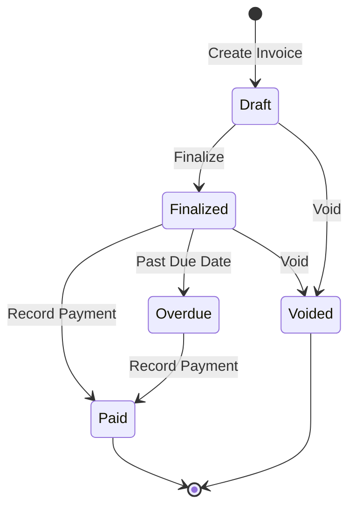
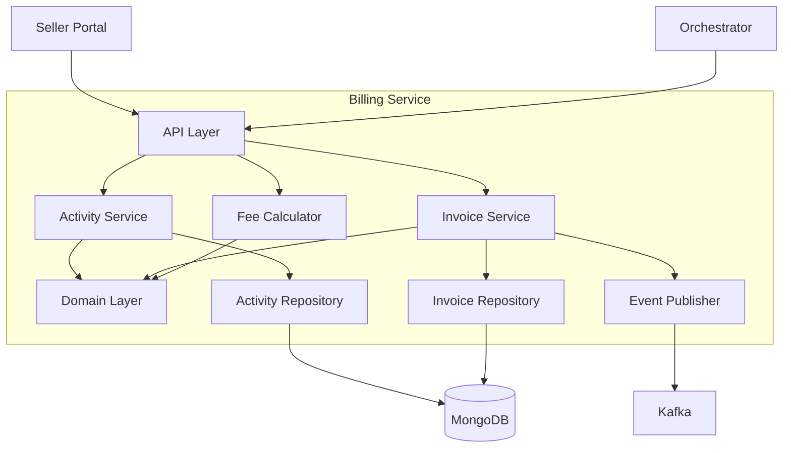

# Billing Service

The Billing Service manages invoicing, billable activities tracking, and fee calculations for the WMS Platform. It aggregates all billable events and generates invoices for sellers.

## Overview

| Property | Value |
|----------|-------|
| **Port** | 8011 |
| **Database** | billing_db |
| **Aggregate Roots** | BillableActivity, Invoice, StorageCalculation |
| **Bounded Context** | Billing |

## Responsibilities

- Billable activity tracking (pick, pack, storage, shipping, etc.)
- Batch activity recording for high-volume operations
- Invoice generation from billable activities
- Invoice lifecycle management (draft, finalize, pay, void)
- Tax and discount application
- Storage fee calculation (daily)
- Fee calculation based on seller fee schedules
- Overdue invoice detection
- Multi-tenant support

## Activity Types

| Activity Type | Description | Trigger |
|---------------|-------------|---------|
| `storage` | Daily storage fees | Inventory service |
| `pick` | Item picking fees | Picking service |
| `pack` | Packing fees | Packing service |
| `receiving` | Inbound receiving fees | Receiving service |
| `shipping` | Shipping handling fees | Shipping service |
| `return_processing` | Return handling fees | Returns service |
| `gift_wrap` | Gift wrapping fees | Packing service |
| `hazmat` | Hazardous material handling | Special handling |
| `oversized` | Oversized item handling | Special handling |
| `cold_chain` | Temperature-controlled storage | Special handling |
| `fragile` | Fragile item handling | Special handling |

## API Endpoints

### Activity Management

#### Record Activity

```http
POST /api/v1/activities
Content-Type: application/json

{
  "tenantId": "TENANT-001",
  "sellerId": "SLR-12345",
  "facilityId": "FAC-001",
  "type": "pick",
  "description": "Item pick for order ORD-67890",
  "quantity": 5,
  "unitPrice": 0.50,
  "referenceType": "order",
  "referenceId": "ORD-67890",
  "activityDate": "2024-01-15T10:30:00Z"
}
```

#### Batch Record Activities

```http
POST /api/v1/activities/batch
Content-Type: application/json

{
  "activities": [
    {
      "tenantId": "TENANT-001",
      "sellerId": "SLR-12345",
      "type": "pick",
      "quantity": 5,
      "unitPrice": 0.50,
      "referenceType": "order",
      "referenceId": "ORD-67890"
    },
    {
      "tenantId": "TENANT-001",
      "sellerId": "SLR-12345",
      "type": "pack",
      "quantity": 1,
      "unitPrice": 0.75,
      "referenceType": "order",
      "referenceId": "ORD-67890"
    }
  ]
}
```

#### Get Activity

```http
GET /api/v1/activities/{activityId}
```

### Seller-Scoped Queries

#### List Seller Activities

```http
GET /api/v1/sellers/{sellerId}/activities?page=1&pageSize=20&startDate=2024-01-01&endDate=2024-01-31
```

#### Get Activity Summary

```http
GET /api/v1/sellers/{sellerId}/activities/summary?startDate=2024-01-01&endDate=2024-01-31
```

**Response:**

```json
{
  "sellerId": "SLR-12345",
  "period": {
    "start": "2024-01-01T00:00:00Z",
    "end": "2024-01-31T23:59:59Z"
  },
  "byType": {
    "pick": { "count": 1500, "total": 750.00 },
    "pack": { "count": 300, "total": 225.00 },
    "storage": { "count": 31, "total": 500.00 },
    "shipping": { "count": 300, "total": 150.00 }
  },
  "totalActivities": 2131,
  "totalAmount": 1625.00
}
```

### Invoice Management

#### Create Invoice

```http
POST /api/v1/invoices
Content-Type: application/json

{
  "tenantId": "TENANT-001",
  "sellerId": "SLR-12345",
  "periodStart": "2024-01-01T00:00:00Z",
  "periodEnd": "2024-01-31T23:59:59Z",
  "dueDate": "2024-02-15T00:00:00Z"
}
```

#### Get Invoice

```http
GET /api/v1/invoices/{invoiceId}
```

#### Finalize Invoice

```http
PUT /api/v1/invoices/{invoiceId}/finalize
```

#### Mark Invoice Paid

```http
PUT /api/v1/invoices/{invoiceId}/pay
Content-Type: application/json

{
  "paymentMethod": "bank_transfer",
  "paymentRef": "TXN-123456"
}
```

#### Void Invoice

```http
PUT /api/v1/invoices/{invoiceId}/void
Content-Type: application/json

{
  "reason": "Duplicate invoice"
}
```

### Fee Calculation

#### Calculate Fees

```http
POST /api/v1/fees/calculate
Content-Type: application/json

{
  "sellerId": "SLR-12345",
  "activities": [
    { "type": "pick", "quantity": 100 },
    { "type": "pack", "quantity": 50 },
    { "type": "shipping", "quantity": 50 }
  ]
}
```

#### Calculate Storage Fees

```http
POST /api/v1/storage/calculate
Content-Type: application/json

{
  "sellerId": "SLR-12345",
  "facilityId": "FAC-001",
  "date": "2024-01-15",
  "units": 5000
}
```

## Domain Events Published

| Event | Type | Topic | Description |
|-------|------|-------|-------------|
| InvoiceCreatedEvent | `wms.billing.invoice-created` | wms.billing.events | New invoice created |
| InvoiceFinalizedEvent | `wms.billing.invoice-finalized` | wms.billing.events | Invoice finalized for payment |
| InvoicePaidEvent | `wms.billing.invoice-paid` | wms.billing.events | Invoice marked as paid |
| InvoiceOverdueEvent | `wms.billing.invoice-overdue` | wms.billing.events | Invoice is overdue |
| ActivityRecordedEvent | `wms.billing.activity-recorded` | wms.billing.events | Billable activity recorded |
| StorageCalculatedEvent | `wms.billing.storage-calculated` | wms.billing.events | Daily storage fees calculated |

### Event Payloads

#### InvoiceCreatedEvent

```json
{
  "type": "wms.billing.invoice-created",
  "invoiceId": "INV-12345678",
  "sellerId": "SLR-12345",
  "periodStart": "2024-01-01T00:00:00Z",
  "periodEnd": "2024-01-31T23:59:59Z",
  "subtotal": 1625.00,
  "total": 1788.75,
  "dueDate": "2024-02-15T00:00:00Z",
  "timestamp": "2024-02-01T10:00:00Z"
}
```

#### InvoiceOverdueEvent

```json
{
  "type": "wms.billing.invoice-overdue",
  "invoiceId": "INV-12345678",
  "sellerId": "SLR-12345",
  "dueDate": "2024-02-15T00:00:00Z",
  "daysOverdue": 5,
  "amountDue": 1788.75,
  "timestamp": "2024-02-20T00:00:00Z"
}
```

## Invoice Status Flow



## Configuration

| Variable | Description | Default |
|----------|-------------|---------|
| SERVICE_NAME | Service identifier | billing-service |
| SERVER_ADDR | Server address | :8011 |
| MONGODB_URI | MongoDB connection string | Required |
| MONGODB_DATABASE | Database name | billing_db |
| KAFKA_BROKERS | Kafka broker addresses | Required |
| OTEL_EXPORTER_OTLP_ENDPOINT | OpenTelemetry endpoint | localhost:4317 |
| TRACING_ENABLED | Enable distributed tracing | true |
| LOG_LEVEL | Logging level | info |

## Health Endpoints

- `GET /health` - Liveness probe
- `GET /ready` - Readiness probe (checks DB, Kafka)
- `GET /metrics` - Prometheus metrics

## Architecture



## Related Documentation

- [Seller Service](/services/seller-service) - Provides fee schedules for sellers
- [Seller Portal](/services/seller-portal) - Seller billing dashboard
- [Order Service](/services/order-service) - Triggers pick/pack activities
