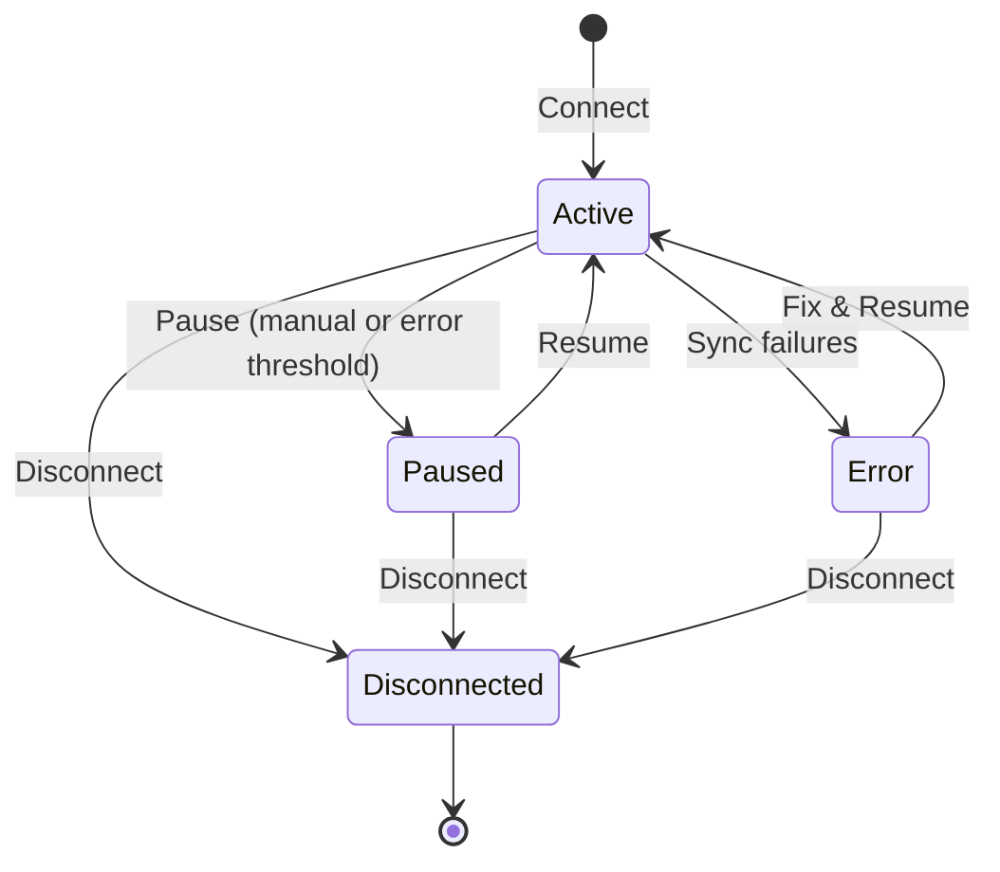
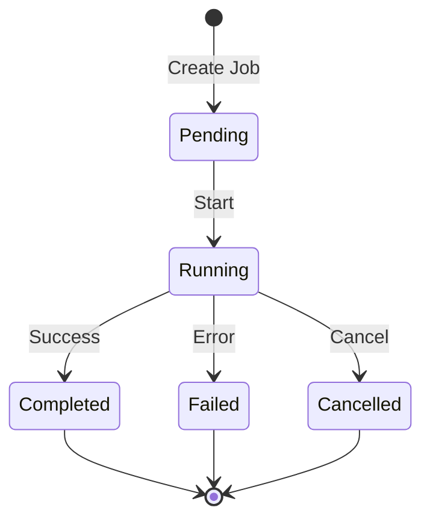
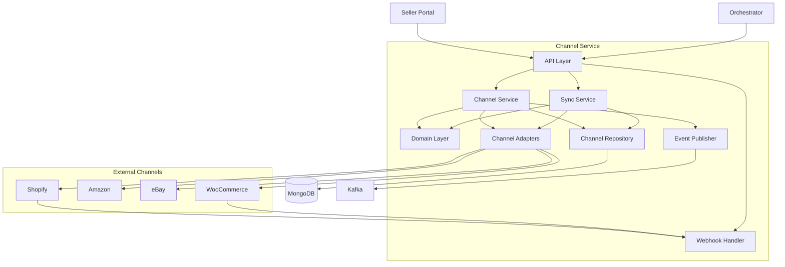

# Channel Service

The Channel Service manages external sales channel integrations, enabling order import, inventory synchronization, and tracking updates with platforms like Shopify, Amazon, eBay, and WooCommerce.

## Overview

| Property | Value |
|----------|-------|
| **Port** | 8012 |
| **Database** | channel_service |
| **Aggregate Roots** | Channel, ChannelOrder, SyncJob |
| **Bounded Context** | Channel Integration |

## Responsibilities

- Multi-channel support (Shopify, Amazon, eBay, WooCommerce, Custom)
- Order import from external channels
- Inventory synchronization to channels
- Tracking information push to channels
- Fulfillment creation on external platforms
- Webhook handling for real-time updates
- Sync job management with progress tracking
- Error tracking and automatic channel pause on repeated failures
- Encrypted credential storage

## Supported Channels

| Channel | Adapter | Features |
|---------|---------|----------|
| **Shopify** | ShopifyAdapter | Orders, Inventory, Tracking, Webhooks |
| **Amazon** | AmazonAdapter | Orders, Inventory, Tracking |
| **eBay** | EbayAdapter | Orders, Inventory, Tracking |
| **WooCommerce** | WooCommerceAdapter | Orders, Inventory, Tracking, Webhooks |
| **Custom** | N/A | Manual integration via API |

## API Endpoints

### Channel Management

#### Connect Channel

```http
POST /api/v1/channels
Content-Type: application/json

{
  "tenantId": "TENANT-001",
  "sellerId": "SLR-12345",
  "type": "shopify",
  "name": "My Shopify Store",
  "storeUrl": "https://mystore.myshopify.com",
  "credentials": {
    "apiKey": "...",
    "apiSecret": "...",
    "accessToken": "..."
  },
  "syncSettings": {
    "autoImportOrders": true,
    "autoSyncInventory": true,
    "inventorySyncInterval": 15
  }
}
```

#### Get Channel

```http
GET /api/v1/channels/{channelId}
```

#### Update Channel

```http
PUT /api/v1/channels/{channelId}
Content-Type: application/json

{
  "name": "My Shopify Store (Updated)",
  "syncSettings": {
    "autoImportOrders": true,
    "inventorySyncInterval": 30
  }
}
```

#### Disconnect Channel

```http
DELETE /api/v1/channels/{channelId}
```

### Order Management

#### List Channel Orders

```http
GET /api/v1/channels/{channelId}/orders?page=1&pageSize=20&imported=false
```

#### Get Unimported Orders

```http
GET /api/v1/channels/{channelId}/orders/unimported
```

#### Mark Order Imported

```http
POST /api/v1/channels/{channelId}/orders/import
Content-Type: application/json

{
  "externalOrderId": "SHOP-12345",
  "wmsOrderId": "ORD-67890"
}
```

### Synchronization

#### List Sync Jobs

```http
GET /api/v1/channels/{channelId}/sync-jobs?page=1&pageSize=20
```

#### Trigger Order Sync

```http
POST /api/v1/channels/{channelId}/sync/orders
```

#### Sync Inventory

```http
POST /api/v1/channels/{channelId}/sync/inventory
Content-Type: application/json

{
  "skus": ["SKU-001", "SKU-002", "SKU-003"]
}
```

### Fulfillment & Tracking

#### Push Tracking Info

```http
POST /api/v1/channels/{channelId}/tracking
Content-Type: application/json

{
  "externalOrderId": "SHOP-12345",
  "trackingNumber": "1Z999AA10123456784",
  "carrier": "UPS",
  "trackingUrl": "https://www.ups.com/track?tracknum=1Z999AA10123456784"
}
```

#### Create Fulfillment

```http
POST /api/v1/channels/{channelId}/fulfillment
Content-Type: application/json

{
  "externalOrderId": "SHOP-12345",
  "lineItems": [
    { "sku": "SKU-001", "quantity": 2 },
    { "sku": "SKU-002", "quantity": 1 }
  ],
  "trackingNumber": "1Z999AA10123456784",
  "carrier": "UPS"
}
```

### Inventory

#### Get Inventory Levels

```http
GET /api/v1/channels/{channelId}/inventory?skus=SKU-001,SKU-002
```

### Seller Channels

#### List Seller's Channels

```http
GET /api/v1/sellers/{sellerId}/channels
```

### Webhooks

#### Handle Incoming Webhook

```http
POST /api/v1/webhooks/{channelId}
```

#### Handle Webhook with Topic

```http
POST /api/v1/webhooks/{channelId}/{topic}
```

## Domain Events Published

| Event | Type | Topic | Description |
|-------|------|-------|-------------|
| ChannelConnectedEvent | `wms.channel.connected` | wms.channels.events | Channel connected |
| ChannelDisconnectedEvent | `wms.channel.disconnected` | wms.channels.events | Channel disconnected |
| OrderImportedEvent | `wms.channel.order-imported` | wms.channels.events | Order imported to WMS |
| TrackingPushedEvent | `wms.channel.tracking-pushed` | wms.channels.events | Tracking pushed to channel |
| InventorySyncedEvent | `wms.channel.inventory-synced` | wms.channels.events | Inventory synced to channel |
| SyncCompletedEvent | `wms.channel.sync-completed` | wms.channels.events | Sync job completed |
| WebhookReceivedEvent | `wms.channel.webhook-received` | wms.channels.events | Webhook received |

### Event Payloads

#### OrderImportedEvent

```json
{
  "type": "wms.channel.order-imported",
  "channelId": "CH-12345678",
  "externalOrderId": "SHOP-12345",
  "wmsOrderId": "ORD-67890",
  "sellerId": "SLR-12345",
  "orderTotal": 149.99,
  "itemCount": 3,
  "timestamp": "2024-01-15T10:30:00Z"
}
```

#### InventorySyncedEvent

```json
{
  "type": "wms.channel.inventory-synced",
  "channelId": "CH-12345678",
  "syncJobId": "SYNC-12345",
  "skusUpdated": 150,
  "skusFailed": 2,
  "timestamp": "2024-01-15T10:30:00Z"
}
```

## Channel Status Flow



## Sync Job Flow



## Configuration

| Variable | Description | Default |
|----------|-------------|---------|
| SERVICE_NAME | Service identifier | channel-service |
| SERVER_ADDR | Server address | :8012 |
| MONGODB_URI | MongoDB connection string | Required |
| MONGODB_DATABASE | Database name | channel_service |
| KAFKA_BROKERS | Kafka broker addresses | Required |
| OTEL_EXPORTER_OTLP_ENDPOINT | OpenTelemetry endpoint | localhost:4317 |
| TRACING_ENABLED | Enable distributed tracing | true |
| LOG_LEVEL | Logging level | info |

## Health Endpoints

- `GET /health` - Liveness probe
- `GET /ready` - Readiness probe (checks DB, Kafka)
- `GET /metrics` - Prometheus metrics

## Architecture



## Related Documentation

- [Seller Service](/services/seller-service) - Manages seller channel configurations
- [Seller Portal](/services/seller-portal) - Channel management UI
- [Order Service](/services/order-service) - Receives imported orders
- [Inventory Service](/services/inventory-service) - Provides inventory levels for sync
