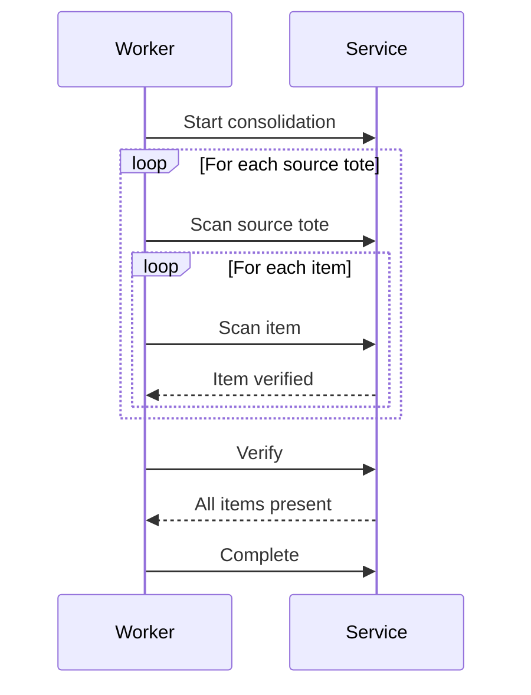

# Consolidation Service

The Consolidation Service combines picked items for multi-item orders.

## Overview

| Property | Value |
|----------|-------|
| **Port** | 8005 |
| **Database** | consolidation_db |
| **Aggregate Root** | ConsolidationUnit |
| **Bounded Context** | Consolidation |

## Responsibilities

- Combine items from multiple picks
- Verify all order items are present
- Prepare orders for packing
- Track consolidation progress

## API Endpoints

### Create Consolidation Unit

```http
POST /api/v1/consolidation-units
Content-Type: application/json

{
  "orderId": "ORD-12345",
  "expectedItems": [
    { "sku": "SKU-001", "quantity": 2 },
    { "sku": "SKU-002", "quantity": 1 }
  ]
}
```

### Get Consolidation Unit

```http
GET /api/v1/consolidation-units/{id}
```

### Add Item

```http
POST /api/v1/consolidation-units/{id}/items
Content-Type: application/json

{
  "sku": "SKU-001",
  "quantity": 2,
  "sourceTote": "TOTE-001"
}
```

### Verify

```http
PUT /api/v1/consolidation-units/{id}/verify
```

### Complete

```http
PUT /api/v1/consolidation-units/{id}/complete
```

## Domain Events Published

| Event | Topic | Description |
|-------|-------|-------------|
| ConsolidationStartedEvent | wms.consolidation.events | Started |
| ItemConsolidatedEvent | wms.consolidation.events | Item added |
| ConsolidationCompletedEvent | wms.consolidation.events | Complete |

## Consolidation Process



## Configuration

| Variable | Description | Default |
|----------|-------------|---------|
| SERVICE_NAME | Service identifier | consolidation-service |
| MONGODB_DATABASE | Database name | consolidation_db |

## Related Documentation

- [ConsolidationUnit Aggregate](/domain-driven-design/aggregates/consolidation-unit) - Domain model
