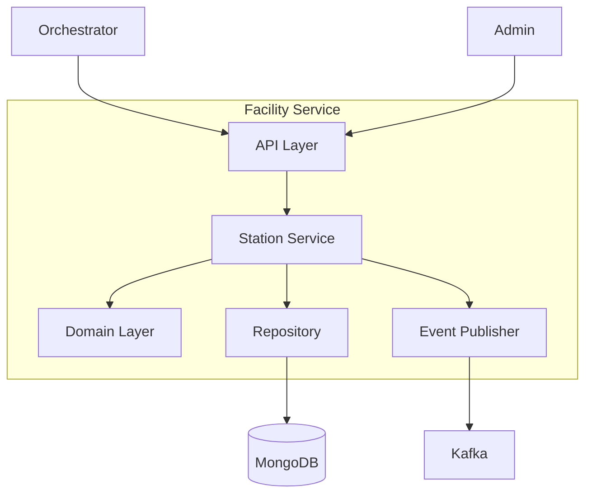
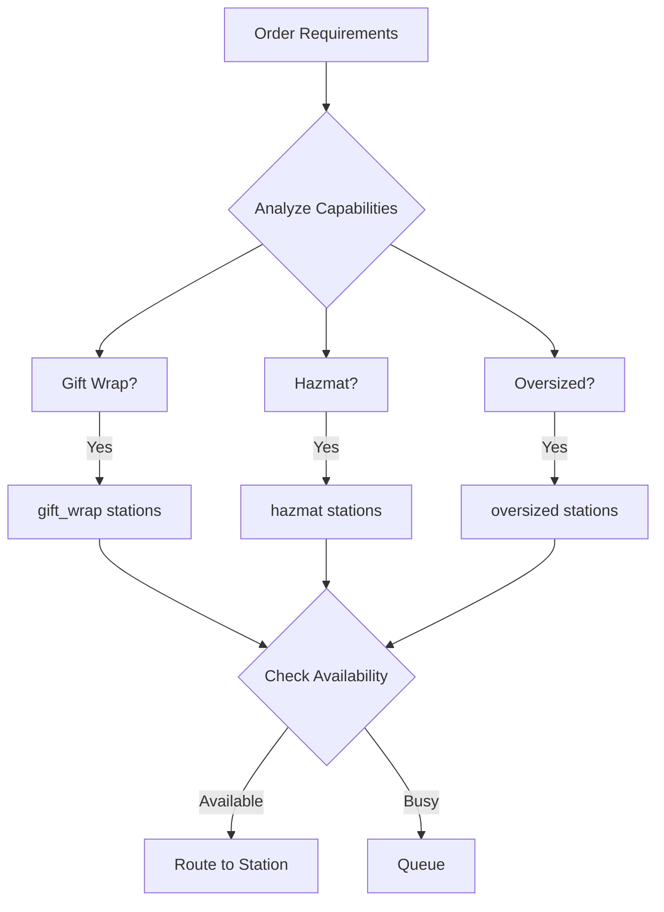

# Facility Service

The Facility Service manages warehouse stations, their capabilities, and process path routing.

## Overview

| Property | Value |
|----------|-------|
| **Port** | 8010 |
| **Database** | facility_db |
| **Aggregate Root** | Station |
| **Bounded Context** | Facility |

## Responsibilities

- Manage station lifecycle (create, update, delete)
- Configure station capabilities
- Support process path routing queries
- Track station status and capacity
- Manage equipment assignments

## Station Types

| Type | Description |
|------|-------------|
| `packing` | Item packing stations |
| `consolidation` | Multi-item order consolidation |
| `shipping` | Shipping label/manifest stations |
| `receiving` | Inbound shipment receiving |
| `stow` | Putaway stations |
| `slam` | Scan-Label-Apply-Manifest stations |
| `sortation` | Package sortation stations |
| `qc` | Quality control/inspection stations |

## Station Capabilities

| Capability | Description |
|------------|-------------|
| `single_item` | Single-item order handling |
| `multi_item` | Multi-item order handling |
| `gift_wrap` | Gift wrapping service |
| `hazmat` | Hazardous materials handling |
| `oversized` | Oversized item handling |
| `fragile` | Fragile item handling |
| `cold_chain` | Cold chain/refrigerated items |
| `high_value` | High-value item handling |

## API Endpoints

### Create Station

```http
POST /api/v1/stations
Content-Type: application/json

{
  "stationId": "STN-PACK-001",
  "name": "Packing Station 1",
  "zone": "zone-a",
  "stationType": "packing",
  "capabilities": ["single_item", "gift_wrap"],
  "maxConcurrentTasks": 5
}
```

### Find Capable Stations

```http
POST /api/v1/stations/find-capable
Content-Type: application/json

{
  "requirements": ["gift_wrap", "fragile"],
  "stationType": "packing",
  "zone": "zone-a"
}
```

### Set Station Status

```http
PUT /api/v1/stations/{stationId}/status
Content-Type: application/json

{
  "status": "maintenance"
}
```

## Domain Events Published

| Event | Topic | Description |
|-------|-------|-------------|
| StationCreatedEvent | wms.facility.events | Station created |
| StationCapabilityAddedEvent | wms.facility.events | Capability added |
| StationCapabilityRemovedEvent | wms.facility.events | Capability removed |
| StationStatusChangedEvent | wms.facility.events | Status changed |
| WorkerAssignedToStationEvent | wms.facility.events | Worker assigned |

## Configuration

| Variable | Description | Default |
|----------|-------------|---------|
| SERVICE_NAME | Service identifier | facility-service |
| MONGODB_DATABASE | Database name | facility_db |
| MONGODB_URI | Connection string | Required |
| KAFKA_BROKERS | Kafka brokers | Required |
| LOG_LEVEL | Logging level | info |

## Health Endpoints

- `GET /health` - Liveness probe
- `GET /ready` - Readiness probe (checks DB, Kafka)
- `GET /metrics` - Prometheus metrics

## Architecture



## Process Path Routing

The facility service enables intelligent process path routing:



## Related Documentation

- [Station Aggregate](/domain-driven-design/aggregates/station) - Domain model
- [Orchestrator](/services/orchestrator) - Uses for process routing
