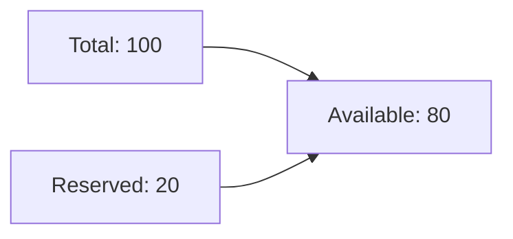
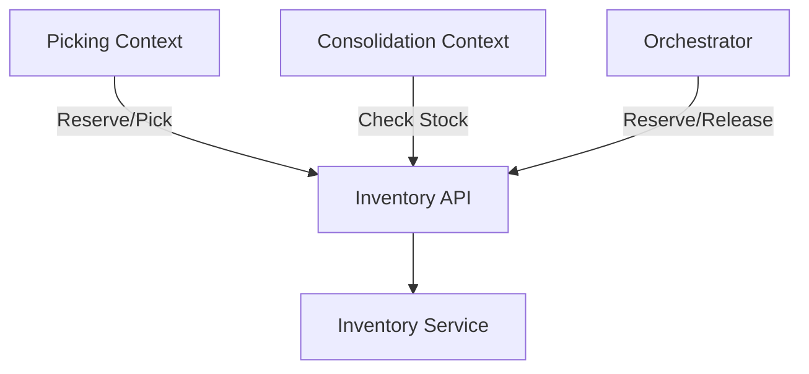

# Inventory Service

The Inventory Service manages stock levels and warehouse locations.

## Overview

| Property | Value |
|----------|-------|
| **Port** | 8008 |
| **Database** | inventory_db |
| **Aggregate Root** | InventoryItem |
| **Bounded Context** | Inventory |

## Responsibilities

- Track stock quantities
- Manage warehouse locations
- Handle reservations
- Process stock adjustments
- Alert on low stock

## API Endpoints

### Create Inventory Item

```http
POST /api/v1/inventory
Content-Type: application/json

{
  "sku": "SKU-001",
  "productName": "Widget A",
  "location": {
    "zone": "A",
    "aisle": "01",
    "rack": "02",
    "level": "3"
  },
  "quantity": 100,
  "minStock": 10,
  "maxStock": 500
}
```

### Get by SKU

```http
GET /api/v1/inventory/sku/{sku}
```

### Reserve Stock

```http
POST /api/v1/inventory/{id}/reserve
Content-Type: application/json

{
  "orderId": "ORD-12345",
  "quantity": 5
}
```

### Release Reservation

```http
POST /api/v1/inventory/{id}/release
Content-Type: application/json

{
  "orderId": "ORD-12345"
}
```

### Pick Stock

```http
POST /api/v1/inventory/{id}/pick
Content-Type: application/json

{
  "quantity": 5
}
```

### Receive Stock

```http
POST /api/v1/inventory/{id}/receive
Content-Type: application/json

{
  "quantity": 50
}
```

### Adjust Stock

```http
POST /api/v1/inventory/{id}/adjust
Content-Type: application/json

{
  "quantity": -5,
  "reason": "damaged"
}
```

### Get Low Stock

```http
GET /api/v1/inventory/low-stock
```

## Domain Events Published

| Event | Topic | Description |
|-------|-------|-------------|
| InventoryReceivedEvent | wms.inventory.events | Stock received |
| InventoryReservedEvent | wms.inventory.events | Stock reserved |
| ReservationReleasedEvent | wms.inventory.events | Reservation released |
| InventoryPickedEvent | wms.inventory.events | Stock picked |
| InventoryAdjustedEvent | wms.inventory.events | Stock adjusted |
| LowStockAlertEvent | wms.inventory.events | Below threshold |

## Stock Calculation

```
Available = Total Quantity - Reserved Quantity
```



## Open Host Service

The Inventory Service provides an OHS for other contexts:



## Configuration

| Variable | Description | Default |
|----------|-------------|---------|
| SERVICE_NAME | Service identifier | inventory-service |
| MONGODB_DATABASE | Database name | inventory_db |
| LOW_STOCK_THRESHOLD | Alert threshold | 10 |

## Related Documentation

- [InventoryItem Aggregate](/domain-driven-design/aggregates/inventory-item) - Domain model
