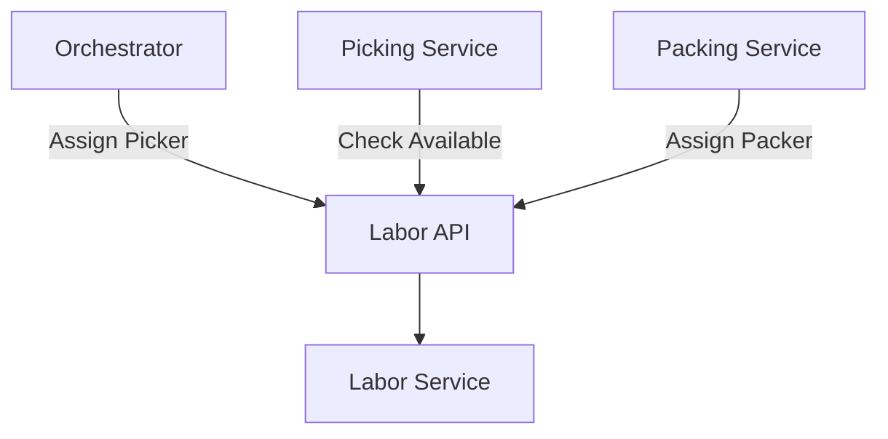

# Labor Service

The Labor Service manages workforce and task assignments.

## Overview

| Property | Value |
|----------|-------|
| **Port** | 8009 |
| **Database** | labor_db |
| **Aggregate Root** | Worker |
| **Bounded Context** | Labor |

## Responsibilities

- Manage worker shifts
- Assign tasks to workers
- Track worker performance
- Handle certifications
- Balance workload

## API Endpoints

### Get Workers

```http
GET /api/v1/workers?status=available&role=picker
```

### Get Worker

```http
GET /api/v1/workers/{id}
```

### Start Shift

```http
POST /api/v1/workers/{id}/shift/start
```

### End Shift

```http
POST /api/v1/workers/{id}/shift/end
```

### Assign Task

```http
POST /api/v1/workers/{id}/tasks/assign
Content-Type: application/json

{
  "taskType": "picking",
  "taskId": "PICK-001",
  "zone": "A"
}
```

### Complete Task

```http
POST /api/v1/workers/{id}/tasks/complete
```

### Get Available Workers

```http
GET /api/v1/workers/available?zone=A&role=picker
```

### Assign Picker to Task

```http
POST /api/v1/assign/picker
Content-Type: application/json

{
  "taskId": "PICK-001",
  "zone": "A"
}
```

Response:
```json
{
  "workerId": "WORKER-001",
  "name": "John Doe"
}
```

## Domain Events Published

| Event | Topic | Description |
|-------|-------|-------------|
| ShiftStartedEvent | wms.labor.events | Shift began |
| ShiftEndedEvent | wms.labor.events | Shift ended |
| TaskAssignedEvent | wms.labor.events | Task assigned |
| TaskCompletedEvent | wms.labor.events | Task completed |
| PerformanceRecordedEvent | wms.labor.events | Metrics updated |

## Worker Roles

| Role | Tasks | Certifications |
|------|-------|----------------|
| PICKER | picking | none |
| PACKER | packing | none |
| RECEIVER | receiving | none |
| FORKLIFT_OPERATOR | forklift | forklift_certified |
| SUPERVISOR | all | supervisor_certified |

## Open Host Service

The Labor Service provides an OHS for task assignment:



## Performance Metrics

| Metric | Description |
|--------|-------------|
| tasks_completed | Total tasks completed |
| average_task_time | Average time per task |
| accuracy | Correct picks/packs |
| productivity | Items per hour |

## Configuration

| Variable | Description | Default |
|----------|-------------|---------|
| SERVICE_NAME | Service identifier | labor-service |
| MONGODB_DATABASE | Database name | labor_db |

## Related Documentation

- [Worker Aggregate](/domain-driven-design/aggregates/worker) - Domain model
