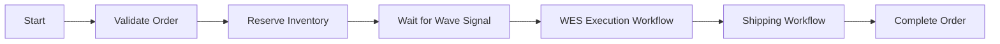
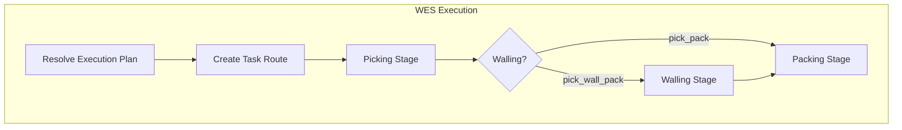
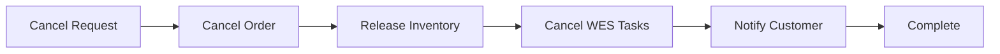
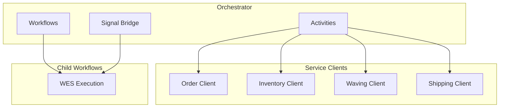
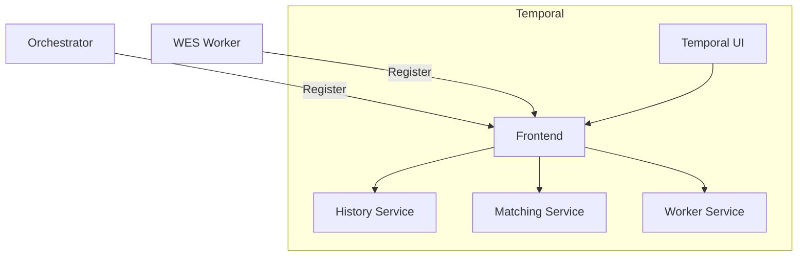

# Orchestrator

The Orchestrator is a Temporal worker that executes workflow orchestration for order fulfillment using the WES (Warehouse Execution System) as the central execution engine.

## Overview

| Property | Value |
|----------|-------|
| **Port** | 30010 (metrics + signals) |
| **Type** | Worker (Temporal) |
| **Task Queue** | orchestrator-queue |

## Responsibilities

- Execute Temporal workflows
- Coordinate WES execution for picking, walling, and packing
- Handle saga compensation
- Manage workflow signals (wave assigned, walling completed)
- Route signals to child workflows

## Workflows

### OrderFulfillmentWorkflow

Main workflow for end-to-end order processing using WES:



The WES Execution Workflow handles all picking, walling (if needed), and packing internally:



### Child Workflows

| Workflow | Purpose | Task Queue |
|----------|---------|------------|
| WESExecutionWorkflow | Orchestrate picking → walling? → packing | wes-queue |
| ShippingWorkflow | SLAM and carrier handoff | orchestrator-queue |

### OrderCancellationWorkflow

Compensation workflow for cancelled orders:



## Activities

| Activity | Service | Operation |
|----------|---------|-----------|
| ValidateOrder | Order Service | Validate order |
| ReserveInventory | Inventory Service | Reserve stock |
| ReleaseInventory | Inventory Service | Release reservation |
| MarkOrderShipped | Order Service | Update status |

## Signals

| Signal | Description | Source | Target |
|--------|-------------|--------|--------|
| waveAssigned | Order assigned to wave | Waving Service | OrderFulfillmentWorkflow |
| wallingCompleted | Walling stage done | Walling Service | WESExecutionWorkflow |

### Signal Endpoints

The orchestrator exposes HTTP endpoints to receive signals from simulators:

```http
POST /api/v1/signals/wave-assigned
POST /api/v1/signals/pick-completed
POST /api/v1/signals/walling-completed
POST /api/v1/signals/consolidation-completed
```

Example - Walling Completed:
```http
POST /api/v1/signals/walling-completed
Content-Type: application/json

{
  "orderId": "ORD-12345",
  "taskId": "WT-a1b2c3d4",
  "routeId": "RT-xyz",
  "sortedItems": [
    {"sku": "SKU-001", "quantity": 2, "slotId": "BIN-A1"}
  ]
}
```

## WES Integration

The orchestrator starts WES execution as a child workflow:

```go
wesChildCtx := workflow.WithChildOptions(ctx, workflow.ChildWorkflowOptions{
    WorkflowID: fmt.Sprintf("wes-execution-%s", input.OrderID),
    WorkflowExecutionTimeout: 4 * time.Hour,
    TaskQueue: "wes-queue",
})

err = workflow.ExecuteChildWorkflow(wesChildCtx, "WESExecutionWorkflow", wesInput).Get(ctx, &wesResult)
```

## Service Clients



## Configuration

| Variable | Description | Default |
|----------|-------------|---------|
| SERVICE_NAME | Service identifier | orchestrator |
| TEMPORAL_HOST | Temporal server | Required |
| TEMPORAL_NAMESPACE | Temporal namespace | wms |
| TEMPORAL_TASK_QUEUE | Task queue | orchestrator-queue |
| ORDER_SERVICE_URL | Order service URL | Required |
| INVENTORY_SERVICE_URL | Inventory service URL | Required |
| SHIPPING_SERVICE_URL | Shipping service URL | Required |
| WES_SERVICE_URL | WES service URL | Required |

## Priority-Based Timeouts

| Priority | Wave Wait Timeout | WES Timeout |
|----------|------------------|-------------|
| same_day | 30 minutes | 2 hours |
| next_day | 2 hours | 3 hours |
| standard | 4 hours | 4 hours |

## Health Endpoints

- `GET /health` - Liveness (worker running)
- `GET /metrics` - Prometheus metrics

## Temporal UI

Monitor workflows at: `http://temporal-ui:8080`



## Related Documentation

- [Order Fulfillment](/architecture/sequence-diagrams/order-fulfillment) - Main workflow
- [WES Execution](/architecture/sequence-diagrams/wes-execution) - Execution workflow
- [Order Cancellation](/architecture/sequence-diagrams/order-cancellation) - Compensation
- [Temporal Infrastructure](/infrastructure/temporal) - Server setup
- [WES Service](/services/wes-service) - Execution service

### Comprehensive Workflow Documentation

For detailed workflow documentation with full Go struct definitions, see:

**Orchestrator Workflows:**
- [Order Fulfillment Workflow](/temporal/workflows/order-fulfillment) - Main saga with 5 stages
- [Planning Workflow](/temporal/workflows/planning) - Process path determination
- [WES Execution Workflow](/temporal/workflows/wes-execution) - Child workflow execution
- [Picking Workflow](/temporal/workflows/picking) - Orchestrated picking
- [Consolidation Workflow](/temporal/workflows/consolidation) - Multi-route handling
- [Packing Workflow](/temporal/workflows/packing) - Pack task management
- [Shipping Workflow](/temporal/workflows/shipping) - SLAM process
- [Sortation Workflow](/temporal/workflows/sortation) - Package sorting
- [Gift Wrap Workflow](/temporal/workflows/gift-wrap) - Gift wrap processing
- [Cancellation Workflows](/temporal/workflows/cancellation) - Order cancellation
- [Reprocessing Workflows](/temporal/workflows/reprocessing) - Failed workflow retry

**Activities:**
- [Activities Overview](/temporal/activities/overview) - Activity patterns and conventions
- [Order Activities](/temporal/activities/order-activities) - Order lifecycle activities
- [Inventory Activities](/temporal/activities/inventory-activities) - Inventory operations

**Reference:**
- [Signals & Queries](/temporal/signals-queries) - All signal handlers
- [Task Queues](/temporal/task-queues) - Queue assignments
- [Retry Policies](/temporal/retry-policies) - Timeout configuration
