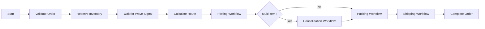
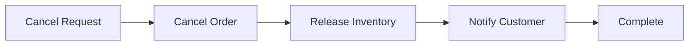
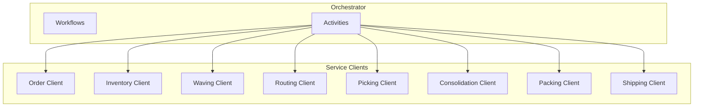
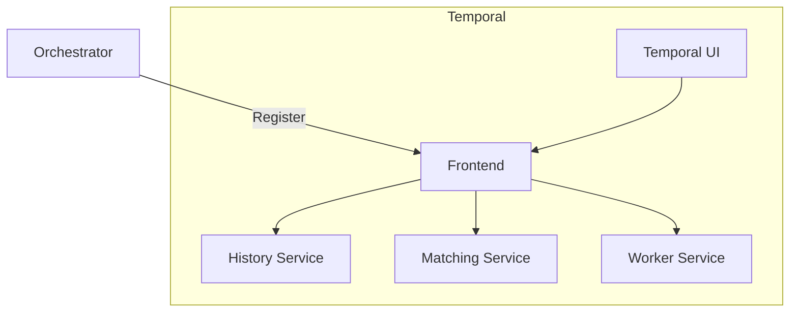

# Orchestrator

The Orchestrator is a Temporal worker that executes workflow orchestration.

## Overview

| Property | Value |
|----------|-------|
| **Port** | 8080 (metrics) |
| **Type** | Worker (no HTTP API) |
| **Task Queue** | orchestrator-queue |

## Responsibilities

- Execute Temporal workflows
- Coordinate service activities
- Handle saga compensation
- Manage workflow signals

## Workflows

### OrderFulfillmentWorkflow

Main workflow for end-to-end order processing:



### Child Workflows

| Workflow | Purpose |
|----------|---------|
| PickingWorkflow | Coordinate picking operations |
| ConsolidationWorkflow | Combine multi-item orders |
| PackingWorkflow | Package preparation |
| ShippingWorkflow | SLAM process |

### OrderCancellationWorkflow

Compensation workflow:



## Activities

| Activity | Service | Operation |
|----------|---------|-----------|
| ValidateOrder | Order Service | Validate order |
| ReserveInventory | Inventory Service | Reserve stock |
| ReleaseInventory | Inventory Service | Release reservation |
| CreatePickTask | Picking Service | Create pick task |
| GetPickTaskStatus | Picking Service | Check status |
| CreateConsolidation | Consolidation Service | Start consolidation |
| CreatePackTask | Packing Service | Create pack task |
| CreateShipment | Shipping Service | Create shipment |
| MarkOrderShipped | Order Service | Update status |

## Signals

| Signal | Description | Source |
|--------|-------------|--------|
| waveAssigned | Order assigned to wave | Waving Service |
| pickCompleted | Picking task done | Picking Service |
| packCompleted | Packing task done | Packing Service |

## Workflow Configuration

```go
workflow.ExecuteActivity(ctx, ValidateOrderActivity, activityOptions{
    StartToCloseTimeout: 5 * time.Minute,
    RetryPolicy: &temporal.RetryPolicy{
        MaximumAttempts:    3,
        InitialInterval:    1 * time.Second,
        BackoffCoefficient: 2.0,
    },
})
```

## Priority-Based Timeouts

| Priority | Wave Wait Timeout |
|----------|------------------|
| same_day | 30 minutes |
| next_day | 2 hours |
| standard | 4 hours |

## Service Clients



## Configuration

| Variable | Description | Default |
|----------|-------------|---------|
| SERVICE_NAME | Service identifier | orchestrator |
| TEMPORAL_HOST | Temporal server | Required |
| TEMPORAL_NAMESPACE | Temporal namespace | wms |
| TEMPORAL_TASK_QUEUE | Task queue | orchestrator-queue |
| ORDER_SERVICE_URL | Order service URL | Required |
| INVENTORY_SERVICE_URL | Inventory service URL | Required |
| ... | Other service URLs | Required |

## Health Endpoints

- `GET /health` - Liveness (worker running)
- `GET /metrics` - Prometheus metrics

## Temporal UI

Monitor workflows at: `http://temporal-ui:8080`



## Related Documentation

- [Order Fulfillment](/architecture/sequence-diagrams/order-fulfillment) - Main workflow
- [Order Cancellation](/architecture/sequence-diagrams/order-cancellation) - Compensation
- [Temporal Infrastructure](/infrastructure/temporal) - Server setup
