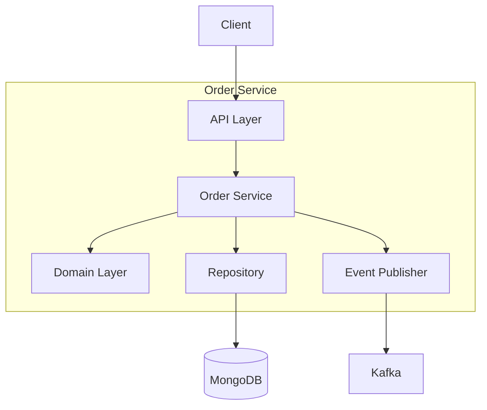

# Order Service

The Order Service manages the complete order lifecycle from receipt to completion.

## Overview

| Property | Value |
|----------|-------|
| **Port** | 8001 |
| **Database** | orders_db |
| **Aggregate Root** | Order |
| **Bounded Context** | Order |

## Responsibilities

- Receive and validate customer orders
- Track order status through fulfillment
- Handle order modifications and cancellations
- Publish order domain events

## API Endpoints

### Create Order

```http
POST /api/v1/orders
Content-Type: application/json

{
  "customerId": "CUST-001",
  "priority": "standard",
  "items": [
    {
      "sku": "SKU-001",
      "productName": "Widget A",
      "quantity": 2,
      "price": { "amount": 29.99, "currency": "USD" }
    }
  ],
  "shippingAddress": {
    "street": "123 Main St",
    "city": "New York",
    "state": "NY",
    "zipCode": "10001",
    "country": "US"
  }
}
```

### Get Order

```http
GET /api/v1/orders/{id}
```

### List Orders

```http
GET /api/v1/orders?status=received&limit=10
```

### Validate Order

```http
PUT /api/v1/orders/{id}/validate
```

### Cancel Order

```http
PUT /api/v1/orders/{id}/cancel
Content-Type: application/json

{
  "reason": "Customer request"
}
```

## Domain Events Published

| Event | Topic | Description |
|-------|-------|-------------|
| OrderReceivedEvent | wms.orders.events | Order placed |
| OrderValidatedEvent | wms.orders.events | Validation passed |
| OrderWaveAssignedEvent | wms.orders.events | Assigned to wave |
| OrderShippedEvent | wms.orders.events | Order shipped |
| OrderCancelledEvent | wms.orders.events | Order cancelled |
| OrderCompletedEvent | wms.orders.events | Delivery confirmed |

## Configuration

| Variable | Description | Default |
|----------|-------------|---------|
| SERVICE_NAME | Service identifier | order-service |
| MONGODB_DATABASE | Database name | orders_db |
| MONGODB_URI | Connection string | Required |
| KAFKA_BROKERS | Kafka brokers | Required |
| LOG_LEVEL | Logging level | info |

## Health Endpoints

- `GET /health` - Liveness probe
- `GET /ready` - Readiness probe (checks DB, Kafka)
- `GET /metrics` - Prometheus metrics

## Architecture



## Related Documentation

- [Order Aggregate](/domain-driven-design/aggregates/order) - Domain model
- [REST API](/api/rest-api) - API specification
