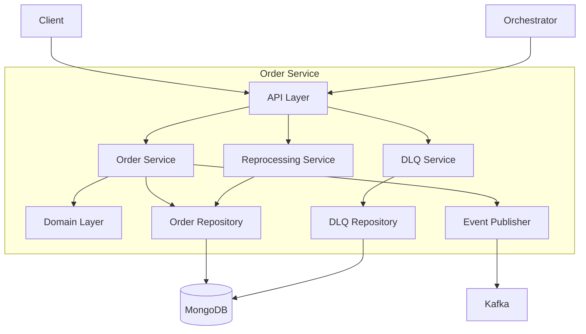
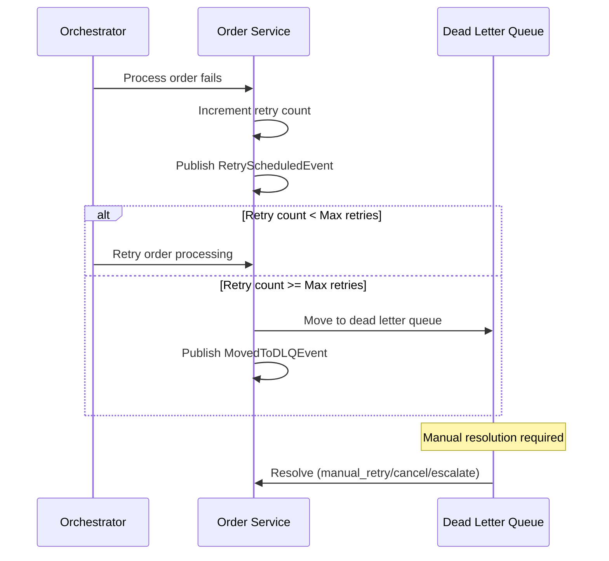

# Order Service

The Order Service manages the complete order lifecycle from receipt to completion, including error handling with retry logic and dead letter queue management.

## Overview

| Property | Value |
|----------|-------|
| **Port** | 8001 |
| **Database** | orders_db |
| **Aggregate Root** | Order |
| **Bounded Context** | Order |

## Responsibilities

- Receive and validate customer orders
- Track order status through fulfillment
- Handle order modifications and cancellations
- Publish order domain events
- Manage order reprocessing and retries
- Handle dead letter queue for failed orders

## CloudEvents Correlation Headers

The Order Service supports CloudEvents extension headers for distributed tracing:

| Header | Description | Example |
|--------|-------------|---------|
| `X-WMS-Correlation-ID` | UUID for distributed tracing across services | `550e8400-e29b-41d4-a716-446655440000` |
| `X-WMS-Wave-Number` | Wave-based processing correlation | `WAVE-2024-00123` |
| `X-WMS-Workflow-ID` | Temporal workflow correlation | `order-fulfillment-ORD-12345` |

## API Endpoints

### Order Management

#### Create Order

```http
POST /api/v1/orders
Content-Type: application/json
X-WMS-Correlation-ID: 550e8400-e29b-41d4-a716-446655440000

{
  "customerId": "CUST-001",
  "priority": "standard",
  "promisedDeliveryAt": "2024-12-27T17:00:00Z",
  "items": [
    {
      "sku": "SKU-001",
      "quantity": 2,
      "unitPrice": 29.99
    }
  ],
  "shippingAddress": {
    "street": "123 Main St",
    "city": "New York",
    "state": "NY",
    "zipCode": "10001",
    "country": "US"
  }
}
```

#### Get Order

```http
GET /api/v1/orders/{orderId}
```

#### List Orders

```http
GET /api/v1/orders?status=received&priority=same_day&page=1&pageSize=20
```

**Query Parameters:**

| Parameter | Type | Description |
|-----------|------|-------------|
| `page` | integer | Page number (default: 1) |
| `pageSize` | integer | Items per page (default: 20) |
| `status` | string | Filter by status (received, validated, assigned_to_wave, picking, packing, shipped, completed, cancelled) |
| `priority` | string | Filter by priority (same_day, next_day, standard) |
| `customerId` | string | Filter by customer ID |

#### Validate Order

```http
PUT /api/v1/orders/{orderId}/validate
```

#### Cancel Order

```http
PUT /api/v1/orders/{orderId}/cancel
Content-Type: application/json

{
  "reason": "Customer request"
}
```

### Reprocessing API

The reprocessing API enables order retry management for transient failures.

#### Get Orders Eligible for Retry

```http
GET /api/v1/reprocessing/eligible?limit=100&maxRetries=5
```

**Query Parameters:**

| Parameter | Type | Description |
|-----------|------|-------------|
| `limit` | integer | Maximum results (default: 100) |
| `maxRetries` | integer | Max retry threshold (default: 5) |
| `status` | array | Filter by status |

**Response:**

```json
{
  "data": [
    {
      "orderId": "ORD-12345",
      "customerId": "CUST-001",
      "status": "picking",
      "retryCount": 2,
      "lastFailureReason": "Inventory unavailable",
      "lastFailedAt": "2024-01-15T10:30:00Z",
      "createdAt": "2024-01-15T08:00:00Z"
    }
  ],
  "total": 15
}
```

#### Get Retry Metadata

```http
GET /api/v1/reprocessing/orders/{orderId}/retry-count
```

**Response:**

```json
{
  "orderId": "ORD-12345",
  "retryCount": 2,
  "maxRetries": 5,
  "lastFailureReason": "Inventory unavailable",
  "lastFailedAt": "2024-01-15T10:30:00Z",
  "nextRetryAt": "2024-01-15T11:00:00Z",
  "isEligibleForRetry": true
}
```

#### Increment Retry Count

```http
POST /api/v1/reprocessing/orders/{orderId}/retry-count
Content-Type: application/json

{
  "failureReason": "Picking station offline",
  "failedAt": "2024-01-15T10:30:00Z"
}
```

#### Reset Order for Retry

```http
POST /api/v1/reprocessing/orders/{orderId}/reset
```

#### Move Order to Dead Letter Queue

```http
POST /api/v1/reprocessing/orders/{orderId}/dlq
Content-Type: application/json

{
  "failureStatus": "picking",
  "failureReason": "Max retries exceeded - inventory permanently unavailable"
}
```

### Dead Letter Queue API

The DLQ API manages orders that have exhausted retry attempts.

#### List DLQ Entries

```http
GET /api/v1/dead-letter-queue?resolved=false&limit=50
```

**Query Parameters:**

| Parameter | Type | Description |
|-----------|------|-------------|
| `resolved` | boolean | Filter by resolution status |
| `failureStatus` | string | Filter by failure status |
| `customerId` | string | Filter by customer |
| `olderThanHours` | number | Filter by age |
| `limit` | integer | Max results (default: 50) |
| `offset` | integer | Pagination offset |

#### Get DLQ Statistics

```http
GET /api/v1/dead-letter-queue/stats
```

**Response:**

```json
{
  "totalEntries": 42,
  "unresolvedCount": 15,
  "resolvedCount": 27,
  "byFailureStatus": {
    "picking": 8,
    "packing": 4,
    "shipping": 3
  },
  "byResolution": {
    "manual_retry": 20,
    "cancelled": 5,
    "escalated": 2
  },
  "oldestUnresolvedAt": "2024-01-10T08:30:00Z"
}
```

#### Get Specific DLQ Entry

```http
GET /api/v1/dead-letter-queue/{orderId}
```

#### Resolve DLQ Entry

```http
PATCH /api/v1/dead-letter-queue/{orderId}/resolve
Content-Type: application/json

{
  "resolution": "manual_retry",
  "notes": "Inventory replenished, retrying order",
  "resolvedBy": "SUPERVISOR-001"
}
```

**Resolution Types:**

| Resolution | Description |
|------------|-------------|
| `manual_retry` | Manually retry the order |
| `cancelled` | Cancel the order |
| `escalated` | Escalate to management |

## Domain Events Published

| Event | Type | Topic | Description |
|-------|------|-------|-------------|
| OrderReceivedEvent | `wms.order.received` | wms.orders.events | Order placed |
| OrderValidatedEvent | `wms.order.validated` | wms.orders.events | Validation passed |
| OrderWaveAssignedEvent | `wms.order.wave-assigned` | wms.orders.events | Assigned to wave |
| OrderShippedEvent | `wms.order.shipped` | wms.orders.events | Order shipped |
| OrderCancelledEvent | `wms.order.cancelled` | wms.orders.events | Order cancelled |
| OrderCompletedEvent | `wms.order.completed` | wms.orders.events | Delivery confirmed |
| OrderRetryScheduledEvent | `wms.order.retry-scheduled` | wms.orders.events | Retry scheduled after failure |
| OrderMovedToDLQEvent | `wms.order.moved-to-dlq` | wms.orders.events | Moved to dead letter queue |
| OrderPartiallyFulfilledEvent | `wms.order.partially-fulfilled` | wms.orders.events | Partial fulfillment due to shortage |
| BackorderCreatedEvent | `wms.order.backorder-created` | wms.orders.events | Backorder created for short items |
| BackorderFulfilledEvent | `wms.order.backorder-fulfilled` | wms.orders.events | Backorder fulfilled |

### Event Payloads

#### OrderRetryScheduledEvent

```json
{
  "type": "wms.order.retry-scheduled",
  "orderId": "ORD-12345",
  "customerId": "CUST-001",
  "retryNumber": 3,
  "failureStatus": "picking",
  "failureReason": "Inventory unavailable",
  "timestamp": "2024-01-15T10:30:00Z"
}
```

#### OrderMovedToDLQEvent

```json
{
  "type": "wms.order.moved-to-dlq",
  "orderId": "ORD-12345",
  "customerId": "CUST-001",
  "finalFailureStatus": "picking",
  "finalFailureReason": "Max retries exceeded",
  "totalRetryAttempts": 5,
  "timestamp": "2024-01-15T12:00:00Z"
}
```

#### OrderPartiallyFulfilledEvent

```json
{
  "type": "wms.order.partially-fulfilled",
  "orderId": "ORD-12345",
  "customerId": "CUST-001",
  "fulfilledItems": [
    { "sku": "SKU-001", "quantityOrdered": 5, "quantityFulfilled": 3 }
  ],
  "backorderedItems": [
    { "sku": "SKU-001", "quantityOrdered": 5, "quantityShort": 2, "reason": "quantity_mismatch" }
  ],
  "fulfillmentRatio": 0.6,
  "timestamp": "2024-01-15T11:00:00Z"
}
```

## Configuration

| Variable | Description | Default |
|----------|-------------|---------|
| SERVICE_NAME | Service identifier | order-service |
| SERVER_ADDR | Server address | :8001 |
| MONGODB_URI | MongoDB connection string | Required |
| MONGODB_DATABASE | Database name | orders_db |
| KAFKA_BROKERS | Kafka broker addresses | Required |
| OTEL_EXPORTER_OTLP_ENDPOINT | OpenTelemetry endpoint | localhost:4317 |
| TRACING_ENABLED | Enable distributed tracing | true |
| LOG_LEVEL | Logging level | info |

## Health Endpoints

- `GET /health` - Liveness probe
- `GET /ready` - Readiness probe (checks DB, Kafka)
- `GET /metrics` - Prometheus metrics

## Architecture



## Order Retry Flow



## Related Documentation

- [Order Aggregate](/domain-driven-design/aggregates/order) - Domain model
- [REST API](/api/rest-api) - API specification
- [Order Fulfillment Workflow](/temporal/workflows/order-fulfillment) - Temporal workflow
- [Reprocessing Workflow](/architecture/sequence-diagrams/reprocessing-workflow) - Error handling flow
