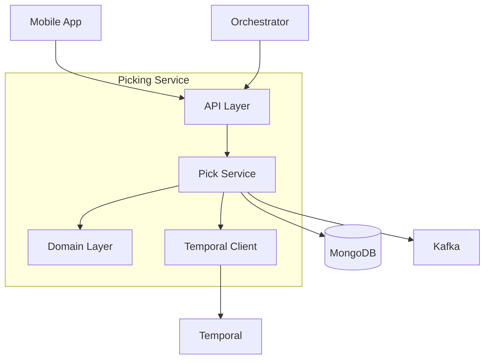
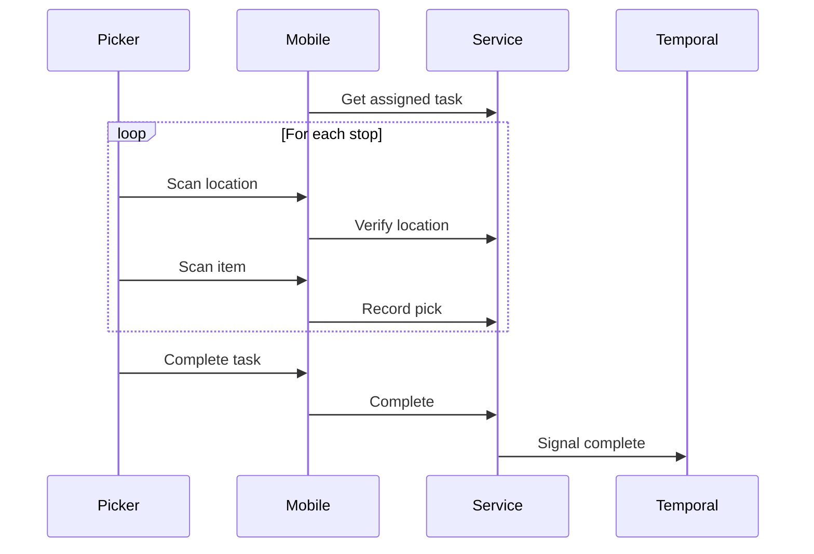

# Picking Service

The Picking Service manages warehouse picking operations.

## Overview

| Property | Value |
|----------|-------|
| **Port** | 8004 |
| **Database** | picking_db |
| **Aggregate Root** | PickTask |
| **Bounded Context** | Picking |

## Responsibilities

- Create and manage pick tasks
- Track item-level picking progress
- Handle pick exceptions
- Signal workflow on completion

## API Endpoints

### Create Pick Task

```http
POST /api/v1/pick-tasks
Content-Type: application/json

{
  "orderId": "ORD-12345",
  "waveId": "WAVE-001",
  "items": [
    {
      "sku": "SKU-001",
      "productName": "Widget A",
      "quantity": 2,
      "location": {
        "zone": "A",
        "aisle": "01",
        "rack": "02",
        "level": "3"
      }
    }
  ]
}
```

### Get Pick Task

```http
GET /api/v1/pick-tasks/{id}
```

### Assign Worker

```http
PUT /api/v1/pick-tasks/{id}/assign
Content-Type: application/json

{
  "workerId": "WORKER-001"
}
```

### Pick Item

```http
POST /api/v1/pick-tasks/{id}/items/{itemId}/pick
Content-Type: application/json

{
  "quantity": 2,
  "location": "A-01-02-3"
}
```

### Report Exception

```http
POST /api/v1/pick-tasks/{id}/items/{itemId}/exception
Content-Type: application/json

{
  "reason": "item_not_found",
  "notes": "Location empty"
}
```

### Complete Task

```http
PUT /api/v1/pick-tasks/{id}/complete
```

## Domain Events Published

| Event | Topic | Description |
|-------|-------|-------------|
| PickTaskCreatedEvent | wms.picking.events | Task created |
| PickTaskAssignedEvent | wms.picking.events | Worker assigned |
| ItemPickedEvent | wms.picking.events | Item picked |
| PickExceptionEvent | wms.picking.events | Exception reported |
| PickTaskCompletedEvent | wms.picking.events | Task complete |

## Exception Types

| Exception | Cause | Resolution |
|-----------|-------|------------|
| item_not_found | Item not at location | Check alternate location |
| damaged | Item damaged | Report for adjustment |
| quantity_mismatch | Less than expected | Short pick |
| wrong_item | SKU mismatch | Find correct item |

## Configuration

| Variable | Description | Default |
|----------|-------------|---------|
| SERVICE_NAME | Service identifier | picking-service |
| MONGODB_DATABASE | Database name | picking_db |
| TEMPORAL_HOST | Temporal server | Required |

## Architecture



## Mobile Workflow



## Related Documentation

- [PickTask Aggregate](/domain-driven-design/aggregates/pick-task) - Domain model
- [Picking Workflow](/architecture/sequence-diagrams/picking-workflow) - Workflow
