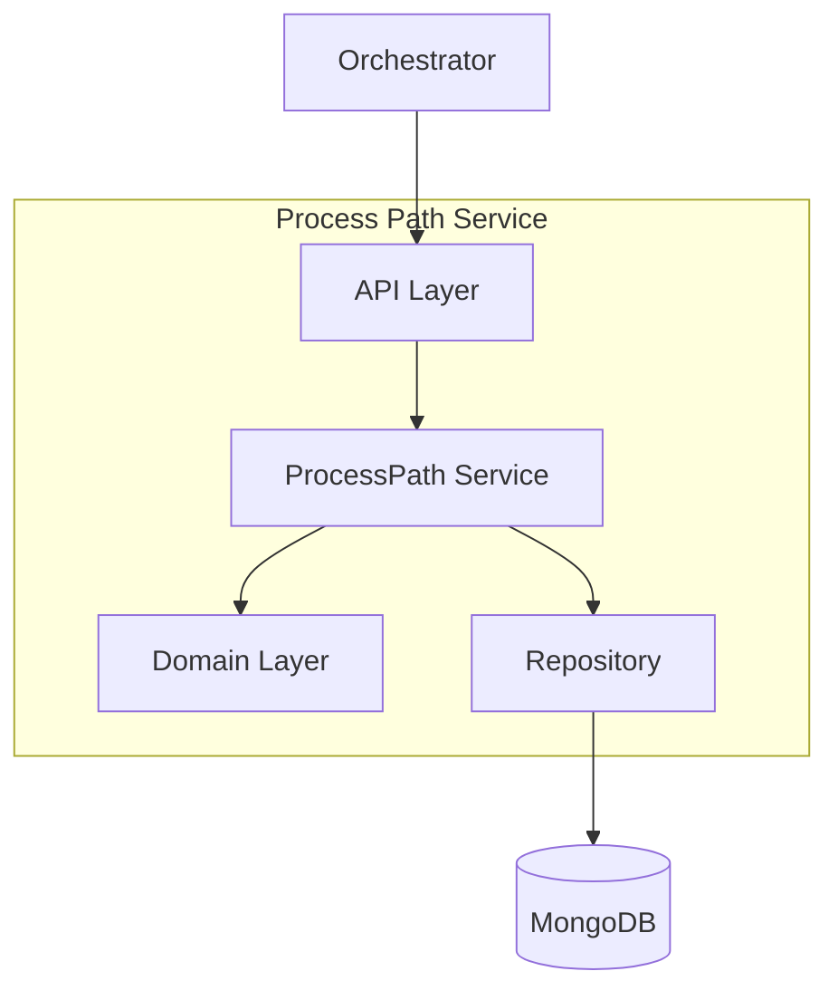
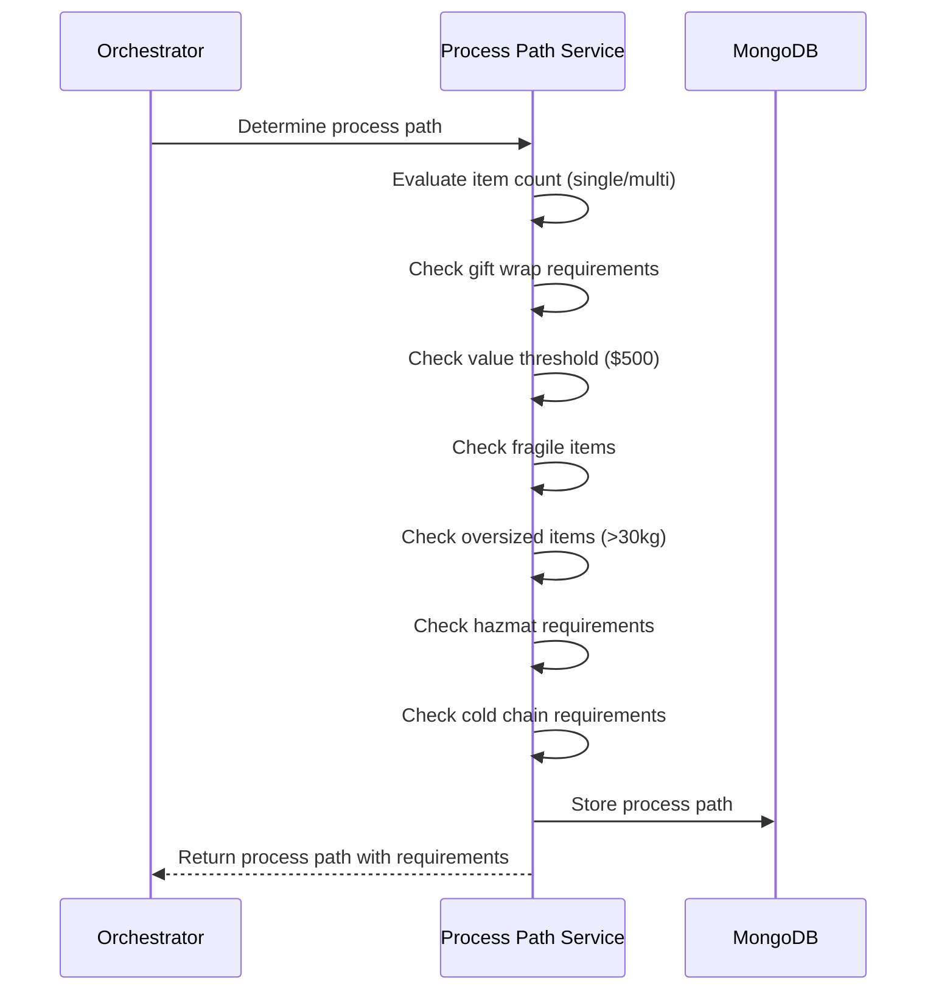
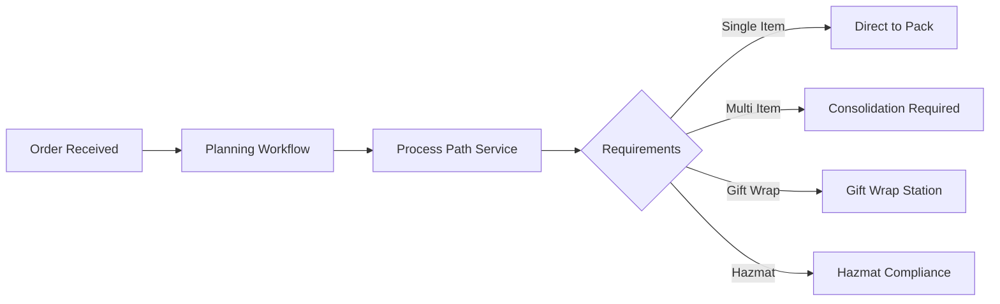

# Process Path Service

The Process Path Service determines the optimal fulfillment process path for orders based on item characteristics and special handling requirements.

## Overview

| Property | Value |
|----------|-------|
| **Port** | 8015 |
| **Database** | process_path_db |
| **Aggregate Root** | ProcessPath |
| **Bounded Context** | Process Path |

## Responsibilities

- Determine optimal process path for orders
- Evaluate item characteristics (fragile, hazmat, cold chain, etc.)
- Identify consolidation requirements for multi-item orders
- Handle special processing like gift wrap and high-value verification
- Assign target stations for fulfillment

## Process Requirements

The service evaluates orders against these process requirements:

| Requirement | Trigger | Special Handling |
|-------------|---------|------------------|
| `single_item` | Single item, quantity 1 | No consolidation needed |
| `multi_item` | Multiple items or quantity > 1 | Consolidation required |
| `gift_wrap` | Gift wrap requested | Gift wrap processing |
| `high_value` | Order value >= $500 | High value verification |
| `fragile` | Any fragile item | Fragile packing |
| `oversized` | Any item weight >= 30kg | Oversized handling |
| `hazmat` | Any hazardous material | Hazmat compliance |
| `cold_chain` | Temperature-controlled items | Cold chain packaging |

## API Endpoints

### Determine Process Path

```http
POST /api/v1/process-paths/determine
Content-Type: application/json

{
  "orderId": "ORD-12345",
  "items": [
    {
      "sku": "SKU-001",
      "quantity": 2,
      "weight": 1.5,
      "isFragile": true,
      "isHazmat": false,
      "requiresColdChain": false
    }
  ],
  "giftWrap": true,
  "giftWrapDetails": {
    "wrapType": "premium",
    "giftMessage": "Happy Birthday!",
    "hidePrice": true
  },
  "totalValue": 299.99
}
```

**Response:**

```json
{
  "id": "path-uuid",
  "pathId": "PATH-001",
  "orderId": "ORD-12345",
  "requirements": ["multi_item", "gift_wrap", "fragile"],
  "consolidationRequired": true,
  "giftWrapRequired": true,
  "specialHandling": ["fragile_packing"],
  "createdAt": "2024-01-15T10:30:00Z",
  "updatedAt": "2024-01-15T10:30:00Z"
}
```

### Get Process Path

```http
GET /api/v1/process-paths/{pathId}
```

### Get Process Path by Order

```http
GET /api/v1/process-paths/order/{orderId}
```

### Assign Station

```http
PUT /api/v1/process-paths/{pathId}/station
Content-Type: application/json

{
  "stationId": "STATION-A01"
}
```

## Domain Model

### ProcessPath Aggregate

```go
type ProcessPath struct {
    ID                    string
    PathID                string
    OrderID               string
    Requirements          []ProcessRequirement
    ConsolidationRequired bool
    GiftWrapRequired      bool
    SpecialHandling       []string
    TargetStationID       string
    CreatedAt             time.Time
    UpdatedAt             time.Time
}
```

### ProcessPathItem

```go
type ProcessPathItem struct {
    SKU               string
    Quantity          int
    Weight            float64
    IsFragile         bool
    IsHazmat          bool
    RequiresColdChain bool
}
```

### GiftWrapDetails

```go
type GiftWrapDetails struct {
    WrapType    string
    GiftMessage string
    HidePrice   bool
}
```

### HazmatDetails

```go
type HazmatDetails struct {
    Class              string
    UNNumber           string
    PackingGroup       string
    ProperShippingName string
    LimitedQuantity    bool
}
```

### ColdChainDetails

```go
type ColdChainDetails struct {
    MinTempCelsius  float64
    MaxTempCelsius  float64
    RequiresDryIce  bool
    RequiresGelPack bool
}
```

## Configuration

| Variable | Description | Default |
|----------|-------------|---------|
| SERVICE_NAME | Service identifier | process-path-service |
| SERVER_ADDR | Server address | :8015 |
| MONGODB_URI | MongoDB connection string | Required |
| MONGODB_DATABASE | Database name | process_path_db |
| OTEL_EXPORTER_OTLP_ENDPOINT | OpenTelemetry endpoint | localhost:4317 |
| TRACING_ENABLED | Enable distributed tracing | true |
| LOG_LEVEL | Logging level | info |
| ENVIRONMENT | Environment name | development |

## Health Endpoints

- `GET /health` - Liveness probe
- `GET /ready` - Readiness probe (checks MongoDB)
- `GET /metrics` - Prometheus metrics

## Architecture



## Process Path Determination Flow



## Integration with Orchestrator

The Process Path Service is called by the Orchestrator during order planning to determine:

1. Whether consolidation is required (multi-item orders)
2. Which special handling processes are needed
3. Target station assignment for fulfillment



## Related Documentation

- [ProcessPath Aggregate](/domain-driven-design/aggregates/process-path) - Domain model
- [Planning Workflow](/temporal/workflows/planning) - Orchestration workflow
- [Order Fulfillment](/architecture/sequence-diagrams/order-fulfillment) - End-to-end flow
