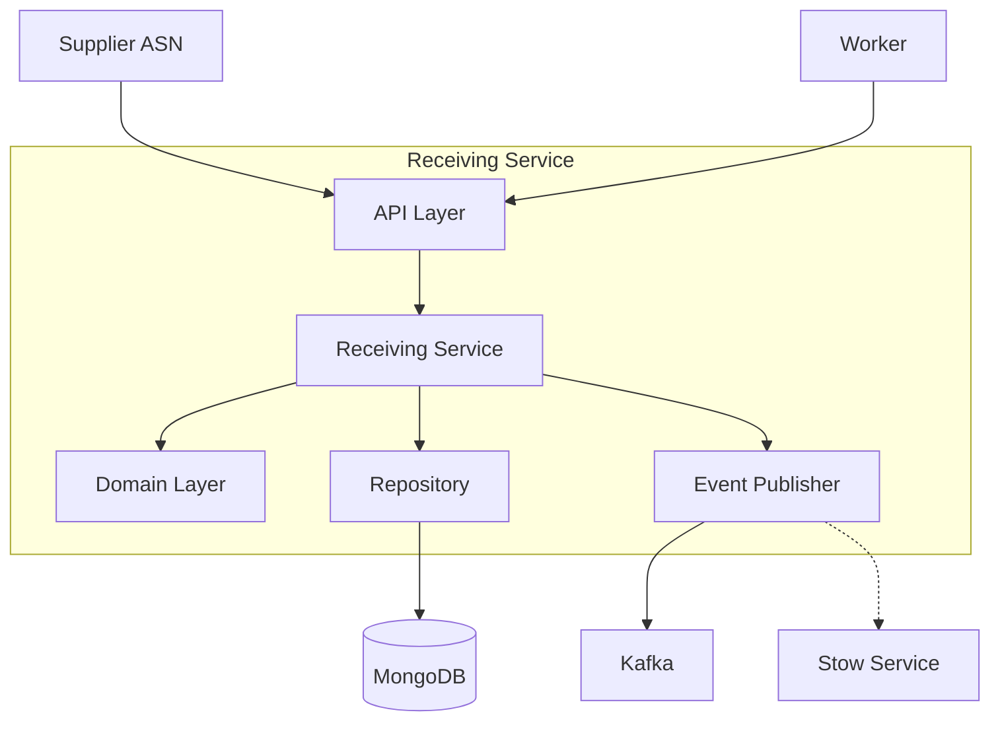

# Receiving Service

The Receiving Service manages inbound shipments and the receiving process for goods arriving at the warehouse.

## Overview

| Property | Value |
|----------|-------|
| **Port** | 8010 |
| **Database** | receiving_db |
| **Aggregate Root** | InboundShipment |
| **Bounded Context** | Receiving |

## Responsibilities

- Process Advance Shipping Notices (ASN)
- Track shipment arrivals at receiving docks
- Record item receipt with condition tracking
- Detect and report discrepancies (shortage, overage, damage)
- Trigger putaway task creation

## API Endpoints

### Create Shipment

```http
POST /api/v1/shipments
Content-Type: application/json

{
  "purchaseOrderId": "PO-2024-001234",
  "asn": {
    "asnId": "ASN-001234",
    "shippingCarrier": "FedEx",
    "trackingNumber": "794644790132",
    "estimatedArrival": "2024-01-15T10:00:00Z"
  },
  "supplier": {
    "supplierId": "SUP-001",
    "name": "Acme Supplies"
  },
  "expectedItems": [
    {
      "sku": "SKU-12345",
      "productName": "Widget A",
      "expectedQuantity": 100
    }
  ]
}
```

### Mark Shipment Arrived

```http
POST /api/v1/shipments/{shipmentId}/arrive
Content-Type: application/json

{
  "dockId": "DOCK-A1"
}
```

### Receive Item

```http
POST /api/v1/shipments/{shipmentId}/receive
Content-Type: application/json

{
  "sku": "SKU-12345",
  "quantity": 25,
  "condition": "good",
  "toteId": "TOTE-001",
  "workerId": "WORKER-001"
}
```

### Complete Receiving

```http
POST /api/v1/shipments/{shipmentId}/complete
```

## Domain Events Published

| Event | Topic | Description |
|-------|-------|-------------|
| ShipmentExpectedEvent | wms.receiving.events | New shipment expected |
| ShipmentArrivedEvent | wms.receiving.events | Shipment arrived at dock |
| ItemReceivedEvent | wms.receiving.events | Item received and scanned |
| ReceivingCompletedEvent | wms.receiving.events | Receiving process completed |
| ReceivingDiscrepancyEvent | wms.receiving.events | Discrepancy detected |
| PutawayTaskCreatedEvent | wms.receiving.events | Putaway task triggered |

## Configuration

| Variable | Description | Default |
|----------|-------------|---------|
| SERVICE_NAME | Service identifier | receiving-service |
| MONGODB_DATABASE | Database name | receiving_db |
| MONGODB_URI | Connection string | Required |
| KAFKA_BROKERS | Kafka brokers | Required |
| LOG_LEVEL | Logging level | info |

## Health Endpoints

- `GET /health` - Liveness probe
- `GET /ready` - Readiness probe (checks DB, Kafka)
- `GET /metrics` - Prometheus metrics

## Architecture



## Related Documentation

- [InboundShipment Aggregate](/domain-driven-design/aggregates/inbound-shipment) - Domain model
- [Stow Service](/services/stow-service) - Receives putaway tasks
