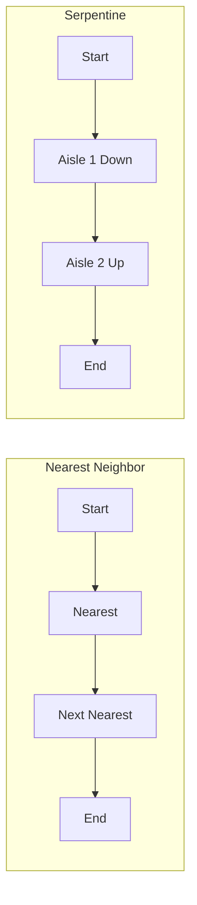
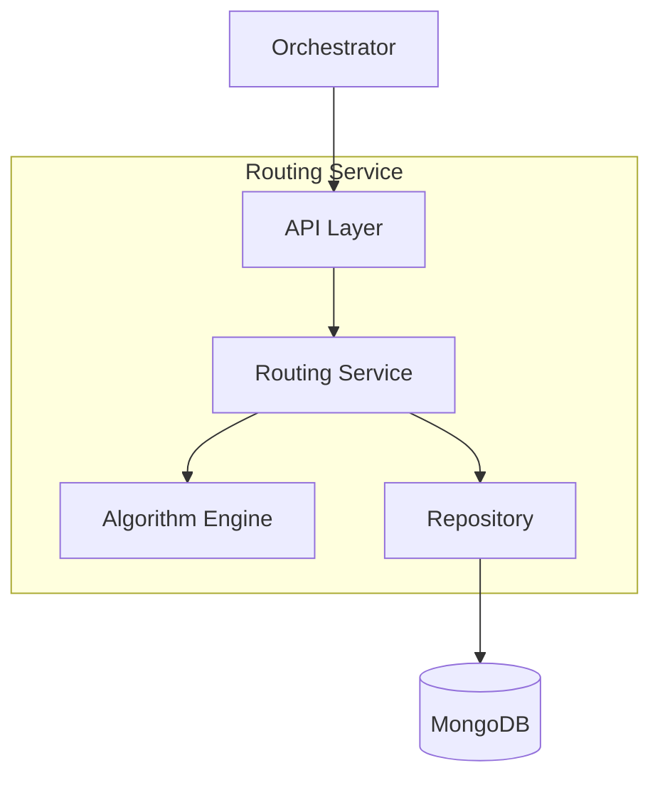

# Routing Service

The Routing Service calculates optimal pick paths through the warehouse.

## Overview

| Property | Value |
|----------|-------|
| **Port** | 8003 |
| **Database** | routing_db |
| **Aggregate Root** | PickRoute |
| **Bounded Context** | Routing |

## Responsibilities

- Calculate optimal pick routes
- Minimize travel distance
- Support multiple routing algorithms
- Provide route visualization data

## API Endpoints

### Calculate Route

```http
POST /api/v1/routes/calculate
Content-Type: application/json

{
  "taskId": "PICK-001",
  "items": [
    {
      "id": "ITEM-001",
      "sku": "SKU-001",
      "location": {
        "zone": "A",
        "aisle": "01",
        "rack": "02",
        "level": "3"
      }
    }
  ],
  "algorithm": "nearest_neighbor"
}
```

Response:
```json
{
  "routeId": "ROUTE-001",
  "stops": [
    { "sequence": 1, "location": "A-01-02-3", "itemId": "ITEM-001" },
    { "sequence": 2, "location": "A-01-03-2", "itemId": "ITEM-002" }
  ],
  "totalDistance": 150.5,
  "estimatedTime": "PT15M"
}
```

### Get Route

```http
GET /api/v1/routes/{id}
```

## Routing Algorithms

| Algorithm | Description | Best For |
|-----------|-------------|----------|
| nearest_neighbor | Greedy closest point | Quick calculation |
| zone_based | Optimize within zones | Large warehouses |
| serpentine | S-pattern through aisles | Aisle-based layouts |
| tsp_approx | TSP approximation | Small routes |



## Domain Events Published

| Event | Topic | Description |
|-------|-------|-------------|
| RouteCalculatedEvent | wms.routes.events | Route created |
| RouteStartedEvent | wms.routes.events | Picking began |
| StopCompletedEvent | wms.routes.events | Stop picked |
| RouteCompletedEvent | wms.routes.events | Route finished |

## Shared Kernel: Location

The `Location` value object is shared with Picking context:

```go
type Location struct {
    Zone     string
    Aisle    string
    Rack     string
    Level    string
    Position string
    X        int  // Warehouse coordinates
    Y        int
}

func (l Location) DistanceFrom(other Location) float64 {
    dx := float64(l.X - other.X)
    dy := float64(l.Y - other.Y)
    return math.Sqrt(dx*dx + dy*dy)
}
```

## Configuration

| Variable | Description | Default |
|----------|-------------|---------|
| SERVICE_NAME | Service identifier | routing-service |
| MONGODB_DATABASE | Database name | routing_db |
| DEFAULT_ALGORITHM | Routing algorithm | nearest_neighbor |

## Architecture



## Related Documentation

- [PickRoute Aggregate](/domain-driven-design/aggregates/pick-route) - Domain model
- [PickTask Aggregate](/domain-driven-design/aggregates/pick-task) - Uses routes
