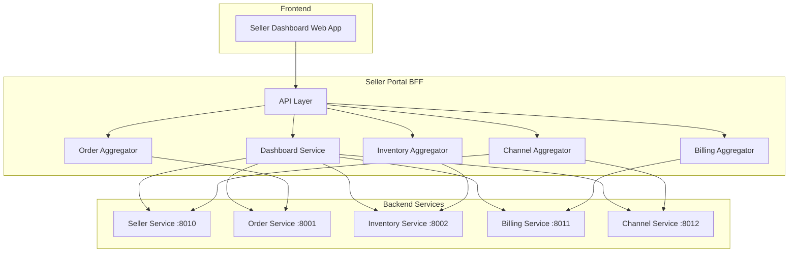
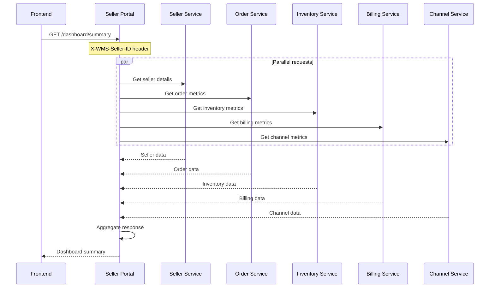

# Seller Portal

The Seller Portal is a Backend-for-Frontend (BFF) service that provides a unified API for seller dashboards, aggregating data from multiple WMS services to deliver order metrics, inventory status, billing information, and channel integrations.

## Overview

| Property | Value |
|----------|-------|
| **Port** | 8013 |
| **Type** | BFF (Backend-for-Frontend) |
| **Database** | None (aggregates from other services) |
| **Bounded Context** | Seller Portal |

## Responsibilities

- Dashboard summary with order, inventory, billing, and channel metrics
- Order management with filtering, search, and pagination
- Inventory visibility across warehouses
- Invoice and billing information aggregation
- Channel integration management (connect, disconnect, sync)
- API key management for programmatic access
- Configurable alert notifications
- CORS support for frontend integration

## Required Headers

| Header | Description | Required |
|--------|-------------|----------|
| `X-WMS-Seller-ID` | Seller identifier | Yes |
| `X-WMS-Tenant-ID` | Tenant identifier | Optional |

## API Endpoints

### Dashboard

#### Get Dashboard Summary

```http
GET /api/v1/dashboard/summary?period=today
X-WMS-Seller-ID: SLR-12345
```

**Query Parameters:**

| Parameter | Type | Description |
|-----------|------|-------------|
| `period` | string | today, week, month, custom (default: today) |
| `startDate` | string | Start date for custom period (YYYY-MM-DD) |
| `endDate` | string | End date for custom period (YYYY-MM-DD) |

**Response:**

```json
{
  "sellerId": "SLR-12345",
  "period": {
    "start": "2024-01-15T00:00:00Z",
    "end": "2024-01-15T23:59:59Z",
    "type": "today"
  },
  "orderMetrics": {
    "totalOrders": 150,
    "pendingOrders": 25,
    "processingOrders": 50,
    "shippedOrders": 75,
    "fulfillmentRate": 95.5,
    "totalRevenue": 15000.00,
    "averageOrderValue": 100.00
  },
  "inventoryMetrics": {
    "totalSkus": 500,
    "lowStockSkus": 15,
    "outOfStockSkus": 3,
    "inventoryValue": 50000.00,
    "totalUnits": 25000
  },
  "billingMetrics": {
    "currentBalance": 1250.00,
    "mtdCharges": 3500.00,
    "ytdCharges": 42000.00,
    "nextInvoiceDate": "2024-01-31",
    "pendingInvoices": 1
  },
  "channelMetrics": [
    {
      "channelId": "CH-001",
      "channelName": "Shopify Store",
      "channelType": "shopify",
      "status": "active",
      "ordersToday": 45,
      "lastSyncAt": "2024-01-15T10:30:00Z"
    }
  ],
  "alerts": [
    {
      "id": "ALERT-001",
      "type": "low_stock",
      "severity": "warning",
      "title": "Low Stock Alert",
      "message": "SKU-001 has only 5 units remaining",
      "createdAt": "2024-01-15T09:00:00Z"
    }
  ]
}
```

### Order Management

#### List Orders

```http
GET /api/v1/orders?page=1&pageSize=20&status=processing
X-WMS-Seller-ID: SLR-12345
```

**Query Parameters:**

| Parameter | Type | Description |
|-----------|------|-------------|
| `page` | integer | Page number (default: 1) |
| `pageSize` | integer | Items per page (default: 20) |
| `status` | string | Filter by status |
| `channelId` | string | Filter by channel |
| `search` | string | Search by order ID or customer |
| `sortBy` | string | Sort field (default: createdAt) |
| `sortOrder` | string | asc or desc (default: desc) |

#### Get Order Details

```http
GET /api/v1/orders/{orderId}
X-WMS-Seller-ID: SLR-12345
```

### Inventory Management

#### List Inventory

```http
GET /api/v1/inventory?page=1&pageSize=20&status=low_stock
X-WMS-Seller-ID: SLR-12345
```

**Query Parameters:**

| Parameter | Type | Description |
|-----------|------|-------------|
| `page` | integer | Page number (default: 1) |
| `pageSize` | integer | Items per page (default: 20) |
| `warehouseId` | string | Filter by warehouse |
| `status` | string | available, low_stock, out_of_stock |
| `search` | string | Search by SKU or name |

### Billing

#### List Invoices

```http
GET /api/v1/billing/invoices?page=1&pageSize=20
X-WMS-Seller-ID: SLR-12345
```

#### Get Invoice Details

```http
GET /api/v1/billing/invoices/{invoiceId}
X-WMS-Seller-ID: SLR-12345
```

### Channel Integrations

#### List Connected Channels

```http
GET /api/v1/integrations
X-WMS-Seller-ID: SLR-12345
```

#### Connect Channel

```http
POST /api/v1/integrations
X-WMS-Seller-ID: SLR-12345
Content-Type: application/json

{
  "type": "shopify",
  "name": "My Shopify Store",
  "storeUrl": "https://mystore.myshopify.com",
  "credentials": {
    "apiKey": "...",
    "apiSecret": "..."
  }
}
```

#### Disconnect Channel

```http
DELETE /api/v1/integrations/{channelId}
X-WMS-Seller-ID: SLR-12345
```

#### Trigger Channel Sync

```http
POST /api/v1/integrations/{channelId}/sync
X-WMS-Seller-ID: SLR-12345
Content-Type: application/json

{
  "syncType": "orders"
}
```

### API Key Management

#### List API Keys

```http
GET /api/v1/api-keys
X-WMS-Seller-ID: SLR-12345
```

#### Generate API Key

```http
POST /api/v1/api-keys
X-WMS-Seller-ID: SLR-12345
Content-Type: application/json

{
  "name": "Production API Key",
  "permissions": ["orders:read", "inventory:read"]
}
```

#### Revoke API Key

```http
DELETE /api/v1/api-keys/{keyId}
X-WMS-Seller-ID: SLR-12345
```

## Alert Types

| Type | Severity | Description |
|------|----------|-------------|
| `low_stock` | warning | SKU below reorder point |
| `out_of_stock` | critical | SKU has zero availability |
| `order_issue` | warning | Order requires attention |
| `shipping_delay` | warning | Shipment delayed |
| `billing_due` | info | Invoice payment due |
| `channel_error` | critical | Channel sync error |
| `performance` | info | Performance metric alert |
| `announcement` | info | System announcement |

## Configuration

| Variable | Description | Default |
|----------|-------------|---------|
| SERVICE_NAME | Service identifier | seller-portal |
| SERVER_ADDR | Server address | :8013 |
| SELLER_SERVICE_URL | Seller service URL | http://localhost:8010 |
| ORDER_SERVICE_URL | Order service URL | http://localhost:8001 |
| INVENTORY_SERVICE_URL | Inventory service URL | http://localhost:8002 |
| BILLING_SERVICE_URL | Billing service URL | http://localhost:8011 |
| CHANNEL_SERVICE_URL | Channel service URL | http://localhost:8012 |
| OTEL_EXPORTER_OTLP_ENDPOINT | OpenTelemetry endpoint | localhost:4317 |
| TRACING_ENABLED | Enable distributed tracing | true |
| LOG_LEVEL | Logging level | info |

## Health Endpoints

- `GET /health` - Liveness probe
- `GET /ready` - Readiness probe (checks downstream services)
- `GET /metrics` - Prometheus metrics

## Architecture



## Request Flow



## Related Documentation

- [Seller Service](/services/seller-service) - Seller account management
- [Order Service](/services/order-service) - Order data and status
- [Inventory Service](/services/inventory-service) - Stock levels and locations
- [Billing Service](/services/billing-service) - Invoices and billing activities
- [Channel Service](/services/channel-service) - Sales channel integrations
