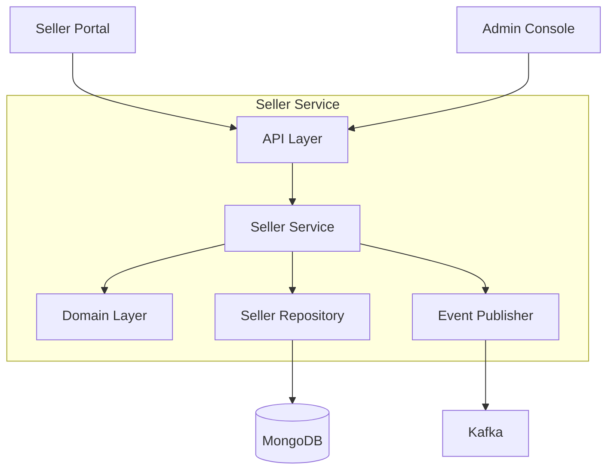
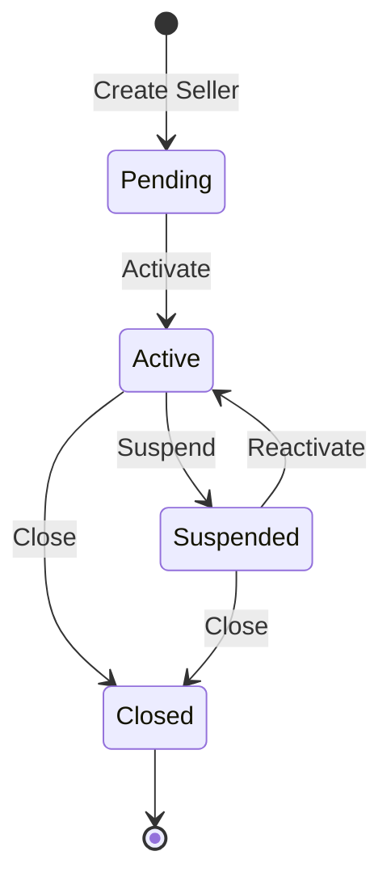

# Seller Service

The Seller Service manages merchant/seller accounts, their contracts, facility assignments, fee schedules, and external sales channel integrations for the WMS Platform.

## Overview

| Property | Value |
|----------|-------|
| **Port** | 8010 |
| **Database** | sellers_db |
| **Aggregate Root** | Seller |
| **Bounded Context** | Seller Management |

## Responsibilities

- Seller account lifecycle management (create, activate, suspend, close)
- Contract management with billing cycles (daily, weekly, monthly)
- Facility assignment and warehouse access control
- Fee schedule configuration with volume discounts
- Channel integrations (Shopify, Amazon, eBay, WooCommerce)
- API key generation and management for programmatic access
- Multi-tenant support (3PL operators)

## API Endpoints

### Seller Management

#### Create Seller

```http
POST /api/v1/sellers
Content-Type: application/json

{
  "tenantId": "TENANT-001",
  "companyName": "Acme Corp",
  "contactName": "John Doe",
  "contactEmail": "john@acme.com",
  "contactPhone": "+1-555-123-4567",
  "billingCycle": "monthly"
}
```

#### Get Seller

```http
GET /api/v1/sellers/{sellerId}
```

#### List Sellers

```http
GET /api/v1/sellers?page=1&pageSize=20
```

#### Search Sellers

```http
GET /api/v1/sellers/search?query=acme
```

### Status Management

#### Activate Seller

```http
PUT /api/v1/sellers/{sellerId}/activate
```

#### Suspend Seller

```http
PUT /api/v1/sellers/{sellerId}/suspend
Content-Type: application/json

{
  "reason": "Payment overdue"
}
```

#### Close Seller

```http
PUT /api/v1/sellers/{sellerId}/close
Content-Type: application/json

{
  "reason": "Contract terminated"
}
```

### Facility Management

#### Assign Facility

```http
POST /api/v1/sellers/{sellerId}/facilities
Content-Type: application/json

{
  "facilityId": "FAC-001",
  "isPrimary": true
}
```

#### Remove Facility

```http
DELETE /api/v1/sellers/{sellerId}/facilities/{facilityId}
```

### Fee Schedule

#### Update Fee Schedule

```http
PUT /api/v1/sellers/{sellerId}/fee-schedule
Content-Type: application/json

{
  "pickFee": 0.50,
  "packFee": 0.75,
  "storageFeePerUnit": 0.10,
  "receivingFee": 0.25,
  "shippingMarkup": 0.15,
  "volumeDiscounts": [
    { "minVolume": 1000, "discountPercent": 5 },
    { "minVolume": 5000, "discountPercent": 10 }
  ]
}
```

### Channel Integrations

#### Connect Channel

```http
POST /api/v1/sellers/{sellerId}/integrations
Content-Type: application/json

{
  "channelType": "shopify",
  "storeUrl": "https://mystore.myshopify.com",
  "apiKey": "...",
  "apiSecret": "..."
}
```

#### Disconnect Channel

```http
DELETE /api/v1/sellers/{sellerId}/integrations/{channelId}
```

### API Key Management

#### List API Keys

```http
GET /api/v1/sellers/{sellerId}/api-keys
```

#### Generate API Key

```http
POST /api/v1/sellers/{sellerId}/api-keys
Content-Type: application/json

{
  "name": "Production API Key",
  "permissions": ["orders:read", "inventory:read", "inventory:write"]
}
```

#### Revoke API Key

```http
DELETE /api/v1/sellers/{sellerId}/api-keys/{keyId}
```

## Domain Events Published

| Event | Type | Topic | Description |
|-------|------|-------|-------------|
| SellerCreatedEvent | `wms.seller.created` | wms.sellers.events | New seller account created |
| SellerActivatedEvent | `wms.seller.activated` | wms.sellers.events | Seller account activated |
| SellerSuspendedEvent | `wms.seller.suspended` | wms.sellers.events | Seller account suspended |
| SellerClosedEvent | `wms.seller.closed` | wms.sellers.events | Seller account closed |
| FacilityAssignedEvent | `wms.seller.facility-assigned` | wms.sellers.events | Facility assigned to seller |
| ChannelConnectedEvent | `wms.seller.channel-connected` | wms.sellers.events | Sales channel connected |
| FeeScheduleUpdatedEvent | `wms.seller.fee-schedule-updated` | wms.sellers.events | Fee schedule updated |

### Event Payloads

#### SellerCreatedEvent

```json
{
  "type": "wms.seller.created",
  "sellerId": "SLR-12345678",
  "tenantId": "TENANT-001",
  "companyName": "Acme Corp",
  "billingCycle": "monthly",
  "timestamp": "2024-01-15T10:30:00Z"
}
```

#### SellerActivatedEvent

```json
{
  "type": "wms.seller.activated",
  "sellerId": "SLR-12345678",
  "activatedAt": "2024-01-15T10:30:00Z",
  "timestamp": "2024-01-15T10:30:00Z"
}
```

## Configuration

| Variable | Description | Default |
|----------|-------------|---------|
| SERVICE_NAME | Service identifier | seller-service |
| SERVER_ADDR | Server address | :8010 |
| MONGODB_URI | MongoDB connection string | Required |
| MONGODB_DATABASE | Database name | sellers_db |
| KAFKA_BROKERS | Kafka broker addresses | Required |
| OTEL_EXPORTER_OTLP_ENDPOINT | OpenTelemetry endpoint | localhost:4317 |
| TRACING_ENABLED | Enable distributed tracing | true |
| LOG_LEVEL | Logging level | info |

## Health Endpoints

- `GET /health` - Liveness probe
- `GET /ready` - Readiness probe (checks DB, Kafka)
- `GET /metrics` - Prometheus metrics

## Architecture



## Seller Lifecycle



## Related Documentation

- [Billing Service](/services/billing-service) - Receives fee schedules and calculates charges
- [Channel Service](/services/channel-service) - Handles channel sync operations
- [Seller Portal](/services/seller-portal) - Seller dashboard BFF
