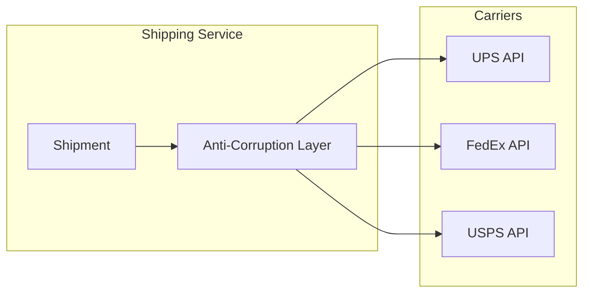

# Shipping Service

The Shipping Service handles carrier integration and the SLAM process.

## Overview

| Property | Value |
|----------|-------|
| **Port** | 8007 |
| **Database** | shipping_db |
| **Aggregate Root** | Shipment |
| **Bounded Context** | Shipping |

## Responsibilities

- Carrier rate shopping
- Label generation
- SLAM process execution
- Manifest management
- Delivery tracking

## API Endpoints

### Create Shipment

```http
POST /api/v1/shipments
Content-Type: application/json

{
  "orderId": "ORD-12345",
  "packageId": "PKG-001",
  "carrier": "UPS",
  "service": "GROUND",
  "weight": { "value": 2.5, "unit": "kg" },
  "dimensions": {
    "length": 30, "width": 20, "height": 15, "unit": "cm"
  },
  "shippingAddress": {
    "street": "123 Main St",
    "city": "New York",
    "state": "NY",
    "zipCode": "10001",
    "country": "US"
  }
}
```

### Generate Label

```http
POST /api/v1/shipments/{id}/label
```

Response:
```json
{
  "trackingNumber": "1Z999AA10123456784",
  "labelFormat": "PDF",
  "labelData": "base64..."
}
```

### Get Rates

```http
POST /api/v1/rates
Content-Type: application/json

{
  "origin": { ... },
  "destination": { ... },
  "weight": { "value": 2.5, "unit": "kg" },
  "dimensions": { ... }
}
```

### Scan Package (SLAM - S)

```http
PUT /api/v1/shipments/{id}/scan
Content-Type: application/json

{
  "scannedPackageId": "PKG-001"
}
```

### Verify Label (SLAM - L)

```http
PUT /api/v1/shipments/{id}/verify-label
Content-Type: application/json

{
  "scannedTrackingNumber": "1Z999AA10123456784"
}
```

### Stage (SLAM - A)

```http
PUT /api/v1/shipments/{id}/stage
Content-Type: application/json

{
  "dockLocation": "DOCK-UPS-01"
}
```

### Manifest (SLAM - M)

```http
PUT /api/v1/shipments/{id}/manifest
```

### Confirm Ship

```http
PUT /api/v1/shipments/{id}/confirm
```

## Domain Events Published

| Event | Topic | Description |
|-------|-------|-------------|
| ShipmentCreatedEvent | wms.shipping.events | Created |
| LabelGeneratedEvent | wms.shipping.events | Label printed |
| ShipmentManifestedEvent | wms.shipping.events | Added to manifest |
| ShipConfirmedEvent | wms.shipping.events | Carrier pickup |
| DeliveryConfirmedEvent | wms.shipping.events | Delivered |

## Supported Carriers

| Carrier | Services |
|---------|----------|
| UPS | Ground, 2-Day, Next Day Air |
| FedEx | Ground, Express, Priority Overnight |
| USPS | Priority, First Class |
| DHL | Express, eCommerce |

## Anti-Corruption Layer



## Configuration

| Variable | Description | Default |
|----------|-------------|---------|
| SERVICE_NAME | Service identifier | shipping-service |
| MONGODB_DATABASE | Database name | shipping_db |
| UPS_API_KEY | UPS credentials | Required |
| FEDEX_API_KEY | FedEx credentials | Required |

## Related Documentation

- [Shipment Aggregate](/domain-driven-design/aggregates/shipment) - Domain model
- [Shipping Workflow](/architecture/sequence-diagrams/shipping-workflow) - SLAM process
