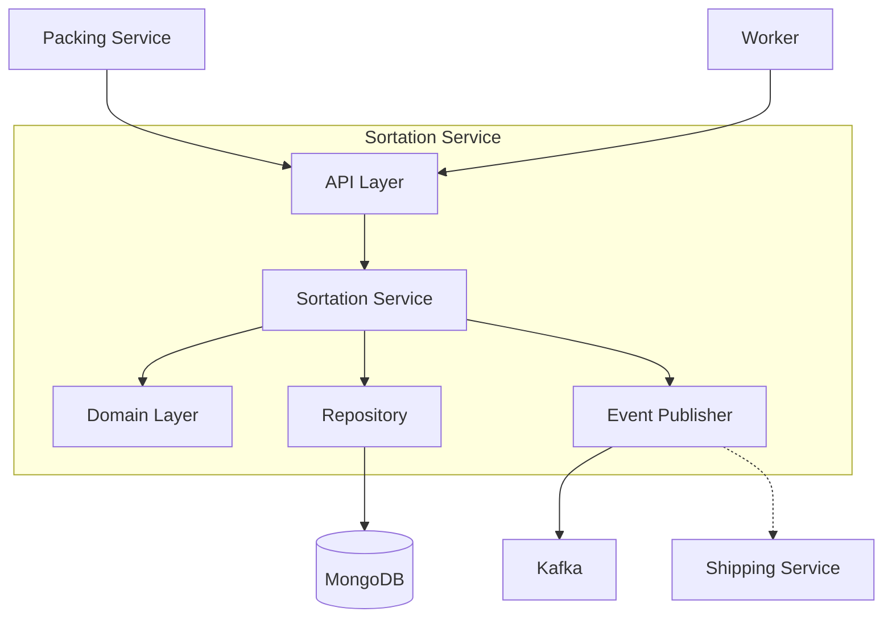
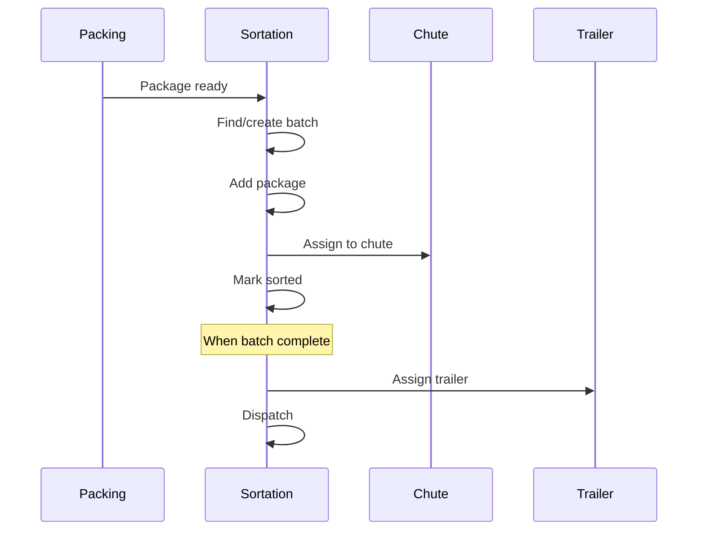

# Sortation Service

The Sortation Service manages package sortation, grouping packages by destination and carrier for efficient dispatch.

## Overview

| Property | Value |
|----------|-------|
| **Port** | 8012 |
| **Database** | sortation_db |
| **Aggregate Root** | SortationBatch |
| **Bounded Context** | Sortation |

## Responsibilities

- Create and manage sortation batches
- Group packages by destination/carrier combination
- Assign packages to physical chutes
- Track sorting progress
- Coordinate trailer assignment and dispatch

## API Endpoints

### Create Sortation Batch

```http
POST /api/v1/batches
Content-Type: application/json

{
  "sortationCenter": "MAIN-SORT",
  "destinationGroup": "945",
  "carrierId": "FEDEX"
}
```

### Add Package to Batch

```http
POST /api/v1/batches/{batchId}/packages
Content-Type: application/json

{
  "packageId": "PKG-001234",
  "orderId": "ORD-001234",
  "trackingNumber": "794644790132",
  "destination": "94501",
  "weight": 2.5
}
```

### Sort Package to Chute

```http
POST /api/v1/batches/{batchId}/sort
Content-Type: application/json

{
  "packageId": "PKG-001234",
  "chuteId": "CHUTE-A01",
  "workerId": "WORKER-001"
}
```

### Dispatch Batch

```http
POST /api/v1/batches/{batchId}/dispatch
Content-Type: application/json

{
  "trailerId": "TRL-001",
  "dispatchDock": "DOCK-OUT-A1"
}
```

## Domain Events Published

| Event | Topic | Description |
|-------|-------|-------------|
| SortationBatchCreatedEvent | wms.sortation.events | Batch created |
| PackageReceivedForSortationEvent | wms.sortation.events | Package added to batch |
| PackageSortedEvent | wms.sortation.events | Package sorted to chute |
| BatchReadyEvent | wms.sortation.events | Batch ready for dispatch |
| BatchDispatchedEvent | wms.sortation.events | Batch dispatched |

## Configuration

| Variable | Description | Default |
|----------|-------------|---------|
| SERVICE_NAME | Service identifier | sortation-service |
| MONGODB_DATABASE | Database name | sortation_db |
| MONGODB_URI | Connection string | Required |
| KAFKA_BROKERS | Kafka brokers | Required |
| LOG_LEVEL | Logging level | info |

## Health Endpoints

- `GET /health` - Liveness probe
- `GET /ready` - Readiness probe (checks DB, Kafka)
- `GET /metrics` - Prometheus metrics

## Architecture



## Sortation Flow



## Related Documentation

- [SortationBatch Aggregate](/domain-driven-design/aggregates/sortation-batch) - Domain model
- [Shipping Service](/services/shipping-service) - Receives dispatched batches
