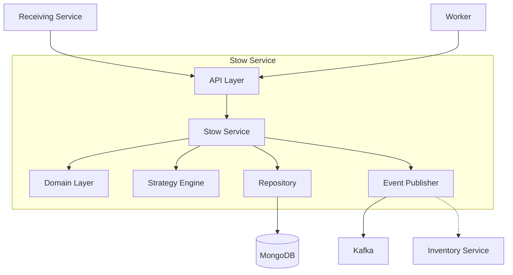

# Stow Service

The Stow Service manages putaway tasks and storage location assignment using various storage strategies.

## Overview

| Property | Value |
|----------|-------|
| **Port** | 8011 |
| **Database** | stow_db |
| **Aggregate Root** | PutawayTask |
| **Bounded Context** | Stow |

## Responsibilities

- Create and manage putaway tasks
- Apply storage strategies (chaotic, directed, velocity, zone-based)
- Assign storage locations based on item constraints
- Track task lifecycle from assignment to completion
- Support special handling (hazmat, cold chain, oversized)

## Storage Strategies

| Strategy | Description |
|----------|-------------|
| `chaotic` | Random available location (Amazon-style) - maximizes space utilization |
| `directed` | System-assigned locations based on predefined rules |
| `velocity` | High-velocity SKUs near pick zones, slow-movers in reserve |
| `zone_based` | Products grouped by category in designated zones |

## API Endpoints

### Create Putaway Task

```http
POST /api/v1/tasks
Content-Type: application/json

{
  "shipmentId": "SHIP-001234",
  "sku": "SKU-12345",
  "productName": "Widget A",
  "quantity": 100,
  "sourceToteId": "TOTE-001",
  "strategy": "chaotic",
  "constraints": {
    "isHazmat": false,
    "requiresColdChain": false
  },
  "priority": 1
}
```

### Assign Task to Worker

```http
POST /api/v1/tasks/{taskId}/assign
Content-Type: application/json

{
  "workerId": "WORKER-001"
}
```

### Record Stow Progress

```http
POST /api/v1/tasks/{taskId}/stow
Content-Type: application/json

{
  "quantity": 25,
  "locationId": "A-01-02-03"
}
```

### Complete Task

```http
POST /api/v1/tasks/{taskId}/complete
```

## Domain Events Published

| Event | Topic | Description |
|-------|-------|-------------|
| PutawayTaskCreatedEvent | wms.stow.events | Task created |
| PutawayTaskAssignedEvent | wms.stow.events | Task assigned to worker |
| LocationAssignedEvent | wms.stow.events | Location assigned to task |
| ItemStowedEvent | wms.stow.events | Items stowed at location |
| PutawayTaskCompletedEvent | wms.stow.events | Task completed |
| PutawayTaskFailedEvent | wms.stow.events | Task failed |

## Configuration

| Variable | Description | Default |
|----------|-------------|---------|
| SERVICE_NAME | Service identifier | stow-service |
| MONGODB_DATABASE | Database name | stow_db |
| MONGODB_URI | Connection string | Required |
| KAFKA_BROKERS | Kafka brokers | Required |
| LOG_LEVEL | Logging level | info |

## Health Endpoints

- `GET /health` - Liveness probe
- `GET /ready` - Readiness probe (checks DB, Kafka)
- `GET /metrics` - Prometheus metrics

## Architecture



## Related Documentation

- [PutawayTask Aggregate](/domain-driven-design/aggregates/putaway-task) - Domain model
- [Receiving Service](/services/receiving-service) - Creates putaway tasks
