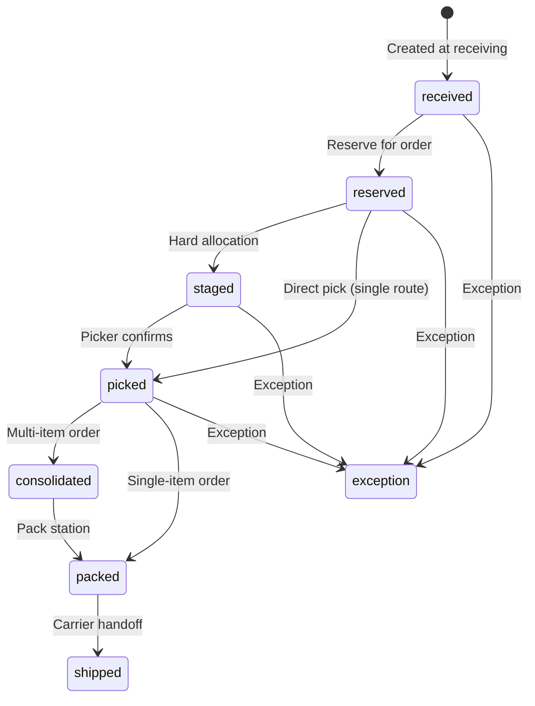
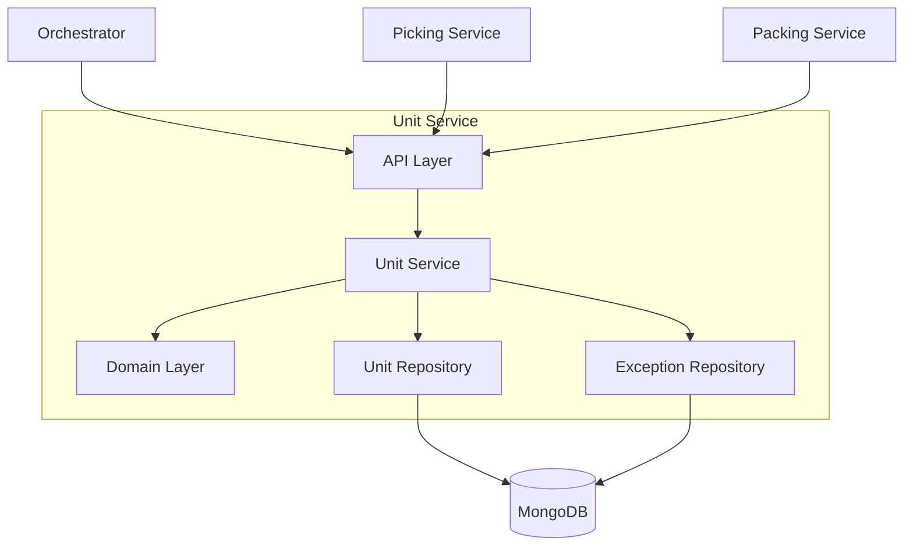
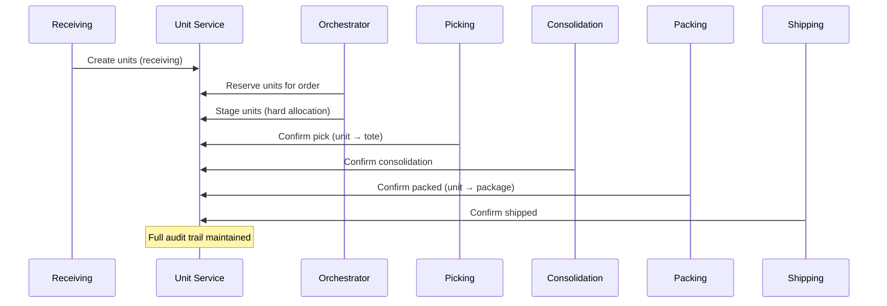
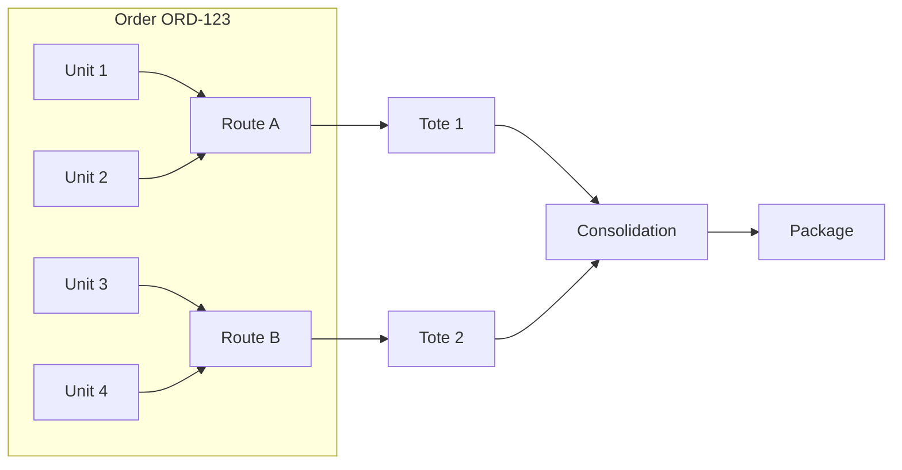

# Unit Service

The Unit Service provides individual unit-level tracking throughout the warehouse fulfillment process, maintaining a complete audit trail of each physical unit's journey from receiving to shipping.

## Overview

| Property | Value |
|----------|-------|
| **Port** | 8014 |
| **Database** | unit_db |
| **Aggregate Root** | Unit |
| **Bounded Context** | Unit Tracking |

## Responsibilities

- Track individual physical units through fulfillment lifecycle
- Maintain complete movement audit trail
- Reserve units for orders (soft allocation)
- Stage units for picking (hard allocation)
- Handle unit-level exceptions
- Support multi-route order tracking

## Unit Lifecycle

Units progress through these statuses:

| Status | Description | Triggered By |
|--------|-------------|--------------|
| `received` | Unit created at receiving dock | Inbound shipment receipt |
| `reserved` | Soft allocated to an order | Order placement |
| `staged` | Hard allocated, ready for picking | Wave planning |
| `picked` | Physically picked into tote | Picker confirmation |
| `consolidated` | Combined with other units | Consolidation workflow |
| `packed` | Placed in shipping package | Packing station |
| `shipped` | Handed off to carrier | Shipping manifest |
| `exception` | Exception reported | Exception handling |



## API Endpoints

### Unit Management

#### Create Units

```http
POST /api/v1/units
Content-Type: application/json

{
  "sku": "SKU-001",
  "shipmentId": "SHIP-12345",
  "locationId": "RECV-DOCK-01",
  "quantity": 10,
  "createdBy": "WORKER-001"
}
```

**Response:**

```json
{
  "unitIds": ["unit-uuid-1", "unit-uuid-2", "..."],
  "sku": "SKU-001",
  "count": 10
}
```

#### Reserve Units

```http
POST /api/v1/units/reserve
Content-Type: application/json

{
  "orderId": "ORD-12345",
  "pathId": "PATH-001",
  "items": [
    { "sku": "SKU-001", "quantity": 2 },
    { "sku": "SKU-002", "quantity": 1 }
  ],
  "handlerId": "SYSTEM"
}
```

**Response:**

```json
{
  "reservedUnits": [
    { "unitId": "unit-uuid-1", "sku": "SKU-001", "locationId": "A-01-02" },
    { "unitId": "unit-uuid-2", "sku": "SKU-001", "locationId": "A-01-02" },
    { "unitId": "unit-uuid-3", "sku": "SKU-002", "locationId": "B-02-03" }
  ],
  "failedItems": []
}
```

#### Get Unit

```http
GET /api/v1/units/{unitId}
```

#### Get Units for Order

```http
GET /api/v1/units/order/{orderId}
```

#### Get Unit Audit Trail

```http
GET /api/v1/units/{unitId}/audit
```

**Response:**

```json
{
  "unitId": "unit-uuid-1",
  "movements": [
    {
      "movementId": "move-1",
      "fromLocationId": "",
      "toLocationId": "RECV-DOCK-01",
      "fromStatus": "",
      "toStatus": "received",
      "handlerId": "WORKER-001",
      "timestamp": "2024-01-15T10:00:00Z",
      "notes": "Unit created at receiving"
    },
    {
      "movementId": "move-2",
      "fromLocationId": "RECV-DOCK-01",
      "toLocationId": "RECV-DOCK-01",
      "fromStatus": "received",
      "toStatus": "reserved",
      "handlerId": "SYSTEM",
      "timestamp": "2024-01-15T10:30:00Z",
      "notes": "Reserved for order"
    }
  ]
}
```

### Unit Operations

#### Confirm Pick

```http
POST /api/v1/units/{unitId}/pick
Content-Type: application/json

{
  "toteId": "TOTE-001",
  "pickerId": "PICKER-001",
  "stationId": "PICK-STATION-01"
}
```

#### Confirm Consolidation

```http
POST /api/v1/units/{unitId}/consolidate
Content-Type: application/json

{
  "destinationBin": "CONSOL-BIN-01",
  "workerId": "WORKER-001",
  "stationId": "CONSOL-STATION-01"
}
```

#### Confirm Packed

```http
POST /api/v1/units/{unitId}/pack
Content-Type: application/json

{
  "packageId": "PKG-001",
  "packerId": "PACKER-001",
  "stationId": "PACK-STATION-01"
}
```

#### Confirm Shipped

```http
POST /api/v1/units/{unitId}/ship
Content-Type: application/json

{
  "shipmentId": "SHIP-OUT-001",
  "trackingNumber": "1Z999AA10123456784",
  "handlerId": "SHIPPER-001"
}
```

### Exception Management

#### Create Exception

```http
POST /api/v1/units/{unitId}/exception
Content-Type: application/json

{
  "exceptionType": "damaged",
  "stage": "picking",
  "description": "Item found damaged during pick",
  "stationId": "PICK-STATION-01",
  "reportedBy": "PICKER-001"
}
```

#### Get Exceptions for Order

```http
GET /api/v1/exceptions/order/{orderId}
```

#### Get Unresolved Exceptions

```http
GET /api/v1/exceptions/unresolved
```

#### Resolve Exception

```http
POST /api/v1/exceptions/{exceptionId}/resolve
Content-Type: application/json

{
  "resolution": "Replaced with new unit from inventory",
  "resolvedBy": "SUPERVISOR-001"
}
```

## Domain Events Published

| Event | Description |
|-------|-------------|
| `UnitCreatedEvent` | Unit created at receiving |
| `UnitReservedEvent` | Unit reserved for order |
| `UnitStagedEvent` | Unit staged for picking |
| `UnitPickedEvent` | Unit physically picked |
| `UnitConsolidatedEvent` | Unit consolidated |
| `UnitPackedEvent` | Unit packed into package |
| `UnitShippedEvent` | Unit shipped |
| `UnitExceptionEvent` | Exception reported |

## Domain Model

### Unit Aggregate

```go
type Unit struct {
    ID                string
    UnitID            string
    SKU               string
    OrderID           string
    ShipmentID        string
    Status            UnitStatus
    CurrentLocationID string
    AssignedPathID    string

    // Allocation tracking
    ReservationID     string
    AllocationID      string
    ToteID            string
    PackageID         string

    // Multi-route support
    RouteID           string
    RouteIndex        int
    SourceToteID      string

    // Audit trail
    Movements         []UnitMovement

    // Exception info
    ExceptionID       string
    ExceptionReason   string

    // Timestamps
    ReceivedAt        time.Time
    ReservedAt        *time.Time
    StagedAt          *time.Time
    PickedAt          *time.Time
    ConsolidatedAt    *time.Time
    PackedAt          *time.Time
    ShippedAt         *time.Time
}
```

### UnitMovement (Audit Trail)

```go
type UnitMovement struct {
    MovementID     string
    FromLocationID string
    ToLocationID   string
    FromStatus     UnitStatus
    ToStatus       UnitStatus
    StationID      string
    HandlerID      string
    Timestamp      time.Time
    Notes          string
}
```

## Configuration

| Variable | Description | Default |
|----------|-------------|---------|
| SERVICE_NAME | Service identifier | unit-service |
| SERVER_ADDR | Server address | :8014 |
| MONGODB_URI | MongoDB connection string | Required |
| MONGODB_DATABASE | Database name | unit_db |
| OTEL_EXPORTER_OTLP_ENDPOINT | OpenTelemetry endpoint | localhost:4317 |
| TRACING_ENABLED | Enable distributed tracing | true |
| LOG_LEVEL | Logging level | info |

## Health Endpoints

- `GET /health` - Liveness probe
- `GET /ready` - Readiness probe (checks MongoDB)
- `GET /metrics` - Prometheus metrics

## Architecture



## Unit Tracking Flow



## Multi-Route Support

For orders that span multiple picking routes, units track:

- **RouteID**: Which picking route the unit is assigned to
- **RouteIndex**: Order of routes (for route sequencing)
- **SourceToteID**: Tote from picking (for consolidation)



## Related Documentation

- [Unit Aggregate](/domain-driven-design/aggregates/unit) - Domain model
- [Picking Workflow](/temporal/workflows/picking) - Picking orchestration
- [Consolidation Workflow](/temporal/workflows/consolidation) - Consolidation process
- [Unit Tracking Sequence](/architecture/sequence-diagrams/unit-tracking) - Detailed flow
