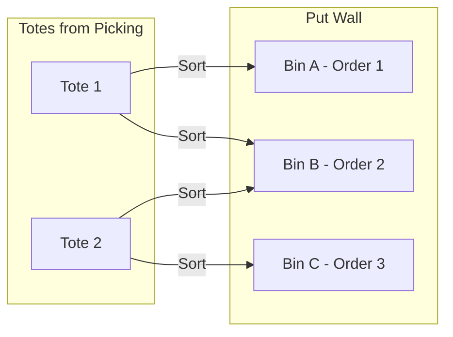
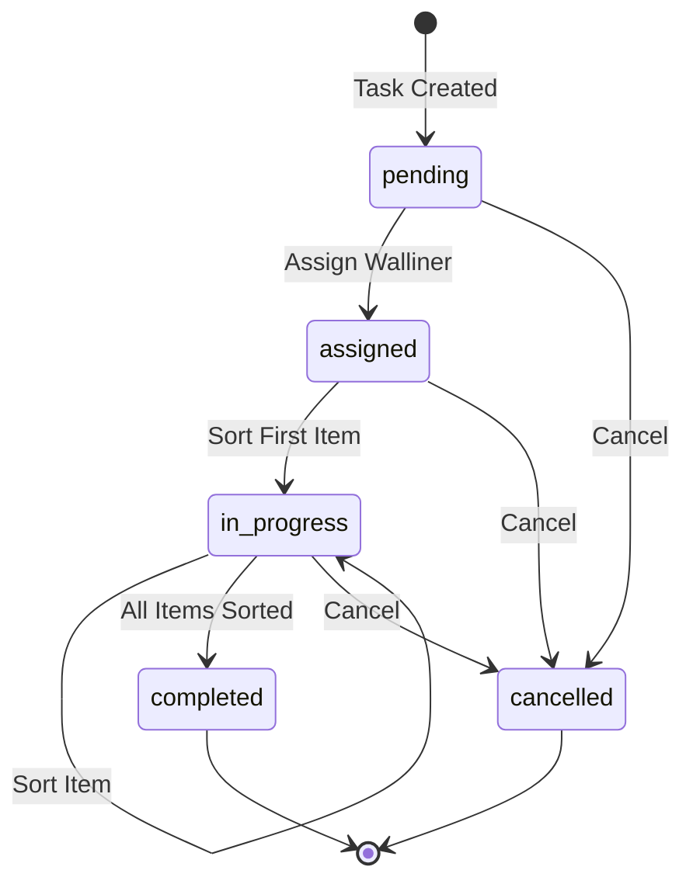
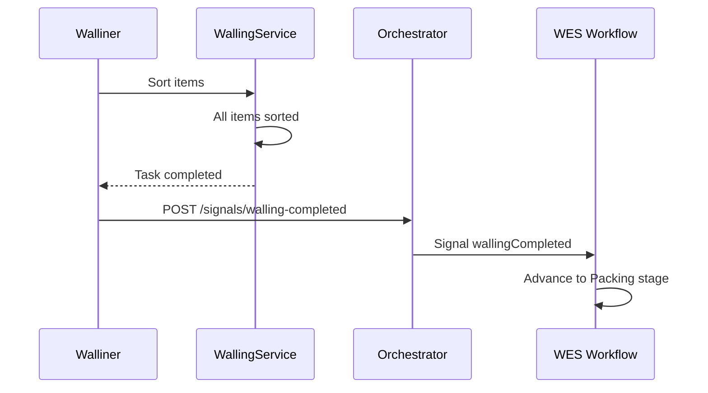
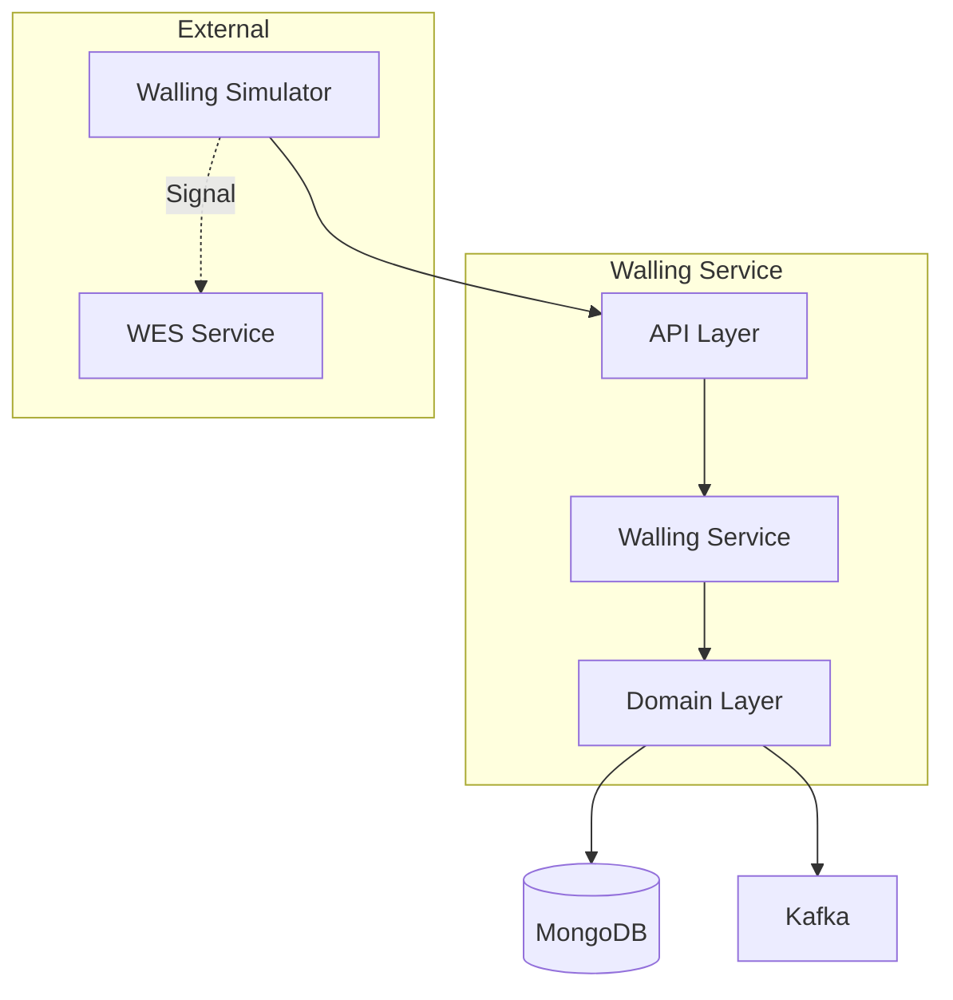

# Walling Service

The Walling Service manages put-wall operations for sorting picked items into order-specific bins before packing. It is used in the `pick_wall_pack` process path for medium-sized orders.

## Overview

| Property | Value |
|----------|-------|
| **Port** | 8017 |
| **Database** | walling_db |
| **Aggregate Root** | WallingTask |
| **Bounded Context** | Walling |

## Responsibilities

- Create walling tasks from picked items
- Assign walliners (workers) to tasks
- Track item sorting from totes to bins
- Verify sort accuracy
- Signal WES workflow on completion

## Put-Wall Concept

A put-wall is a physical sorting structure with multiple bins. Workers (walliners) sort items from pick totes into order-specific bins:



## API Endpoints

### Create Walling Task

```http
POST /api/v1/tasks
Content-Type: application/json

{
  "orderId": "ORD-12345",
  "waveId": "WAVE-001",
  "putWallId": "PUTWALL-1",
  "destinationBin": "BIN-A1",
  "sourceTotes": [
    {"toteId": "TOTE-001", "pickTaskId": "PT-001", "itemCount": 3}
  ],
  "itemsToSort": [
    {"sku": "SKU-001", "quantity": 2, "fromToteId": "TOTE-001"},
    {"sku": "SKU-002", "quantity": 1, "fromToteId": "TOTE-001"}
  ]
}
```

Response:
```json
{
  "taskId": "WT-a1b2c3d4",
  "orderId": "ORD-12345",
  "status": "pending",
  "putWallId": "PUTWALL-1",
  "destinationBin": "BIN-A1",
  "itemsToSort": 3,
  "createdAt": "2024-01-15T10:00:00Z"
}
```

### Get Pending Tasks by Put Wall

```http
GET /api/v1/tasks/pending?putWallId=PUTWALL-1&limit=10
```

Response:
```json
{
  "tasks": [
    {
      "taskId": "WT-a1b2c3d4",
      "orderId": "ORD-12345",
      "status": "pending",
      "priority": 5,
      "itemCount": 3
    }
  ],
  "total": 1
}
```

### Get Task

```http
GET /api/v1/tasks/{taskId}
```

### Get Active Task by Walliner

```http
GET /api/v1/tasks/walliner/{wallinerId}/active
```

### Assign Walliner

```http
POST /api/v1/tasks/{taskId}/assign
Content-Type: application/json

{
  "wallinerId": "WALLINER-001",
  "station": "WALL-STATION-1"
}
```

### Sort Item

Records an item being sorted from a tote into the destination bin.

```http
POST /api/v1/tasks/{taskId}/sort
Content-Type: application/json

{
  "sku": "SKU-001",
  "quantity": 1,
  "fromToteId": "TOTE-001"
}
```

Response:
```json
{
  "taskId": "WT-a1b2c3d4",
  "sku": "SKU-001",
  "quantitySorted": 1,
  "remainingItems": 2,
  "allItemsSorted": false
}
```

### Complete Task

Manually completes the task (auto-completes when all items sorted).

```http
POST /api/v1/tasks/{taskId}/complete
```

## Task Lifecycle



## Domain Events Published

| Event | Topic | Description |
|-------|-------|-------------|
| WallingTaskCreatedEvent | wms.walling.events | Task created |
| WallingTaskAssignedEvent | wms.walling.events | Walliner assigned |
| ItemSortedEvent | wms.walling.events | Item sorted to bin |
| WallingTaskCompletedEvent | wms.walling.events | Task completed |

### Event Payloads

**WallingTaskCreatedEvent**
```json
{
  "type": "wms.walling.task-created",
  "taskId": "WT-a1b2c3d4",
  "orderId": "ORD-12345",
  "waveId": "WAVE-001",
  "putWallId": "PUTWALL-1",
  "destinationBin": "BIN-A1",
  "itemCount": 3,
  "createdAt": "2024-01-15T10:00:00Z"
}
```

**ItemSortedEvent**
```json
{
  "type": "wms.walling.item-sorted",
  "taskId": "WT-a1b2c3d4",
  "orderId": "ORD-12345",
  "sku": "SKU-001",
  "quantity": 1,
  "toteId": "TOTE-001",
  "binId": "BIN-A1",
  "sortedAt": "2024-01-15T10:05:00Z"
}
```

**WallingTaskCompletedEvent**
```json
{
  "type": "wms.walling.task-completed",
  "taskId": "WT-a1b2c3d4",
  "orderId": "ORD-12345",
  "wallinerId": "WALLINER-001",
  "destinationBin": "BIN-A1",
  "itemsSorted": 3,
  "completedAt": "2024-01-15T10:10:00Z"
}
```

## Integration with WES

When a walling task completes, the simulator/worker sends a `wallingCompleted` signal to the orchestrator, which forwards it to the WES workflow:



## Configuration

| Variable | Description | Default |
|----------|-------------|---------|
| SERVICE_NAME | Service identifier | walling-service |
| HTTP_PORT | HTTP server port | 8017 |
| MONGODB_URI | MongoDB connection string | Required |
| MONGODB_DATABASE | Database name | walling_db |

## Architecture



## Health Endpoints

- `GET /health` - Liveness check
- `GET /ready` - Readiness check (MongoDB connected)

## Related Documentation

- [WallingTask Aggregate](/domain-driven-design/aggregates/walling-task) - Domain model
- [Walling Workflow](/architecture/sequence-diagrams/walling-workflow) - Sequence diagram
- [WES Service](/services/wes-service) - Execution orchestration
