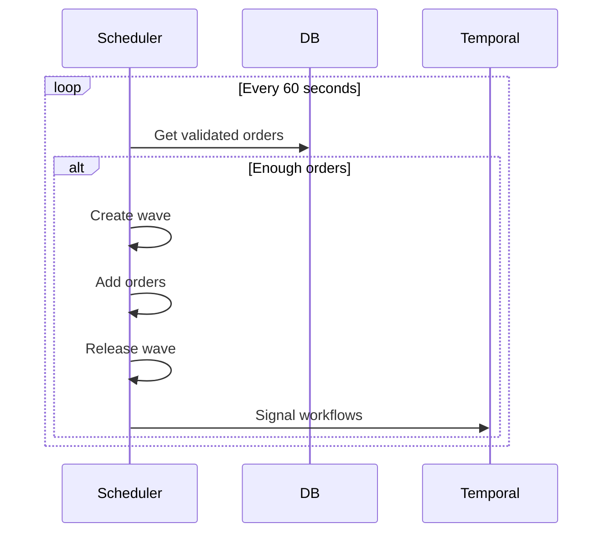
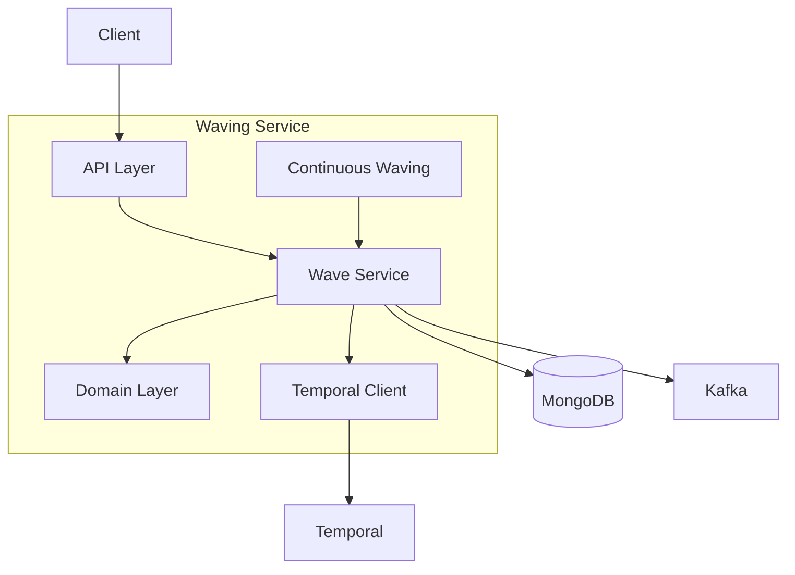

# Waving Service

The Waving Service groups orders into waves for efficient batch processing.

## Overview

| Property | Value |
|----------|-------|
| **Port** | 8002 |
| **Database** | waves_db |
| **Aggregate Root** | Wave |
| **Bounded Context** | Waving |

## Responsibilities

- Create and manage waves
- Group orders by priority and zone
- Schedule wave release times
- Signal Temporal workflows when waves are released
- Continuous waving scheduler

## API Endpoints

### Create Wave

```http
POST /api/v1/waves
Content-Type: application/json

{
  "type": "standard",
  "maxOrders": 50
}
```

### Add Order to Wave

```http
POST /api/v1/waves/{id}/orders
Content-Type: application/json

{
  "orderId": "ORD-12345"
}
```

### Schedule Wave

```http
PUT /api/v1/waves/{id}/schedule
Content-Type: application/json

{
  "scheduledAt": "2024-01-15T14:00:00Z"
}
```

### Release Wave

```http
PUT /api/v1/waves/{id}/release
```

### Get Scheduler Status

```http
GET /api/v1/scheduler/status
```

Response:
```json
{
  "enabled": true,
  "running": true,
  "lastRun": "2024-01-15T10:30:00Z",
  "nextRun": "2024-01-15T10:31:00Z"
}
```

## Continuous Waving Scheduler

The service includes an automatic scheduler that:

1. Polls for validated orders every 60 seconds
2. Creates waves when enough orders are pending
3. Automatically releases waves
4. Signals Temporal workflows

Enable with: `CONTINUOUS_WAVING_ENABLED=true`



## Domain Events Published

| Event | Topic | Description |
|-------|-------|-------------|
| WaveCreatedEvent | wms.waves.events | Wave created |
| OrderAddedToWaveEvent | wms.waves.events | Order added |
| WaveScheduledEvent | wms.waves.events | Wave scheduled |
| WaveReleasedEvent | wms.waves.events | Released for picking |
| WaveCompletedEvent | wms.waves.events | All orders done |
| WaveCancelledEvent | wms.waves.events | Wave cancelled |

## Configuration

| Variable | Description | Default |
|----------|-------------|---------|
| SERVICE_NAME | Service identifier | waving-service |
| MONGODB_DATABASE | Database name | waves_db |
| CONTINUOUS_WAVING_ENABLED | Enable scheduler | false |
| TEMPORAL_HOST | Temporal server | Required |
| TEMPORAL_NAMESPACE | Temporal namespace | wms |

## Architecture



## Related Documentation

- [Wave Aggregate](/domain-driven-design/aggregates/wave) - Domain model
- [Order Fulfillment](/architecture/sequence-diagrams/order-fulfillment) - Workflow
