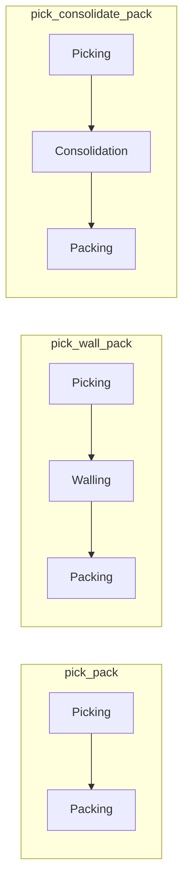
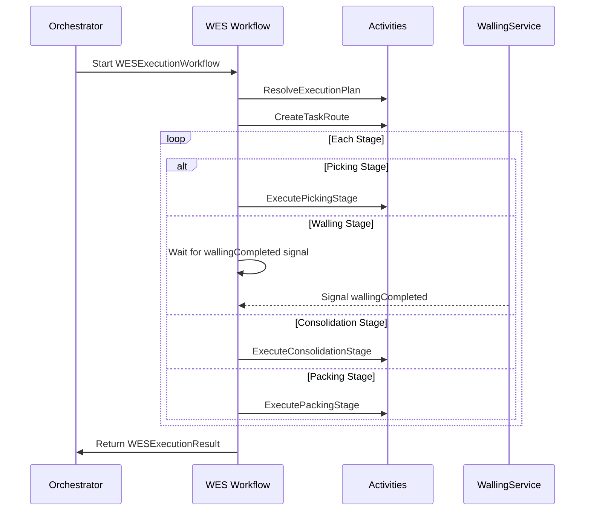
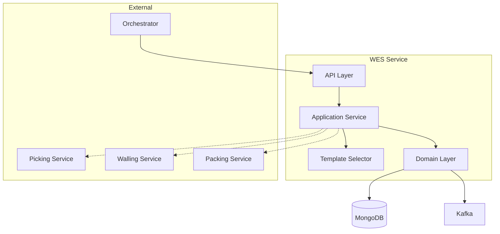

# WES Service

The Warehouse Execution System (WES) Service orchestrates order execution through configurable process paths, managing the flow from picking through optional walling/consolidation to packing.

## Overview

| Property | Value |
|----------|-------|
| **Port** | 8016 |
| **Database** | wes_db |
| **Aggregate Root** | TaskRoute |
| **Bounded Context** | Execution |

## Responsibilities

- Resolve execution plans based on order characteristics
- Manage stage templates (pick_pack, pick_wall_pack, pick_consolidate_pack)
- Create and track task routes through stages
- Coordinate stage transitions with signals
- Seed default templates on startup

## Process Paths

WES supports three process paths based on order characteristics:

| Path Type | Stages | Use Case |
|-----------|--------|----------|
| `pick_pack` | Picking → Packing | Small orders (1-3 items) |
| `pick_wall_pack` | Picking → Walling → Packing | Medium orders (4-20 items) |
| `pick_consolidate_pack` | Picking → Consolidation → Packing | Multi-zone orders |



## API Endpoints

### Resolve Execution Plan

Determines the optimal process path for an order.

```http
POST /api/v1/execution-plans/resolve
Content-Type: application/json

{
  "orderId": "ORD-12345",
  "items": [
    {"sku": "SKU-001", "quantity": 2},
    {"sku": "SKU-002", "quantity": 1}
  ],
  "multiZone": false,
  "specialHandling": ["fragile"]
}
```

Response:
```json
{
  "templateId": "tpl-pick-pack",
  "pathType": "pick_pack",
  "stages": [
    {"order": 1, "stageType": "picking", "taskType": "picking", "required": true},
    {"order": 2, "stageType": "packing", "taskType": "packing", "required": true}
  ]
}
```

### Create Task Route

Creates a new task route for order execution.

```http
POST /api/v1/routes
Content-Type: application/json

{
  "orderId": "ORD-12345",
  "waveId": "WAVE-001",
  "templateId": "tpl-pick-pack",
  "specialHandling": ["fragile"]
}
```

### Get Task Route

```http
GET /api/v1/routes/{routeId}
```

### Get Task Route by Order

```http
GET /api/v1/routes/order/{orderId}
```

### Assign Worker to Stage

```http
POST /api/v1/routes/{routeId}/stages/current/assign
Content-Type: application/json

{
  "workerId": "WORKER-001",
  "taskId": "TASK-001"
}
```

### Start Stage

```http
POST /api/v1/routes/{routeId}/stages/current/start
```

### Complete Stage

```http
POST /api/v1/routes/{routeId}/stages/current/complete
```

### Fail Stage

```http
POST /api/v1/routes/{routeId}/stages/current/fail
Content-Type: application/json

{
  "error": "Item not found at location"
}
```

### List Templates

```http
GET /api/v1/templates
```

### Get Template

```http
GET /api/v1/templates/{templateId}
```

## Stage Templates

Default templates seeded on startup:

### tpl-pick-pack (Default)

| Property | Value |
|----------|-------|
| **Path Type** | pick_pack |
| **Item Range** | 1-3 items |
| **Stages** | Picking (30min) → Packing (15min) |

### tpl-pick-wall-pack

| Property | Value |
|----------|-------|
| **Path Type** | pick_wall_pack |
| **Item Range** | 4-20 items |
| **Stages** | Picking (30min) → Walling (10min) → Packing (15min) |
| **Note** | Requires wallingCompleted signal |

### tpl-pick-consolidate-pack

| Property | Value |
|----------|-------|
| **Path Type** | pick_consolidate_pack |
| **Criteria** | Multi-zone orders |
| **Stages** | Picking (30min) → Consolidation (20min) → Packing (15min) |

## Domain Events Published

| Event | Topic | Description |
|-------|-------|-------------|
| RouteCreatedEvent | wms.wes.events | Task route created |
| StageAssignedEvent | wms.wes.events | Worker assigned to stage |
| StageStartedEvent | wms.wes.events | Stage execution started |
| StageCompletedEvent | wms.wes.events | Stage completed successfully |
| StageFailedEvent | wms.wes.events | Stage failed with error |
| RouteCompletedEvent | wms.wes.events | All stages completed |

## Temporal Workflow

### WESExecutionWorkflow

The main workflow orchestrating order execution:



## Signals

| Signal | Description | Source |
|--------|-------------|--------|
| wallingCompleted | Walling stage completed | Walling Service (via Orchestrator) |

## Configuration

| Variable | Description | Default |
|----------|-------------|---------|
| SERVICE_NAME | Service identifier | wes-service |
| HTTP_PORT | HTTP server port | 8016 |
| MONGODB_URI | MongoDB connection string | Required |
| MONGODB_DATABASE | Database name | wes_db |
| TEMPORAL_HOST | Temporal server | Required |
| TEMPORAL_NAMESPACE | Temporal namespace | wms |
| TEMPORAL_TASK_QUEUE | Worker task queue | wes-queue |

## Architecture



## Health Endpoints

- `GET /health` - Liveness check
- `GET /ready` - Readiness check (MongoDB connected)

## Related Documentation

- [TaskRoute Aggregate](/domain-driven-design/aggregates/task-route) - Domain model
- [WES Execution Workflow](/architecture/sequence-diagrams/wes-execution) - Sequence diagram
- [Orchestrator](/services/orchestrator) - Parent workflow
