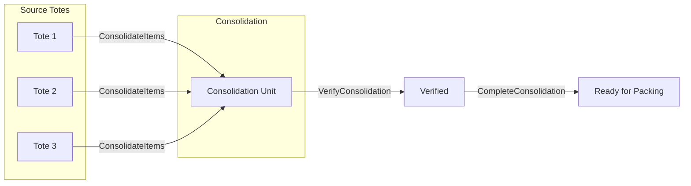

# Consolidation Activities

Activities for managing item consolidation from multiple pick totes.

## Activity Struct

```go
type ConsolidationActivities struct {
    clients *ServiceClients
    logger  *slog.Logger
}
```

## Activities

### CreateConsolidationUnit

Creates a consolidation container for multi-item orders.

**Signature:**
```go
func (a *ConsolidationActivities) CreateConsolidationUnit(ctx context.Context, input map[string]interface{}) (string, error)
```

**Input:**
```go
{
    "orderId":     string,
    "waveId":      string,
    "pickedItems": []PickedItem
}
```

**Output:** `string` - Consolidation ID

---

### ConsolidateItems

Physically moves items from source totes to consolidation container.

**Signature:**
```go
func (a *ConsolidationActivities) ConsolidateItems(ctx context.Context, input map[string]interface{}) error
```

**Input:**
```go
{
    "consolidationId": string,
    "pickedItems":     []PickedItem
}
```

---

### VerifyConsolidation

Verifies all expected items are present in the consolidation container.

**Signature:**
```go
func (a *ConsolidationActivities) VerifyConsolidation(ctx context.Context, consolidationID string) (bool, error)
```

**Output:** `bool` - True if all items verified

---

### CompleteConsolidation

Marks the consolidation as complete.

**Signature:**
```go
func (a *ConsolidationActivities) CompleteConsolidation(ctx context.Context, consolidationID string) error
```

---

### AssignStation

Assigns a consolidation station and worker.

**Signature:**
```go
func (a *ConsolidationActivities) AssignStation(ctx context.Context, input map[string]interface{}) error
```

**Input:**
```go
{
    "consolidationId": string,
    "station":         string,
    "workerId":        string,
    "destinationBin":  string
}
```

---

### ConfirmUnitConsolidation

Confirms a unit-level consolidation (when unit tracking is enabled).

**Signature:**
```go
func (a *ConsolidationActivities) ConfirmUnitConsolidation(ctx context.Context, input map[string]interface{}) error
```

**Input:**
```go
{
    "unitId":         string,
    "destinationBin": string,
    "workerId":       string,
    "stationId":      string
}
```

---

## Consolidation Flow



## Configuration

| Property | Value |
|----------|-------|
| Default Timeout | 15 minutes |
| Retry Policy | Standard (3 attempts) |
| Heartbeat | Optional |

## Related Workflows

- [Consolidation Workflow](../workflows/consolidation) - Orchestrator consolidation
- [Service Consolidation Workflow](../workflows/service-consolidation) - Service-level consolidation
