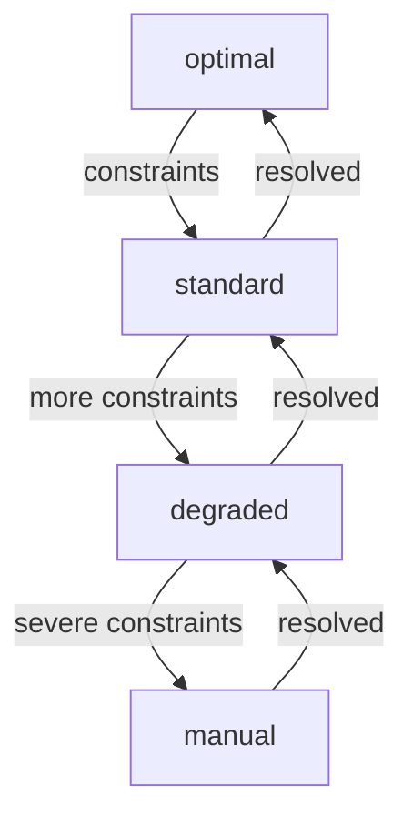

# Escalation Activities

Activities for handling process path escalation, tier changes, and fallback station discovery.

## Activity Struct

```go
type EscalationActivities struct {
    clients *clients.ServiceClients
}
```

## Activities

### EscalateProcessPath

Escalates a process path to a degraded tier when constraints are detected.

**Signature:**
```go
func (a *EscalationActivities) EscalateProcessPath(ctx context.Context, input EscalateProcessPathInput) (*EscalateProcessPathResult, error)
```

**Input:**
```go
type EscalateProcessPathInput struct {
    PathID      string `json:"pathId"`
    OrderID     string `json:"orderId"`
    FromTier    string `json:"fromTier"`
    ToTier      string `json:"toTier"`
    Trigger     string `json:"trigger"`
    Reason      string `json:"reason"`
    EscalatedBy string `json:"escalatedBy,omitempty"`
}
```

**Output:**
```go
type EscalateProcessPathResult struct {
    PathID           string    `json:"pathId"`
    NewTier          string    `json:"newTier"`
    EscalatedAt      time.Time `json:"escalatedAt"`
    FallbackStations []string  `json:"fallbackStations,omitempty"`
    Success          bool      `json:"success"`
}
```

---

### DetermineEscalationTier

Analyzes the situation and recommends an escalation tier.

**Signature:**
```go
func (a *EscalationActivities) DetermineEscalationTier(ctx context.Context, input DetermineEscalationTierInput) (*DetermineEscalationTierResult, error)
```

**Input:**
```go
type DetermineEscalationTierInput struct {
    PathID               string   `json:"pathId"`
    OrderID              string   `json:"orderId"`
    StationUnavailable   bool     `json:"stationUnavailable"`
    CapacityExceeded     bool     `json:"capacityExceeded"`
    EquipmentUnavailable bool     `json:"equipmentUnavailable"`
    WorkerUnavailable    bool     `json:"workerUnavailable"`
    Timeout              bool     `json:"timeout"`
    Requirements         []string `json:"requirements"`
}
```

**Output:**
```go
type DetermineEscalationTierResult struct {
    RecommendedTier  string   `json:"recommendedTier"`
    Trigger          string   `json:"trigger"`
    Reason           string   `json:"reason"`
    Priority         int      `json:"priority"` // 1=high, 2=medium, 3=low
    FallbackStations []string `json:"fallbackStations,omitempty"`
}
```

**Escalation Decision Matrix:**

| Condition | Tier | Trigger | Priority |
|-----------|------|---------|----------|
| Station unavailable | `degraded` | `station_unavailable` | 1 (High) |
| Critical equipment unavailable (hazmat/cold) | `manual` | `equipment_unavailable` | 1 (High) |
| Standard equipment unavailable | `degraded` | `equipment_unavailable` | 2 (Medium) |
| Worker unavailable | `standard` | `worker_unavailable` | 2 (Medium) |
| Capacity exceeded | `standard` | `capacity_exceeded` | 2 (Medium) |
| Timeout | `degraded` | `timeout` | 3 (Low) |
| No issues | `optimal` | (none) | 0 |

---

### FindFallbackStations

Finds alternative stations when the primary station fails.

**Signature:**
```go
func (a *EscalationActivities) FindFallbackStations(ctx context.Context, input FindFallbackStationsInput) (*FindFallbackStationsResult, error)
```

**Input:**
```go
type FindFallbackStationsInput struct {
    PathID            string   `json:"pathId"`
    OrderID           string   `json:"orderId"`
    FailedStationID   string   `json:"failedStationId"`
    Requirements      []string `json:"requirements"`
    SpecialHandling   []string `json:"specialHandling"`
    FacilityID        string   `json:"facilityId"`
    MaxAlternates     int      `json:"maxAlternates"` // Default: 3
}
```

**Output:**
```go
type FindFallbackStationsResult struct {
    FallbackStations []FallbackStationInfo `json:"fallbackStations"`
    Success          bool                  `json:"success"`
}

type FallbackStationInfo struct {
    StationID  string  `json:"stationId"`
    Score      float64 `json:"score"`
    Rank       int     `json:"rank"`
    Confidence float64 `json:"confidence"`
    Distance   float64 `json:"distance,omitempty"`
}
```

---

### DowngradeProcessPath

Improves a process path to a better tier (opposite of escalate).

**Signature:**
```go
func (a *EscalationActivities) DowngradeProcessPath(ctx context.Context, input DowngradeProcessPathInput) (*DowngradeProcessPathResult, error)
```

**Input:**
```go
type DowngradeProcessPathInput struct {
    PathID       string `json:"pathId"`
    OrderID      string `json:"orderId"`
    ToTier       string `json:"toTier"`
    Reason       string `json:"reason"`
    DowngradedBy string `json:"downgradedBy,omitempty"`
}
```

**Output:**
```go
type DowngradeProcessPathResult struct {
    PathID       string    `json:"pathId"`
    NewTier      string    `json:"newTier"`
    DowngradedAt time.Time `json:"downgradedAt"`
    Success      bool      `json:"success"`
}
```

**Use Case:** When constraints are resolved and order can return to optimal processing.

## Tier Hierarchy



| Tier | Description |
|------|-------------|
| `optimal` | Best station selection, no constraints |
| `standard` | Good alternatives available, minor constraints |
| `degraded` | Limited options, using fallback stations |
| `manual` | Requires supervisor intervention |

## Configuration

| Property | Value |
|----------|-------|
| Default Timeout | 2 minutes |
| Retry Policy | 3 maximum attempts |
| Heartbeat | Not required |

## Usage Example

```go
// Determine if escalation needed
determineInput := activities.DetermineEscalationTierInput{
    PathID:             "PATH-12345",
    OrderID:            "ORD-12345",
    StationUnavailable: true,
    Requirements:       []string{"standard"},
}

var decision activities.DetermineEscalationTierResult
err := workflow.ExecuteActivity(ctx, escalationActivities.DetermineEscalationTier, determineInput).Get(ctx, &decision)

if decision.RecommendedTier != "optimal" {
    // Find fallback stations
    fallbackInput := activities.FindFallbackStationsInput{
        PathID:          "PATH-12345",
        OrderID:         "ORD-12345",
        FailedStationID: "STATION-A01",
        Requirements:    []string{"standard"},
        MaxAlternates:   3,
    }

    var fallbacks activities.FindFallbackStationsResult
    err = workflow.ExecuteActivity(ctx, escalationActivities.FindFallbackStations, fallbackInput).Get(ctx, &fallbacks)

    // Escalate with fallbacks
    escalateInput := activities.EscalateProcessPathInput{
        PathID:   "PATH-12345",
        OrderID:  "ORD-12345",
        FromTier: "optimal",
        ToTier:   decision.RecommendedTier,
        Trigger:  decision.Trigger,
        Reason:   decision.Reason,
    }

    workflow.ExecuteActivity(ctx, escalationActivities.EscalateProcessPath, escalateInput).Get(ctx, nil)
}
```

## Related Workflows

- [Planning Workflow](../workflows/planning) - Uses escalation for constraint handling
- [WES Execution Workflow](../workflows/wes-execution) - May trigger escalation

## Related Documentation

- [Process Path Service](/services/process-path-service) - Tier management
