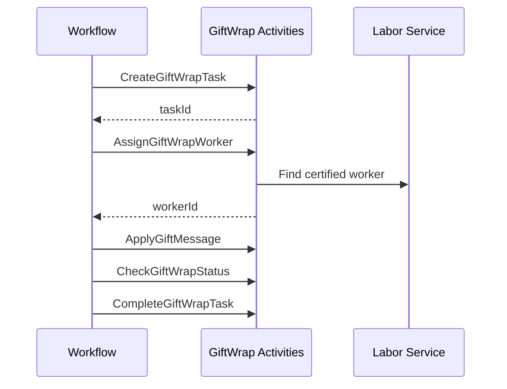

# Gift Wrap Activities

Activities for managing gift wrap operations during order fulfillment.

## Activity Struct

```go
type GiftWrapActivities struct {
    clients *ServiceClients
}
```

## Activities

### CreateGiftWrapTask

Creates a gift wrap task for an order requiring gift wrapping.

**Signature:**
```go
func (a *GiftWrapActivities) CreateGiftWrapTask(ctx context.Context, input map[string]interface{}) (string, error)
```

**Input:**
```go
{
    "orderId":   string,  // Order requiring gift wrap
    "waveId":    string,  // Wave assignment
    "stationId": string   // Gift wrap station ID
}
```

**Output:** `string` - Task ID (format: `GW-{uuid}`)

**Used By:** [OrderFulfillmentWorkflow](../workflows/order-fulfillment) when `GiftWrap: true`

---

### AssignGiftWrapWorker

Assigns a certified gift wrap worker to a task.

**Signature:**
```go
func (a *GiftWrapActivities) AssignGiftWrapWorker(ctx context.Context, input map[string]interface{}) (string, error)
```

**Input:**
```go
{
    "taskId":    string,  // Gift wrap task ID
    "stationId": string   // Station for worker assignment
}
```

**Output:** `string` - Worker ID (format: `WORKER-GW-{uuid}`)

**Notes:** Only workers with gift wrap certification are assigned.

---

### CheckGiftWrapStatus

Checks the status of a gift wrap task.

**Signature:**
```go
func (a *GiftWrapActivities) CheckGiftWrapStatus(ctx context.Context, taskID string) (bool, error)
```

**Input:** `string` - Task ID

**Output:** `bool` - True if task is complete

---

### ApplyGiftMessage

Applies a gift message to the wrapped item.

**Signature:**
```go
func (a *GiftWrapActivities) ApplyGiftMessage(ctx context.Context, input map[string]interface{}) error
```

**Input:**
```go
{
    "taskId":  string,  // Gift wrap task ID
    "message": string   // Gift message text
}
```

**Notes:** Prints a gift message card or adds the message to the package.

---

### CompleteGiftWrapTask

Marks a gift wrap task as complete.

**Signature:**
```go
func (a *GiftWrapActivities) CompleteGiftWrapTask(ctx context.Context, taskID string) error
```

**Input:** `string` - Task ID

**Side Effects:**
- Updates task status in the service
- Releases the worker
- Updates station capacity

---

## Data Types

### GiftWrapTask

```go
type GiftWrapTask struct {
    TaskID      string                 `json:"taskId"`
    OrderID     string                 `json:"orderId"`
    WaveID      string                 `json:"waveId"`
    StationID   string                 `json:"stationId"`
    WorkerID    string                 `json:"workerId,omitempty"`
    Status      string                 `json:"status"`
    Items       []GiftWrapItem         `json:"items"`
    WrapDetails map[string]interface{} `json:"wrapDetails"`
}
```

### GiftWrapItem

```go
type GiftWrapItem struct {
    SKU      string `json:"sku"`
    Quantity int    `json:"quantity"`
}
```

## Workflow Integration



## Related Documentation

- [Order Fulfillment Workflow](../workflows/order-fulfillment) - Parent workflow
- [Gift Wrap Workflow](../workflows/gift-wrap) - Child workflow for gift wrap operations
