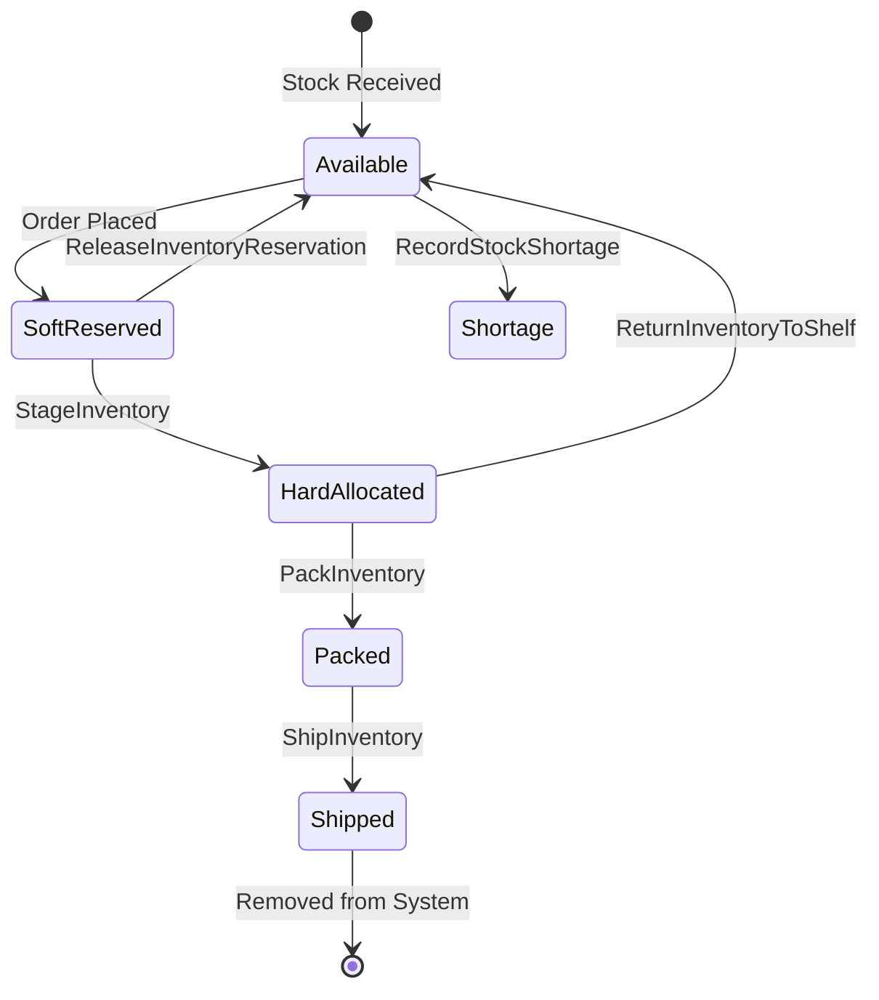

# Inventory Activities

Activities for managing inventory operations including reservations, allocations, and shipments.

## Activity Struct

```go
type InventoryActivities struct {
    clients *ServiceClients
    logger  *slog.Logger
}
```

## Activities

### ConfirmInventoryPick

Decrements inventory for all picked items.

**Signature:**
```go
func (a *InventoryActivities) ConfirmInventoryPick(ctx context.Context, input ConfirmInventoryPickInput) error
```

**Input:**
```go
type ConfirmInventoryPickInput struct {
    OrderID     string                     `json:"orderId"`
    PickedItems []ConfirmInventoryPickItem `json:"pickedItems"`
}

type ConfirmInventoryPickItem struct {
    SKU        string `json:"sku"`
    Quantity   int    `json:"quantity"`
    LocationID string `json:"locationId"`
}
```

**Behavior:**
- Records heartbeat for progress tracking
- Continues on individual item failures
- Fails only if all items fail

**Used By:** [OrchestratedPickingWorkflow](../workflows/picking)

---

### ReleaseInventoryReservation

Releases inventory reservations for an order.

**Signature:**
```go
func (a *InventoryActivities) ReleaseInventoryReservation(ctx context.Context, orderID string) error
```

**Purpose:** Releases soft reservations when order is cancelled or fails.

**Used By:**
- [OrderCancellationWorkflow](../workflows/cancellation)
- [OrderFulfillmentWorkflow](../workflows/order-fulfillment) - On failure

---

### StageInventory

Converts soft reservations to hard allocations (physical staging).

**Signature:**
```go
func (a *InventoryActivities) StageInventory(ctx context.Context, input StageInventoryInput) (*StageInventoryOutput, error)
```

**Input:**
```go
type StageInventoryInput struct {
    OrderID           string               `json:"orderId"`
    StagingLocationID string               `json:"stagingLocationId"`
    StagedBy          string               `json:"stagedBy"`
    Items             []StageInventoryItem `json:"items"`
}

type StageInventoryItem struct {
    SKU           string `json:"sku"`
    ReservationID string `json:"reservationId"`
}
```

**Output:**
```go
type StageInventoryOutput struct {
    StagedItems   []StagedItem `json:"stagedItems"`
    FailedItems   []string     `json:"failedItems,omitempty"`
    AllocationIDs []string     `json:"allocationIds"`
}

type StagedItem struct {
    SKU          string `json:"sku"`
    AllocationID string `json:"allocationId"`
}
```

**Purpose:** Creates hard allocations that can only be released via return-to-shelf.

**Used By:** [OrchestratedPickingWorkflow](../workflows/picking)

---

### PackInventory

Marks hard allocations as packed.

**Signature:**
```go
func (a *InventoryActivities) PackInventory(ctx context.Context, input PackInventoryInput) error
```

**Input:**
```go
type PackInventoryInput struct {
    OrderID  string              `json:"orderId"`
    PackedBy string              `json:"packedBy"`
    Items    []PackInventoryItem `json:"items"`
}

type PackInventoryItem struct {
    SKU          string `json:"sku"`
    AllocationID string `json:"allocationId"`
}
```

**Used By:** [PackingWorkflow](../workflows/packing)

---

### ShipInventory

Ships hard allocations (removes inventory from system).

**Signature:**
```go
func (a *InventoryActivities) ShipInventory(ctx context.Context, input ShipInventoryInput) error
```

**Input:**
```go
type ShipInventoryInput struct {
    OrderID string              `json:"orderId"`
    Items   []ShipInventoryItem `json:"items"`
}

type ShipInventoryItem struct {
    SKU          string `json:"sku"`
    AllocationID string `json:"allocationId"`
}
```

**Purpose:** Finalizes inventory removal after shipping.

**Used By:** [ShippingWorkflow](../workflows/shipping)

---

### ReturnInventoryToShelf

Returns hard allocated inventory back to available stock.

**Signature:**
```go
func (a *InventoryActivities) ReturnInventoryToShelf(ctx context.Context, input ReturnInventoryToShelfInput) error
```

**Input:**
```go
type ReturnInventoryToShelfInput struct {
    OrderID    string                       `json:"orderId"`
    ReturnedBy string                       `json:"returnedBy"`
    Reason     string                       `json:"reason"`
    Items      []ReturnInventoryToShelfItem `json:"items"`
}

type ReturnInventoryToShelfItem struct {
    SKU          string `json:"sku"`
    AllocationID string `json:"allocationId"`
}
```

**Purpose:** Compensation action for cancelled orders with hard allocations.

**Used By:** [OrderCancellationWorkflowWithAllocations](../workflows/cancellation)

---

### RecordStockShortage

Records a confirmed stock shortage discovered during picking.

**Signature:**
```go
func (a *InventoryActivities) RecordStockShortage(ctx context.Context, input RecordStockShortageInput) error
```

**Input:**
```go
type RecordStockShortageInput struct {
    SKU         string `json:"sku"`
    LocationID  string `json:"locationId"`
    OrderID     string `json:"orderId"`
    ExpectedQty int    `json:"expectedQty"`
    ActualQty   int    `json:"actualQty"`
    Reason      string `json:"reason"`      // not_found, damaged, quantity_mismatch
    ReportedBy  string `json:"reportedBy"`
}
```

**Used By:** [StockShortageWorkflow](../workflows/stock-shortage)

---

## Inventory Lifecycle



## Error Handling

| Activity | Partial Failure | Full Failure |
|----------|-----------------|--------------|
| ConfirmInventoryPick | Continue processing | Error if all fail |
| StageInventory | Return partial result | Error if all fail |
| PackInventory | Continue processing | Error if all fail |
| ShipInventory | Continue processing | Error if all fail |
| ReturnInventoryToShelf | Continue processing | Error if all fail |

## Configuration

| Property | Value |
|----------|-------|
| Default Timeout | 5 minutes |
| Retry Policy | Standard (3 attempts) |
| Heartbeat | Required for multi-item operations |

## Related Workflows

- [Order Fulfillment Workflow](../workflows/order-fulfillment) - Uses inventory activities
- [Picking Workflow](../workflows/picking) - Uses staging activities
- [Cancellation Workflow](../workflows/cancellation) - Uses release/return activities
- [Stock Shortage Workflow](../workflows/stock-shortage) - Uses shortage recording
