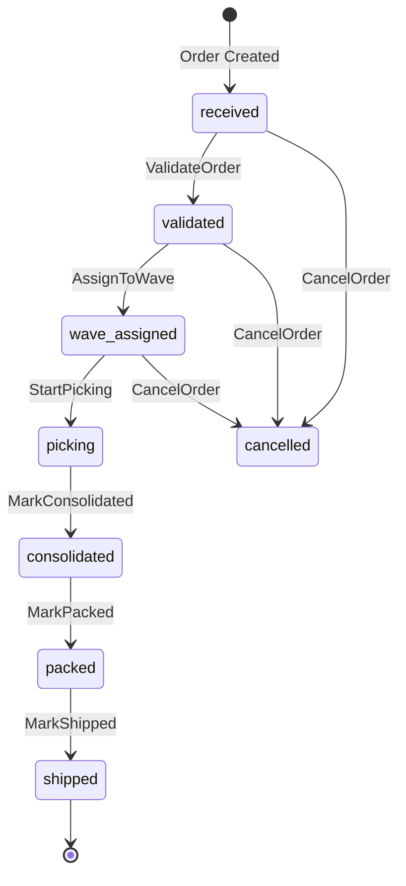

# Order Activities

Activities for managing order lifecycle and status transitions.

## Activity Struct

```go
type OrderActivities struct {
    clients *ServiceClients
    logger  *slog.Logger
}
```

## Activities

### ValidateOrder

Validates an order by calling order-service.

**Signature:**
```go
func (a *OrderActivities) ValidateOrder(ctx context.Context, input OrderFulfillmentInput) (bool, error)
```

**Purpose:** Validates order data and inventory availability before processing.

**Input:** `OrderFulfillmentInput` - Full order input with items and customer info

**Output:** `bool` - True if valid, error if invalid

**Error Handling:**
- Retryable: Network errors, service unavailable
- Non-retryable: `OrderValidationFailed` - Order data is invalid

**Example:**
```go
valid, err := workflow.ExecuteActivity(ctx, orderActivities.ValidateOrder, input).Get(ctx, &valid)
if err != nil {
    // Handle validation failure
}
```

---

### CancelOrder

Cancels an order in the order-service.

**Signature:**
```go
func (a *OrderActivities) CancelOrder(ctx context.Context, orderID string, reason string) error
```

**Purpose:** Updates order status to cancelled with reason.

**Input:**
- `orderID` - Order identifier
- `reason` - Cancellation reason

**Used By:** [OrderCancellationWorkflow](../workflows/cancellation)

---

### NotifyCustomerCancellation

Notifies the customer about order cancellation (best-effort).

**Signature:**
```go
func (a *OrderActivities) NotifyCustomerCancellation(ctx context.Context, orderID string, reason string) error
```

**Purpose:** Sends cancellation notification to customer.

**Error Handling:** Non-fatal - logs warning and returns nil on failure.

---

### AssignToWave

Assigns an order to a wave.

**Signature:**
```go
func (a *OrderActivities) AssignToWave(ctx context.Context, orderID, waveID string) error
```

**Purpose:** Updates order status to wave_assigned.

**Used By:** [PlanningWorkflow](../workflows/planning)

---

### StartPicking

Marks an order as picking in progress.

**Signature:**
```go
func (a *OrderActivities) StartPicking(ctx context.Context, orderID string) error
```

**Purpose:** Updates order status to picking.

---

### MarkConsolidated

Marks an order as consolidated.

**Signature:**
```go
func (a *OrderActivities) MarkConsolidated(ctx context.Context, orderID string) error
```

**Purpose:** Updates order status to consolidated.

---

### MarkPacked

Marks an order as packed.

**Signature:**
```go
func (a *OrderActivities) MarkPacked(ctx context.Context, orderID string) error
```

**Purpose:** Updates order status to packed.

---

## Order Status Flow



## Configuration

| Property | Value |
|----------|-------|
| Default Timeout | 2 minutes |
| Retry Policy | Standard (3 attempts) |
| Heartbeat | Not required |

## Related Workflows

- [Order Fulfillment Workflow](../workflows/order-fulfillment) - Uses order activities
- [Cancellation Workflow](../workflows/cancellation) - Uses CancelOrder
- [Planning Workflow](../workflows/planning) - Uses AssignToWave
