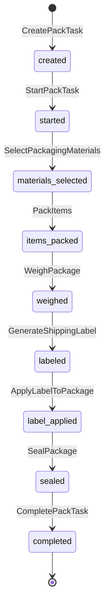

# Packing Activities

Activities for managing packing tasks, materials, and labels.

## Activity Struct

```go
type PackingActivities struct {
    clients *ServiceClients
    logger  *slog.Logger
}
```

## Activities

### CreatePackTask

Creates a pack task for an order.

**Signature:**
```go
func (a *PackingActivities) CreatePackTask(ctx context.Context, input map[string]interface{}) (string, error)
```

**Output:** `string` - Task ID

---

### StartPackTask

Sets the start timestamp on a pack task.

**Signature:**
```go
func (a *PackingActivities) StartPackTask(ctx context.Context, taskID string) error
```

---

### SelectPackagingMaterials

Chooses appropriate box/envelope based on order items.

**Signature:**
```go
func (a *PackingActivities) SelectPackagingMaterials(ctx context.Context, input map[string]interface{}) (string, error)
```

**Input:**
```go
{
    "taskId":  string,
    "orderId": string
}
```

**Output:** `string` - Package ID

---

### PackItems

Places items into the package.

**Signature:**
```go
func (a *PackingActivities) PackItems(ctx context.Context, input map[string]interface{}) error
```

**Input:**
```go
{
    "taskId":    string,
    "packageId": string
}
```

---

### WeighPackage

Records the package weight.

**Signature:**
```go
func (a *PackingActivities) WeighPackage(ctx context.Context, packageID string) (float64, error)
```

**Output:** `float64` - Weight in pounds/kg

---

### GenerateShippingLabel

Creates a carrier label with tracking number.

**Signature:**
```go
func (a *PackingActivities) GenerateShippingLabel(ctx context.Context, input map[string]interface{}) (map[string]interface{}, error)
```

**Input:**
```go
{
    "orderId":   string,
    "packageId": string,
    "weight":    float64
}
```

**Output:**
```go
{
    "trackingNumber": string,
    "carrier": {
        "code": string,
        "name": string
    },
    "labelUrl": string
}
```

---

### ApplyLabelToPackage

Attaches the label to the package.

**Signature:**
```go
func (a *PackingActivities) ApplyLabelToPackage(ctx context.Context, input map[string]interface{}) error
```

**Input:**
```go
{
    "packageId":      string,
    "trackingNumber": string
}
```

---

### SealPackage

Seals the package.

**Signature:**
```go
func (a *PackingActivities) SealPackage(ctx context.Context, packageID string) error
```

---

### CompletePackTask

Sets the completion timestamp on a pack task.

**Signature:**
```go
func (a *PackingActivities) CompletePackTask(ctx context.Context, taskID string) error
```

---

### ConfirmUnitPacked

Confirms a unit-level pack (when unit tracking is enabled).

**Signature:**
```go
func (a *PackingActivities) ConfirmUnitPacked(ctx context.Context, input map[string]interface{}) error
```

**Input:**
```go
{
    "unitId":    string,
    "packageId": string,
    "packerId":  string,
    "stationId": string
}
```

---

## Pack Task Lifecycle



## Configuration

| Property | Value |
|----------|-------|
| Default Timeout | 15 minutes |
| Retry Policy | Standard (3 attempts) |
| Heartbeat | Optional |

## Related Workflows

- [Packing Workflow](../workflows/packing) - Orchestrator packing
- [Service Packing Workflow](../workflows/service-packing) - Service-level packing
