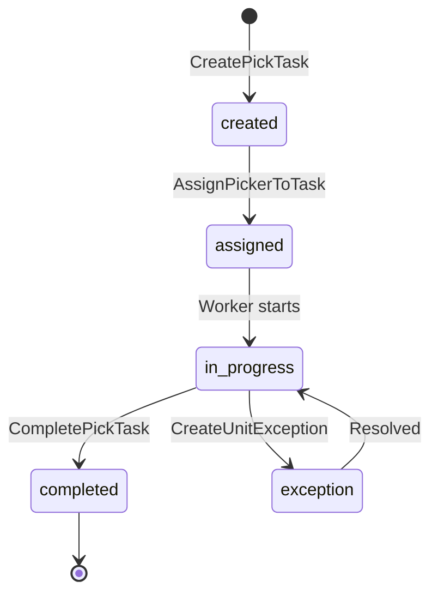

# Picking Activities

Activities for managing picking tasks and worker assignments.

## Activity Struct

```go
type PickingActivities struct {
    clients *ServiceClients
    logger  *slog.Logger
}
```

## Activities

### CreatePickTask

Creates a pick task for an order with route information.

**Signature:**
```go
func (a *PickingActivities) CreatePickTask(ctx context.Context, input map[string]interface{}) (string, error)
```

**Input:**
```go
{
    "orderId": string,
    "waveId":  string,
    "routeId": string,
    "stops":   []RouteStop,
    "items":   []ItemInfo
}
```

**Output:** `string` - Task ID

**Used By:** [PickingWorkflow](../workflows/picking), [Service PickingWorkflow](../workflows/service-picking)

---

### AssignPickerToTask

Assigns an available picker to a task.

**Signature:**
```go
func (a *PickingActivities) AssignPickerToTask(ctx context.Context, input map[string]interface{}) (string, error)
```

**Input:**
```go
{
    "taskId": string,
    "waveId": string
}
```

**Output:** `string` - Worker ID

---

### CompletePickTask

Marks a pick task as complete.

**Signature:**
```go
func (a *PickingActivities) CompletePickTask(ctx context.Context, taskID string) error
```

---

### ConfirmUnitPick

Confirms a unit-level pick (when unit tracking is enabled).

**Signature:**
```go
func (a *PickingActivities) ConfirmUnitPick(ctx context.Context, input map[string]interface{}) error
```

**Input:**
```go
{
    "unitId":    string,
    "toteId":    string,
    "pickerId":  string,
    "stationId": string
}
```

**Used By:** [OrchestratedPickingWorkflow](../workflows/picking) (unit tracking mode)

---

### CreateUnitException

Records a unit-level picking exception.

**Signature:**
```go
func (a *PickingActivities) CreateUnitException(ctx context.Context, input map[string]interface{}) (map[string]interface{}, error)
```

**Input:**
```go
{
    "unitId":        string,
    "exceptionType": string,  // "picking_failure"
    "stage":         string,  // "picking"
    "description":   string,
    "stationId":     string,
    "reportedBy":    string
}
```

**Output:**
```go
{
    "exceptionId": string
}
```

---

## Pick Task Lifecycle



## Configuration

| Property | Value |
|----------|-------|
| Default Timeout | 10 minutes |
| Retry Policy | Standard (3 attempts) |
| Heartbeat | Optional |

## Related Workflows

- [Picking Workflow](../workflows/picking) - Orchestrator picking
- [Service Picking Workflow](../workflows/service-picking) - Service-level picking
