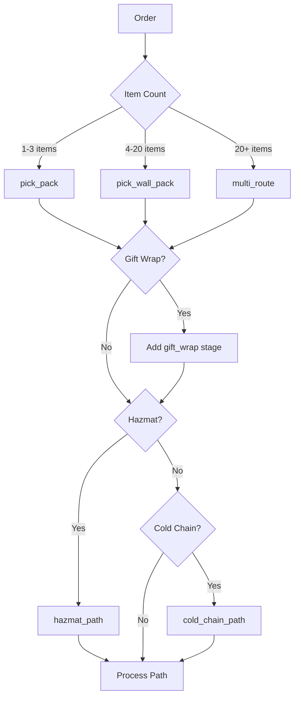

# Process Path Activities

Activities for determining and persisting order process paths.

## Activity Struct

```go
type ProcessPathActivities struct {
    clients *ServiceClients
    logger  *slog.Logger
}
```

## Overview

Process path activities determine the optimal fulfillment route for an order based on its characteristics (item count, special handling requirements, etc.).

## Activities

### DetermineProcessPath

Calculates the optimal process path for an order.

**Signature:**
```go
func (a *ProcessPathActivities) DetermineProcessPath(ctx context.Context, input map[string]interface{}) (*ProcessPathResult, error)
```

**Input:**
```go
{
    "orderId":       string,
    "items":         []Item,
    "isMultiItem":   bool,
    "giftWrap":      bool,
    "giftWrapDetails": *GiftWrapDetailsInput,
    "hazmatDetails":   *HazmatDetailsInput,
    "coldChainDetails": *ColdChainDetailsInput,
    "totalValue":    float64
}
```

**Output:**
```go
type ProcessPathResult struct {
    PathID                string   `json:"pathId"`
    Requirements          []string `json:"requirements"`          // multi_item, fragile, hazmat, etc.
    ConsolidationRequired bool     `json:"consolidationRequired"` // Needs walling step
    GiftWrapRequired      bool     `json:"giftWrapRequired"`
    SpecialHandling       []string `json:"specialHandling"`
    TargetStation         string   `json:"targetStation,omitempty"`
}
```

**Used By:** [PlanningWorkflow](../workflows/planning)

---

### PersistProcessPath

Saves the process path for unit-level tracking.

**Signature:**
```go
func (a *ProcessPathActivities) PersistProcessPath(ctx context.Context, input map[string]interface{}) (string, error)
```

**Input:**
```go
{
    "orderId":      string,
    "processPath":  ProcessPathResult,
    "unitIds":      []string
}
```

**Output:** `string` - Persisted Path ID

**Used By:** [PlanningWorkflow](../workflows/planning) (when unit tracking enabled)

---

## Process Path Decision Logic



## Path Types

| Path Type | Item Count | Stages | Description |
|-----------|------------|--------|-------------|
| `pick_pack` | 1-3 | 2 | Direct pick to pack |
| `pick_wall_pack` | 4-20 | 3 | Requires consolidation |
| `pick_consolidate_pack` | Multi-zone | 3 | Multi-zone consolidation |
| `hazmat_path` | Any | 3+ | Certified workers only |
| `cold_chain_path` | Any | 3+ | Temperature-controlled |

## Requirements Array

The `requirements` array indicates special handling needs:

| Requirement | Description |
|-------------|-------------|
| `multi_item` | More than 3 items |
| `fragile` | Contains fragile items |
| `hazmat` | Contains hazardous materials |
| `cold_chain` | Requires temperature control |
| `gift_wrap` | Gift wrapping required |
| `high_value` | High-value order (> threshold) |
| `oversize` | Contains oversized items |

## Configuration

| Property | Value |
|----------|-------|
| Default Timeout | 2 minutes |
| Retry Policy | Standard (3 attempts) |
| Heartbeat | Optional |

## Related Workflows

- [Planning Workflow](../workflows/planning) - Uses process path activities
- [Order Fulfillment Workflow](../workflows/order-fulfillment) - Receives path result
