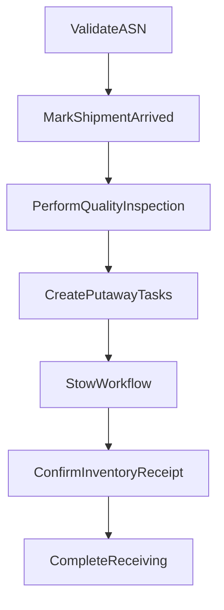

# Receiving Activities

Activities for managing inbound shipment receiving and stow operations.

## Activities

### ValidateASN

Validates the Advanced Shipping Notice data.

**Signature:**
```go
func (a *ReceivingActivities) ValidateASN(ctx context.Context, input map[string]interface{}) (bool, error)
```

**Input:**
```go
{
    "shipmentId": string,
    "asnId":      string,
    "supplierId": string
}
```

**Output:** `bool` - True if ASN is valid

---

### MarkShipmentArrived

Updates shipment status to arrived.

**Signature:**
```go
func (a *ReceivingActivities) MarkShipmentArrived(ctx context.Context, input map[string]interface{}) error
```

**Input:**
```go
{
    "shipmentId": string,
    "dockId":     string
}
```

---

### PerformQualityInspection

Samples and inspects items from the shipment.

**Signature:**
```go
func (a *ReceivingActivities) PerformQualityInspection(ctx context.Context, input map[string]interface{}) (*QualityInspectionResult, error)
```

**Input:**
```go
{
    "shipmentId":    string,
    "samplingRate":  float64,  // e.g., 0.1 for 10%
    "expectedItems": []InboundExpectedItem
}
```

**Output:**
```go
type QualityInspectionResult struct {
    ShipmentID     string `json:"shipmentId"`
    InspectedCount int    `json:"inspectedCount"`
    PassedCount    int    `json:"passedCount"`
    FailedCount    int    `json:"failedCount"`
    Passed         bool   `json:"passed"`
}
```

---

### CreatePutawayTasks

Creates stow tasks for received items.

**Signature:**
```go
func (a *ReceivingActivities) CreatePutawayTasks(ctx context.Context, input map[string]interface{}) (*PutawayResult, error)
```

**Input:**
```go
{
    "shipmentId":      string,
    "receivedItems":   []InboundExpectedItem,
    "storageStrategy": string  // "chaotic", "zone", "product"
}
```

**Output:**
```go
type PutawayResult struct {
    ShipmentID string   `json:"shipmentId"`
    TaskIDs    []string `json:"taskIds"`
    TaskCount  int      `json:"taskCount"`
    TotalItems int      `json:"totalItems"`
}
```

---

### ConfirmInventoryReceipt

Confirms inventory has been received in the system.

**Signature:**
```go
func (a *ReceivingActivities) ConfirmInventoryReceipt(ctx context.Context, input map[string]interface{}) error
```

**Input:**
```go
{
    "shipmentId":    string,
    "receivedItems": []InboundExpectedItem,
    "stowedCount":   int
}
```

---

### CompleteReceiving

Marks the receiving process as complete.

**Signature:**
```go
func (a *ReceivingActivities) CompleteReceiving(ctx context.Context, shipmentID string) error
```

---

## Receiving Flow



## Configuration

| Property | Value |
|----------|-------|
| Default Timeout | 5 minutes |
| Retry Policy | Standard (3 attempts) |
| Heartbeat | Required for quality inspection |

## Related Workflows

- [Inbound Fulfillment Workflow](../workflows/inbound-fulfillment) - Parent workflow
