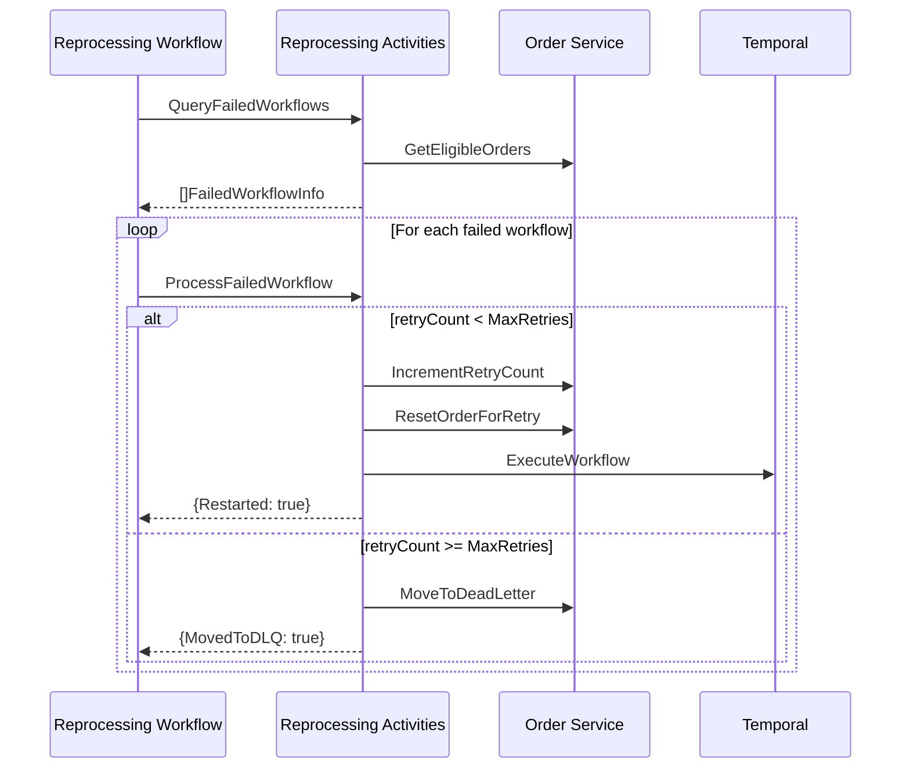

# Reprocessing Activities

Activities for managing failed workflow reprocessing, retry logic, and dead letter queue operations.

## Activity Struct

```go
type ReprocessingActivities struct {
    clients        *ServiceClients
    temporalClient client.Client
    failureMetrics *FailureMetrics
    logger         *slog.Logger
}
```

## Activities

### QueryFailedWorkflows

Queries for failed workflows that are eligible for reprocessing.

**Signature:**
```go
func (a *ReprocessingActivities) QueryFailedWorkflows(ctx context.Context, input QueryFailedWorkflowsInput) ([]FailedWorkflowInfo, error)
```

**Input:**
```go
type QueryFailedWorkflowsInput struct {
    FailureStatuses []string `json:"failureStatuses"` // Filter by failure status
    MaxRetries      int      `json:"maxRetries"`      // Max retry threshold
    Limit           int      `json:"limit"`           // Result limit
}
```

**Output:**
```go
type FailedWorkflowInfo struct {
    OrderID       string    `json:"orderId"`
    WorkflowID    string    `json:"workflowId"`
    RunID         string    `json:"runId"`
    FailureStatus string    `json:"failureStatus"`
    FailureReason string    `json:"failureReason"`
    FailedAt      time.Time `json:"failedAt"`
    RetryCount    int       `json:"retryCount"`
    CustomerID    string    `json:"customerId"`
    Priority      string    `json:"priority"`
}
```

**Used By:** [ReprocessingWorkflow](../workflows/reprocessing)

---

### ProcessFailedWorkflow

Processes a single failed workflow - either restarts it or moves to DLQ.

**Signature:**
```go
func (a *ReprocessingActivities) ProcessFailedWorkflow(ctx context.Context, fw FailedWorkflowInfo) (*ProcessWorkflowResult, error)
```

**Input:** `FailedWorkflowInfo` - Failed workflow details

**Output:**
```go
type ProcessWorkflowResult struct {
    OrderID       string `json:"orderId"`
    Restarted     bool   `json:"restarted"`
    MovedToDLQ    bool   `json:"movedToDLQ"`
    NewWorkflowID string `json:"newWorkflowId,omitempty"`
}
```

**Logic:**
```
IF retryCount >= MaxReprocessingRetries (5):
    Move to Dead Letter Queue
    Record DLQ metric
ELSE:
    Increment retry count
    Reset order status
    Restart workflow
    Record retry metrics
```

---

## Internal Methods

### moveToDeadLetterQueue

Moves an order to the dead letter queue.

```go
func (a *ReprocessingActivities) moveToDeadLetterQueue(ctx context.Context, fw FailedWorkflowInfo) error
```

**Request:**
```go
type MoveToDeadLetterRequest struct {
    FailureStatus string `json:"failureStatus"`
    FailureReason string `json:"failureReason"`
    RetryCount    int    `json:"retryCount"`
    WorkflowID    string `json:"workflowId"`
    RunID         string `json:"runId"`
}
```

---

### incrementRetryCount

Increments the retry count for an order.

```go
func (a *ReprocessingActivities) incrementRetryCount(ctx context.Context, fw FailedWorkflowInfo) error
```

---

### resetOrderForRetry

Resets an order to allow reprocessing.

```go
func (a *ReprocessingActivities) resetOrderForRetry(ctx context.Context, orderID string) error
```

---

### restartWorkflow

Starts a new workflow execution for the order.

```go
func (a *ReprocessingActivities) restartWorkflow(ctx context.Context, fw FailedWorkflowInfo) (string, error)
```

**New Workflow ID Format:** `order-fulfillment-{orderId}-retry-{timestamp}`

**Task Queue:** `orchestrator`

---

## Constants

```go
const MaxReprocessingRetries = 5  // Maximum retry attempts before DLQ
```

## Metrics

| Metric | Description |
|--------|-------------|
| `RecordMovedToDLQ` | Order moved to dead letter queue |
| `RecordRetrySuccess` | Successful retry attempt |
| `RecordRetryFailure` | Failed retry attempt |
| `RecordWorkflowRetry` | Workflow restart initiated |

## Workflow Integration



## Error Handling

| Error | Action |
|-------|--------|
| Query failed | Return error, retry activity |
| Increment retry failed | Record failure metric, return error |
| Reset order failed | Record failure metric, return error |
| Workflow start failed | Record failure metric, return error |
| Move to DLQ failed | Return error |

## Related Documentation

- [Reprocessing Workflow](../workflows/reprocessing) - Parent workflow
- [Order Service - Reprocessing API](/services/order-service#reprocessing-api) - API endpoints
- [Order Service - Dead Letter Queue](/services/order-service#dead-letter-queue-api) - DLQ management
