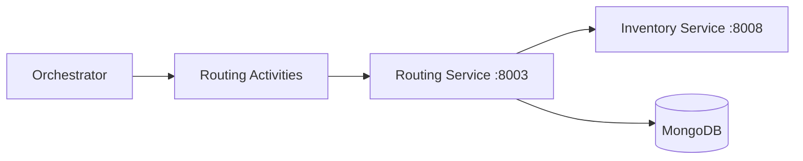
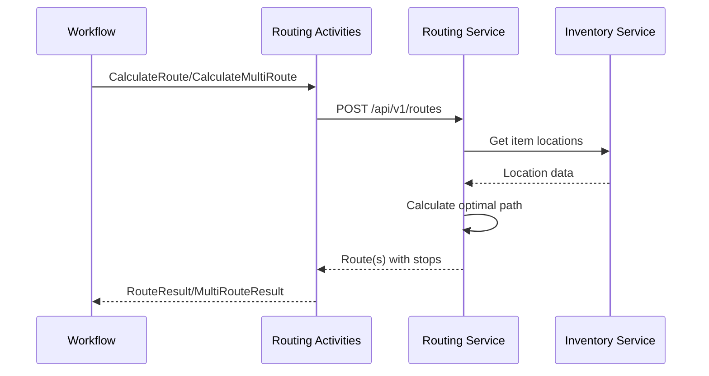

# Routing Activities

Activities for calculating optimal pick routes through the warehouse.

## Activity Struct

```go
type RoutingActivities struct {
    clients *ServiceClients
    logger  *slog.Logger
}
```

## Activities

### CalculateRoute

Calculates the optimal pick route for a single-route order.

**Signature:**
```go
func (a *RoutingActivities) CalculateRoute(ctx context.Context, input map[string]interface{}) (*RouteResult, error)
```

**Input:**
```go
{
    "orderId": string,        // Order ID
    "waveId":  string,        // Wave assignment
    "items":   []interface{}  // Items to pick (SKU + quantity)
}
```

**Output:**
```go
type RouteResult struct {
    RouteID           string      `json:"routeId"`           // Format: RT-{uuid}
    Stops             []RouteStop `json:"stops"`             // Ordered pick stops
    EstimatedDistance float64     `json:"estimatedDistance"` // Travel distance
    Strategy          string      `json:"strategy"`          // Routing strategy used
}

type RouteStop struct {
    LocationID string `json:"locationId"`  // Storage location
    SKU        string `json:"sku"`         // Item SKU
    Quantity   int    `json:"quantity"`    // Pick quantity
}
```

**Used By:** [PickingWorkflow](../workflows/picking), [WESExecutionWorkflow](../workflows/wes-execution)

---

### CalculateMultiRoute

Calculates multiple routes for orders that require zone or capacity splitting.

**Signature:**
```go
func (a *RoutingActivities) CalculateMultiRoute(ctx context.Context, input map[string]interface{}) (*MultiRouteResult, error)
```

**Input:**
```go
{
    "orderId": string,        // Order ID
    "waveId":  string,        // Wave assignment
    "items":   []interface{}  // Items to pick (SKU + quantity)
}
```

**Output:**
```go
type MultiRouteResult struct {
    OrderID       string              `json:"orderId"`
    Routes        []RouteResult       `json:"routes"`         // Multiple routes
    TotalRoutes   int                 `json:"totalRoutes"`    // Number of routes
    SplitReason   string              `json:"splitReason"`    // zone, capacity, both
    ZoneBreakdown map[string]int      `json:"zoneBreakdown"`  // Items per zone
    TotalItems    int                 `json:"totalItems"`
}
```

**Split Reasons:**

| Reason | Description |
|--------|-------------|
| `zone` | Items in different warehouse zones |
| `capacity` | Too many items for single route |
| `both` | Both zone and capacity splitting |

---

## Routing Strategies

The routing service supports multiple strategies:

| Strategy | Description |
|----------|-------------|
| `s_shape` | S-shaped (serpentine) traversal through aisles |
| `return` | Enter and exit from same aisle end |
| `largest_gap` | Skip largest gap within aisles |
| `combined` | Combination of strategies based on density |
| `nearest` | Nearest neighbor algorithm |

**Default Strategy:** `s_shape`

## Service Integration



## Request/Response Flow



## Data Types

### CalculateRouteRequest (to Routing Service)

```go
type CalculateRouteRequest struct {
    RouteID  string             `json:"routeId"`
    OrderID  string             `json:"orderId"`
    WaveID   string             `json:"waveId"`
    Items    []RouteItemRequest `json:"items"`
    Strategy string             `json:"strategy"`
}

type RouteItemRequest struct {
    SKU      string `json:"sku"`
    Quantity int    `json:"quantity"`
}
```

## Error Handling

| Error | Action |
|-------|--------|
| Routing service unavailable | Retry with exponential backoff |
| Invalid item locations | Return error, fail workflow |
| Strategy not supported | Fall back to `s_shape` |

## Related Documentation

- [Routing Service](/services/routing-service) - Backend service
- [Picking Workflow](../workflows/picking) - Uses single routes
- [WES Execution Workflow](../workflows/wes-execution) - Uses multi-routes
- [PickTask Aggregate](/domain-driven-design/aggregates/pick-task) - Pick task domain
