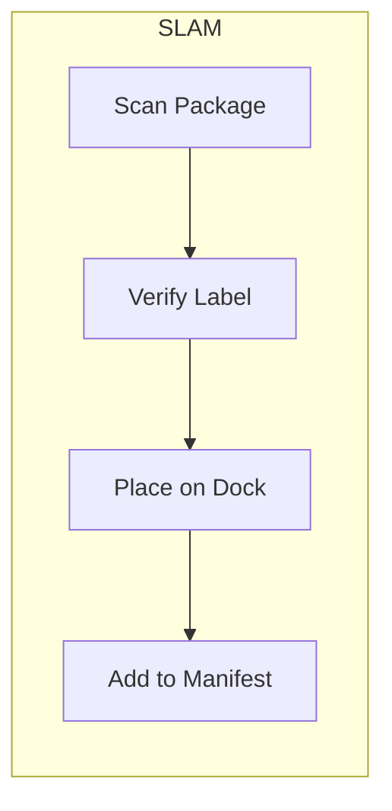

# Shipping Activities

Activities for managing shipments, carrier manifests, and customer notifications.

## Activity Struct

```go
type ShippingActivities struct {
    clients *ServiceClients
    logger  *slog.Logger
}
```

## Activities

### CreateShipment

Creates a shipment record.

**Signature:**
```go
func (a *ShippingActivities) CreateShipment(ctx context.Context, input map[string]interface{}) (string, error)
```

**Input:**
```go
{
    "orderId":        string,
    "packageId":      string,
    "trackingNumber": string,
    "carrier":        string
}
```

**Output:** `string` - Shipment ID

---

### ScanPackage

Verifies package identity by scanning barcode (SLAM - Scan).

**Signature:**
```go
func (a *ShippingActivities) ScanPackage(ctx context.Context, input map[string]interface{}) error
```

**Input:**
```go
{
    "shipmentId":     string,
    "trackingNumber": string
}
```

---

### VerifyShippingLabel

Validates the label matches the tracking number (SLAM - Label).

**Signature:**
```go
func (a *ShippingActivities) VerifyShippingLabel(ctx context.Context, input map[string]interface{}) (bool, error)
```

**Output:** `bool` - True if label verified

---

### PlaceOnOutboundDock

Assigns package to carrier dock area (SLAM - Apply).

**Signature:**
```go
func (a *ShippingActivities) PlaceOnOutboundDock(ctx context.Context, input map[string]interface{}) error
```

**Input:**
```go
{
    "shipmentId": string,
    "carrier":    string
}
```

---

### AddToCarrierManifest

Adds package to carrier's daily manifest (SLAM - Manifest).

**Signature:**
```go
func (a *ShippingActivities) AddToCarrierManifest(ctx context.Context, input map[string]interface{}) error
```

**Input:**
```go
{
    "shipmentId":     string,
    "trackingNumber": string,
    "carrier":        string
}
```

---

### MarkOrderShipped

Updates order status to shipped.

**Signature:**
```go
func (a *ShippingActivities) MarkOrderShipped(ctx context.Context, input map[string]interface{}) error
```

**Input:**
```go
{
    "orderId":        string,
    "shipmentId":     string,
    "trackingNumber": string
}
```

---

### NotifyCustomerShipped

Sends tracking notification to customer.

**Signature:**
```go
func (a *ShippingActivities) NotifyCustomerShipped(ctx context.Context, input map[string]interface{}) error
```

**Input:**
```go
{
    "orderId":        string,
    "trackingNumber": string,
    "carrier":        string
}
```

**Error Handling:** Best-effort - logs warning and returns nil on failure.

---

### ConfirmUnitShipped

Confirms unit-level shipping (when unit tracking is enabled).

**Signature:**
```go
func (a *ShippingActivities) ConfirmUnitShipped(ctx context.Context, input map[string]interface{}) error
```

**Input:**
```go
{
    "unitId":         string,
    "shipmentId":     string,
    "trackingNumber": string,
    "handlerId":      string
}
```

---

## SLAM Process



## Configuration

| Property | Value |
|----------|-------|
| Default Timeout | 10 minutes |
| Retry Policy | Standard (3 attempts) |
| Heartbeat | Optional |

## Related Workflows

- [Shipping Workflow](../workflows/shipping) - Orchestrator shipping
- [Service Shipping Workflow](../workflows/service-shipping) - Service-level shipping
- [Sortation Workflow](../workflows/sortation) - Pre-shipping sortation
