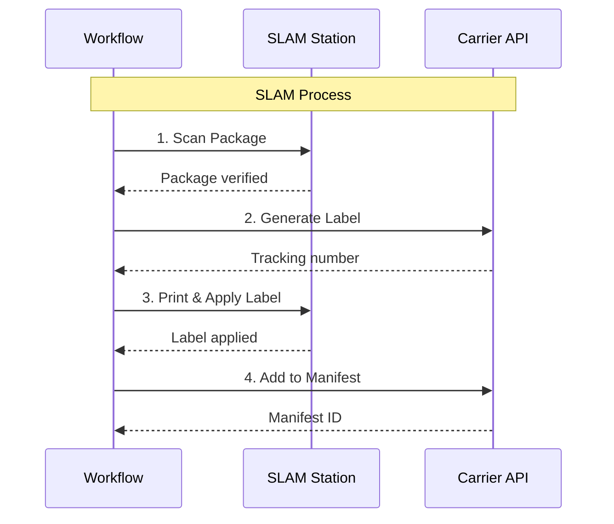

# SLAM Activities

Activities for the Scan, Label, Apply, Manifest (SLAM) process.

## Overview

SLAM is the final quality gate before packages leave the warehouse:
- **S**can - Verify package identity
- **L**abel - Confirm shipping label
- **A**pply - Place on outbound dock
- **M**anifest - Add to carrier manifest

## Activities

### ExecuteSLAM

Executes the complete SLAM process as a single activity.

**Signature:**
```go
func (a *SLAMActivities) ExecuteSLAM(ctx context.Context, input SLAMInput) (*SLAMResult, error)
```

**Input:**
```go
type SLAMInput struct {
    OrderID        string  `json:"orderId"`
    PackageID      string  `json:"packageId"`
    Weight         float64 `json:"weight"`
    TrackingNumber string  `json:"trackingNumber,omitempty"` // Optional if not generated
    Carrier        string  `json:"carrier,omitempty"`
}
```

**Output:**
```go
type SLAMResult struct {
    TrackingNumber string `json:"trackingNumber"`
    ManifestID     string `json:"manifestId"`
    CarrierCode    string `json:"carrierCode"`
    LabelURL       string `json:"labelUrl"`
    Success        bool   `json:"success"`
}
```

**Used By:** [OrderFulfillmentWorkflow](../workflows/order-fulfillment)

---

### GenerateCarrierLabel

Generates a carrier-specific shipping label.

**Signature:**
```go
func (a *SLAMActivities) GenerateCarrierLabel(ctx context.Context, input map[string]interface{}) (*LabelResult, error)
```

**Output:**
```go
type LabelResult struct {
    TrackingNumber string `json:"trackingNumber"`
    LabelURL       string `json:"labelUrl"`
    CarrierCode    string `json:"carrierCode"`
}
```

---

### VerifyPackageWeight

Verifies the package weight matches expected.

**Signature:**
```go
func (a *SLAMActivities) VerifyPackageWeight(ctx context.Context, input map[string]interface{}) (bool, error)
```

**Input:**
```go
{
    "packageId":       string,
    "measuredWeight":  float64,
    "expectedWeight":  float64,
    "tolerancePercent": float64  // e.g., 0.05 for 5%
}
```

---

### PrintLabel

Prints the shipping label at the SLAM station.

**Signature:**
```go
func (a *SLAMActivities) PrintLabel(ctx context.Context, input map[string]interface{}) error
```

**Input:**
```go
{
    "labelUrl":   string,
    "stationId":  string,
    "printerId":  string
}
```

---

## SLAM Flow



## Error Handling

| Scenario | Handling |
|----------|----------|
| Scan failure | Retry 3 times, then manual intervention |
| Weight mismatch | Flag for QA review |
| Label generation fails | Retry with different carrier |
| Manifest failure | Continue, add to next manifest batch |

## Configuration

| Property | Value |
|----------|-------|
| Default Timeout | 5 minutes |
| Retry Policy | Standard (3 attempts) |
| Heartbeat | Required for multi-step SLAM |

## Related Workflows

- [Order Fulfillment Workflow](../workflows/order-fulfillment) - Uses ExecuteSLAM
- [Shipping Workflow](../workflows/shipping) - Alternative SLAM approach
