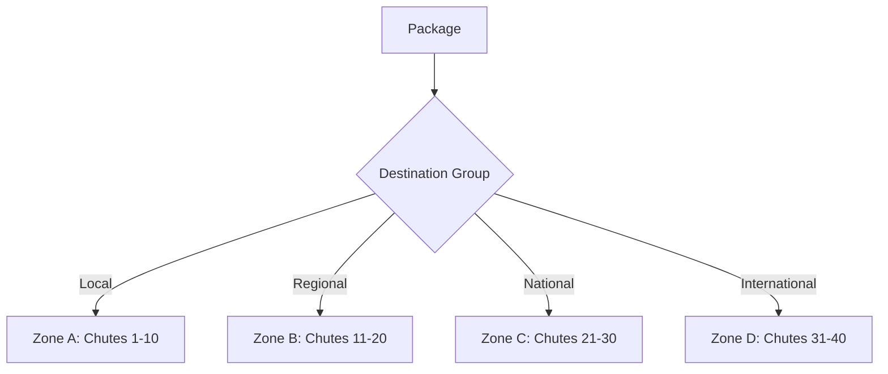

# Sortation Activities

Activities for managing package sortation to carrier chutes.

## Activities

### CreateSortationBatch

Creates or retrieves a sortation batch for carrier/destination.

**Signature:**
```go
func (a *SortationActivities) CreateSortationBatch(ctx context.Context, input map[string]interface{}) (string, error)
```

**Input:**
```go
{
    "carrierId":       string,
    "destination":     string,  // Zip code
    "sortationCenter": string
}
```

**Output:** `string` - Batch ID

---

### AssignChute

Assigns package to physical chute based on destination.

**Signature:**
```go
func (a *SortationActivities) AssignChute(ctx context.Context, input map[string]interface{}) (*ChuteAssignment, error)
```

**Input:**
```go
{
    "packageId":   string,
    "carrierId":   string,
    "destination": string
}
```

**Output:**
```go
type ChuteAssignment struct {
    ChuteID          string `json:"chuteId"`
    ChuteNumber      int    `json:"chuteNumber"`
    Zone             string `json:"zone"`
    DestinationGroup string `json:"destinationGroup"`
}
```

---

### AddPackageToBatch

Registers package in the sortation batch.

**Signature:**
```go
func (a *SortationActivities) AddPackageToBatch(ctx context.Context, input map[string]interface{}) error
```

**Input:**
```go
{
    "batchId":   string,
    "packageId": string,
    "chuteId":   string
}
```

---

### SortPackage

Records physical sort to chute.

**Signature:**
```go
func (a *SortationActivities) SortPackage(ctx context.Context, input map[string]interface{}) error
```

**Input:**
```go
{
    "packageId": string,
    "chuteId":   string,
    "batchId":   string
}
```

---

## Chute Assignment Logic



## Configuration

| Property | Value |
|----------|-------|
| Default Timeout | 2 minutes |
| Retry Policy | Standard (3 attempts) |
| Heartbeat | Optional |

## Related Workflows

- [Sortation Workflow](../workflows/sortation) - Uses sortation activities
