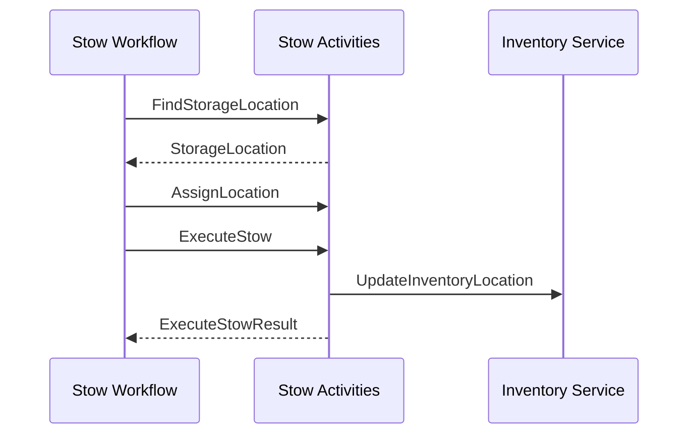

# Stow Activities

Activities for managing stow operations during inbound receiving and putaway.

## Activity Struct

```go
type StowActivities struct {
    // Service clients for inventory and location management
}
```

## Activities

### FindStorageLocation

Finds a storage location for an item using chaotic storage strategy.

**Signature:**
```go
func (a *StowActivities) FindStorageLocation(ctx context.Context, input FindStorageLocationInput) (*StorageLocation, error)
```

**Input:**
```go
type FindStorageLocationInput struct {
    TaskID            string `json:"taskId"`
    SKU               string `json:"sku"`
    Quantity          int    `json:"quantity"`
    IsHazmat          bool   `json:"isHazmat"`
    RequiresColdChain bool   `json:"requiresColdChain"`
    IsOversized       bool   `json:"isOversized"`
    Strategy          string `json:"strategy"` // chaotic, directed, velocity
}
```

**Output:**
```go
type StorageLocation struct {
    LocationID string `json:"locationId"`  // Format: ZONE-AISLE-RACK-LEVEL-BIN
    Zone       string `json:"zone"`        // GENERAL, HAZMAT, COLD, OVERSIZE
    Aisle      string `json:"aisle"`
    Rack       int    `json:"rack"`
    Level      int    `json:"level"`
    Bin        string `json:"bin"`
}
```

**Zone Selection:**
| Item Type | Zone |
|-----------|------|
| Hazmat items | `HAZMAT` |
| Cold chain items | `COLD` |
| Oversized items | `OVERSIZE` |
| Standard items | `GENERAL` |

---

### AssignLocation

Assigns a storage location to a stow task.

**Signature:**
```go
func (a *StowActivities) AssignLocation(ctx context.Context, input AssignLocationInput) error
```

**Input:**
```go
type AssignLocationInput struct {
    TaskID   string           `json:"taskId"`
    Location *StorageLocation `json:"location"`
}
```

---

### ExecuteStow

Executes the stow operation - moves item from tote to storage location.

**Signature:**
```go
func (a *StowActivities) ExecuteStow(ctx context.Context, input ExecuteStowInput) (*ExecuteStowResult, error)
```

**Input:**
```go
type ExecuteStowInput struct {
    TaskID       string           `json:"taskId"`
    SKU          string           `json:"sku"`
    Quantity     int              `json:"quantity"`
    SourceToteID string           `json:"sourceToteId"`
    Location     *StorageLocation `json:"location"`
    WorkerID     string           `json:"workerId,omitempty"`
}
```

**Output:**
```go
type ExecuteStowResult struct {
    TaskID         string    `json:"taskId"`
    SKU            string    `json:"sku"`
    StowedQuantity int       `json:"stowedQuantity"`
    LocationID     string    `json:"locationId"`
    StowedAt       time.Time `json:"stowedAt"`
    Success        bool      `json:"success"`
}
```

**Side Effects:**
1. Verifies location is accessible
2. Records stow action
3. Updates inventory system
4. Updates location capacity

---

### UpdateInventoryLocation

Updates inventory with the new storage location.

**Signature:**
```go
func (a *StowActivities) UpdateInventoryLocation(ctx context.Context, input UpdateInventoryLocationInput) error
```

**Input:**
```go
type UpdateInventoryLocationInput struct {
    SKU        string  `json:"sku"`
    LocationID string  `json:"locationId"`
    Quantity   int     `json:"quantity"`
    Weight     float64 `json:"weight"`
}
```

---

### ProcessStow

Processes stow tasks as a child workflow activity.

**Signature:**
```go
func (a *StowActivities) ProcessStow(ctx context.Context, input StowWorkflowInput) (*StowWorkflowResult, error)
```

**Input:**
```go
type StowWorkflowInput struct {
    ShipmentID string   `json:"shipmentId"`
    TaskIDs    []string `json:"taskIds"`
}
```

**Output:**
```go
type StowWorkflowResult struct {
    ShipmentID  string `json:"shipmentId"`
    StowedCount int    `json:"stowedCount"`
    FailedCount int    `json:"failedCount"`
    Success     bool   `json:"success"`
}
```

---

## Data Types

### StowTaskInput

```go
type StowTaskInput struct {
    TaskID            string  `json:"taskId"`
    ShipmentID        string  `json:"shipmentId"`
    SKU               string  `json:"sku"`
    ProductName       string  `json:"productName"`
    Quantity          int     `json:"quantity"`
    SourceToteID      string  `json:"sourceToteId"`
    IsHazmat          bool    `json:"isHazmat"`
    RequiresColdChain bool    `json:"requiresColdChain"`
    IsOversized       bool    `json:"isOversized"`
    Weight            float64 `json:"weight"`
}
```

## Workflow Integration



## Registration

```go
func RegisterStowActivities(activities *StowActivities) map[string]interface{} {
    return map[string]interface{}{
        "FindStorageLocation":     activities.FindStorageLocation,
        "AssignLocation":          activities.AssignLocation,
        "ExecuteStow":             activities.ExecuteStow,
        "UpdateInventoryLocation": activities.UpdateInventoryLocation,
        "StowWorkflow":            activities.ProcessStow,
    }
}
```

## Related Documentation

- [Inbound Fulfillment Workflow](../workflows/inbound-fulfillment) - Parent workflow
- [Receiving Activities](./receiving-activities) - Upstream activities
- [Inventory Activities](./inventory-activities) - Inventory updates
