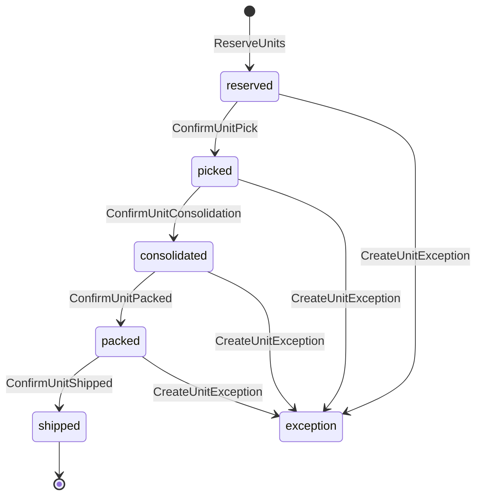

# Unit Activities

Activities for unit-level tracking throughout the fulfillment process.

## Activity Struct

```go
type UnitActivities struct {
    clients *ServiceClients
    logger  *slog.Logger
}
```

## Overview

Unit-level tracking provides granular visibility into individual items as they move through the warehouse. When enabled, each unit is tracked through:
- Reservation
- Picking
- Consolidation
- Packing
- Shipping

## Activities

### ReserveUnits

Reserves specific inventory units for an order.

**Signature:**
```go
func (a *UnitActivities) ReserveUnits(ctx context.Context, input map[string]interface{}) ([]string, error)
```

**Input:**
```go
{
    "orderId":  string,
    "pathId":   string,
    "unitIds":  []string
}
```

**Output:** `[]string` - Reserved unit IDs

**Used By:** [PlanningWorkflow](../workflows/planning)

---

### ConfirmUnitPick

Confirms a unit has been picked.

**Signature:**
```go
func (a *UnitActivities) ConfirmUnitPick(ctx context.Context, input map[string]interface{}) error
```

**Input:**
```go
{
    "unitId":    string,
    "toteId":    string,
    "pickerId":  string,
    "stationId": string
}
```

**Used By:** [OrchestratedPickingWorkflow](../workflows/picking)

---

### ConfirmUnitConsolidation

Confirms a unit has been consolidated.

**Signature:**
```go
func (a *UnitActivities) ConfirmUnitConsolidation(ctx context.Context, input map[string]interface{}) error
```

**Input:**
```go
{
    "unitId":         string,
    "destinationBin": string,
    "workerId":       string,
    "stationId":      string
}
```

**Used By:** [ConsolidationWorkflow](../workflows/consolidation)

---

### ConfirmUnitPacked

Confirms a unit has been packed.

**Signature:**
```go
func (a *UnitActivities) ConfirmUnitPacked(ctx context.Context, input map[string]interface{}) error
```

**Input:**
```go
{
    "unitId":    string,
    "packageId": string,
    "packerId":  string,
    "stationId": string
}
```

**Used By:** [PackingWorkflow](../workflows/packing)

---

### ConfirmUnitShipped

Confirms a unit has been shipped.

**Signature:**
```go
func (a *UnitActivities) ConfirmUnitShipped(ctx context.Context, input map[string]interface{}) error
```

**Input:**
```go
{
    "unitId":         string,
    "shipmentId":     string,
    "trackingNumber": string,
    "handlerId":      string
}
```

**Used By:** [ShippingWorkflow](../workflows/shipping)

---

### CreateUnitException

Records a unit-level exception.

**Signature:**
```go
func (a *UnitActivities) CreateUnitException(ctx context.Context, input map[string]interface{}) (map[string]interface{}, error)
```

**Input:**
```go
{
    "unitId":        string,
    "exceptionType": string,  // picking_failure, consolidation_failure, etc.
    "stage":         string,  // picking, consolidation, packing, shipping
    "description":   string,
    "stationId":     string,
    "reportedBy":    string
}
```

**Output:**
```go
{
    "exceptionId": string
}
```

---

## Unit Lifecycle



## Enabling Unit Tracking

Unit tracking is enabled via the workflow input:

```go
input := OrderFulfillmentInput{
    OrderID:         "ORD-123",
    UseUnitTracking: true,      // Enable unit tracking
    UnitIDs:         unitIDs,   // Pre-reserved unit IDs
}
```

## Exception Types

| Type | Stage | Description |
|------|-------|-------------|
| `picking_failure` | Picking | Failed to confirm pick |
| `consolidation_failure` | Consolidation | Failed to consolidate |
| `packing_failure` | Packing | Failed to pack |
| `shipping_failure` | Shipping | Failed to ship |

## Configuration

| Property | Value |
|----------|-------|
| Default Timeout | 2 minutes |
| Retry Policy | Standard (3 attempts) |
| Heartbeat | Optional |

## Related Workflows

- [Order Fulfillment Workflow](../workflows/order-fulfillment) - Enables unit tracking
- [Planning Workflow](../workflows/planning) - Reserves units
