# Order Flow Diagram

Complete visualization of order processing through the WMS Platform.

## End-to-End Order Flow

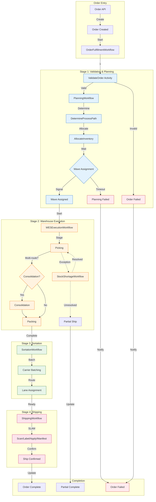

---

## Detailed Stage Breakdown

### Stage 1: Validation & Planning

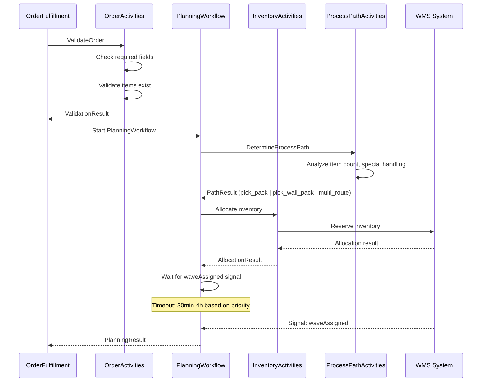

### Stage 2: Warehouse Execution

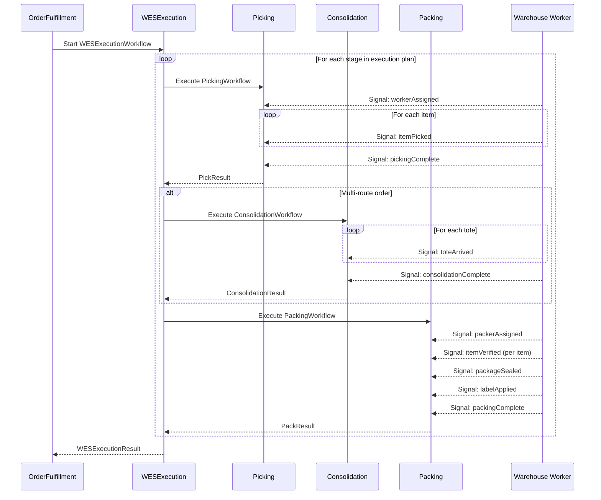

### Stage 3: Sortation

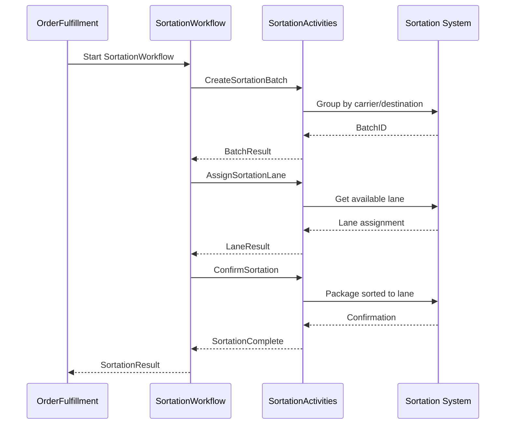

### Stage 4: Shipping

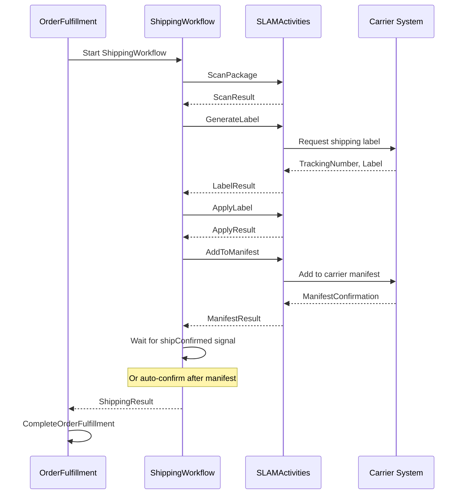

---

## Process Path Variations

### Single-Item Order (pick_pack)

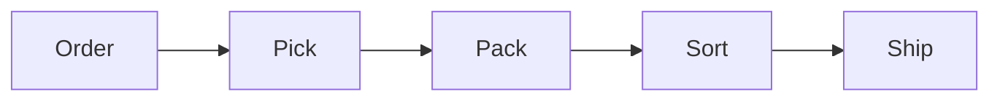

### Multi-Item Order (pick_wall_pack)

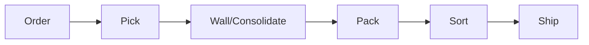

### Multi-Route Order (multi_route)

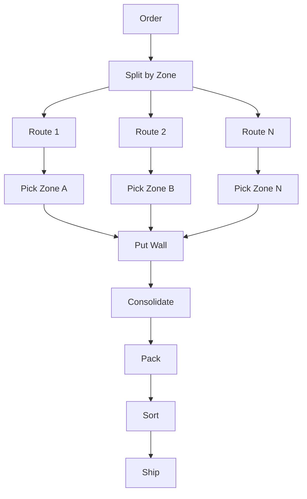

---

## Special Handling Flows

### Gift Wrap Order

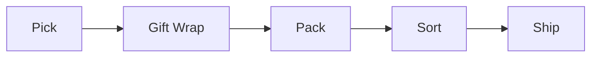

### Hazmat Order

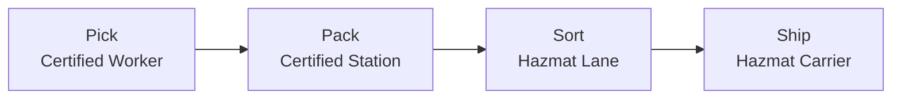

### Cold Chain Order

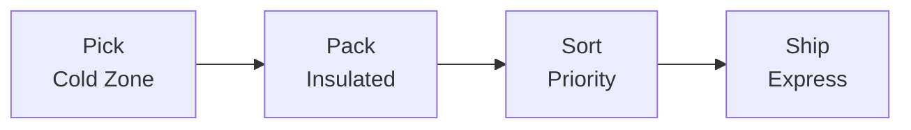

---

## Exception Handling Flows

### Stock Shortage

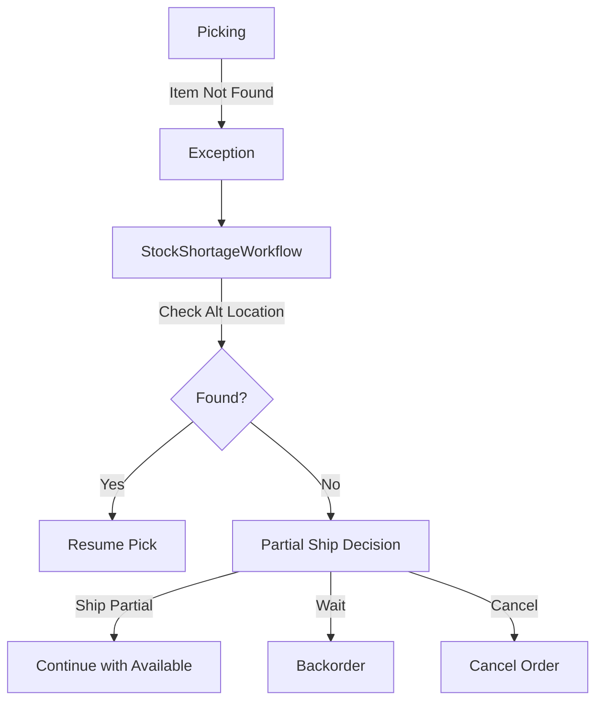

### Order Cancellation

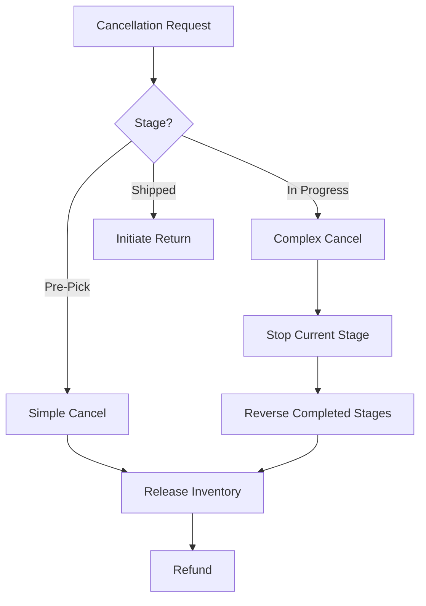

## Related Documentation

- [Workflow Hierarchy](./workflow-hierarchy) - Parent-child relationships
- [Signal Flow](./signal-flow) - Signal timing between workflows
- [Order Fulfillment Workflow](../workflows/order-fulfillment) - Detailed workflow documentation
