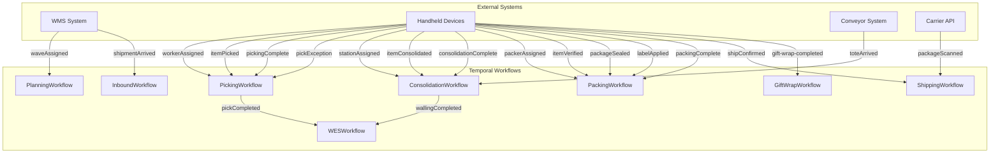
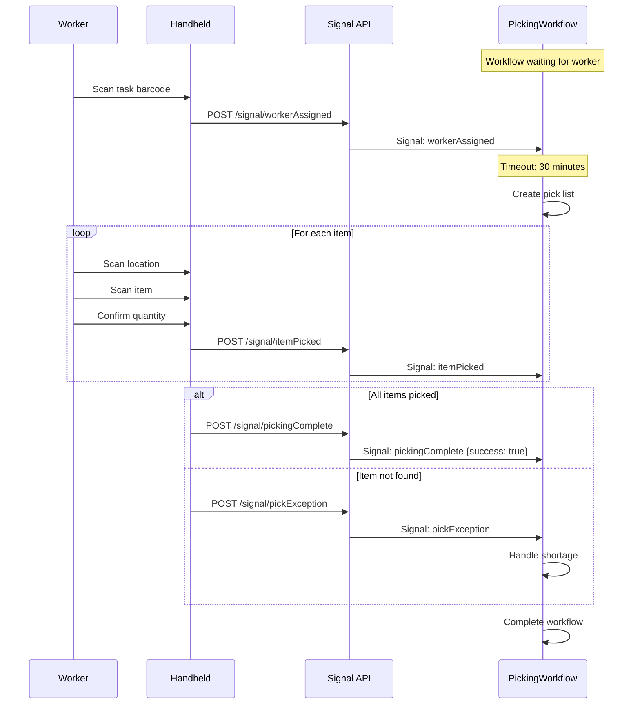
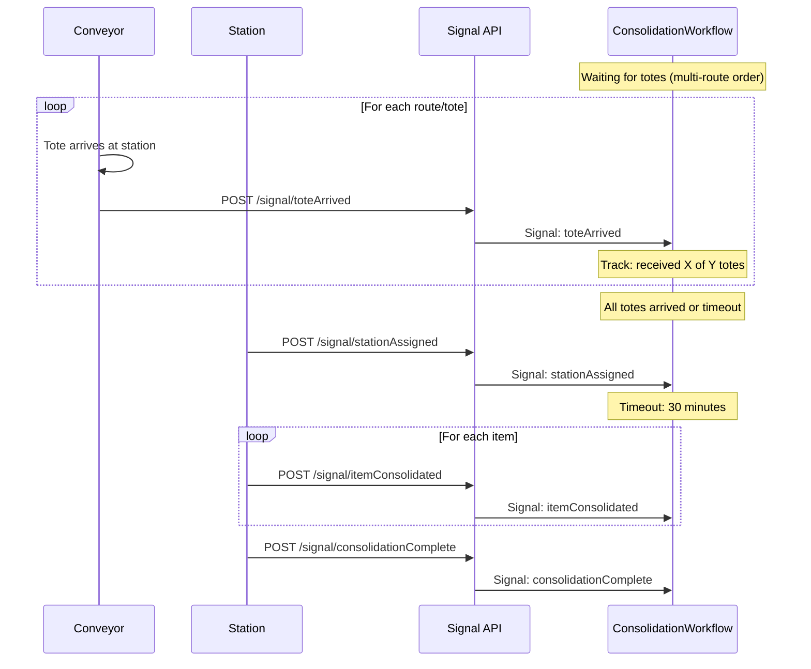
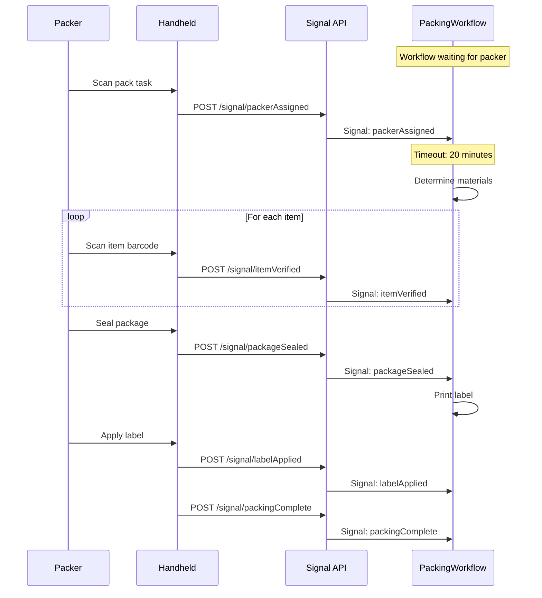
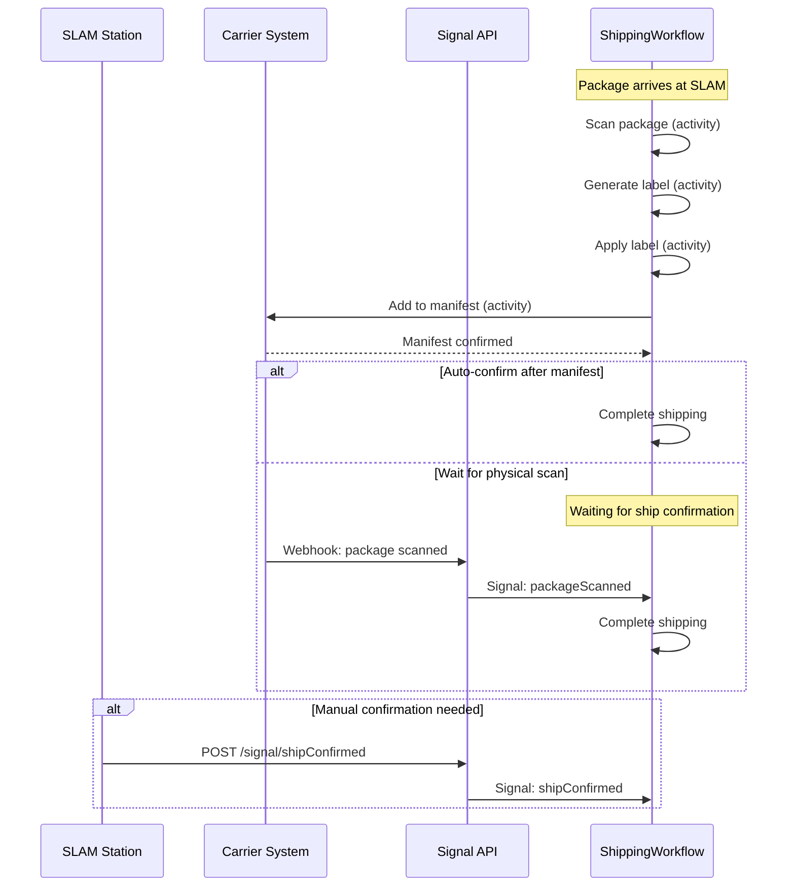
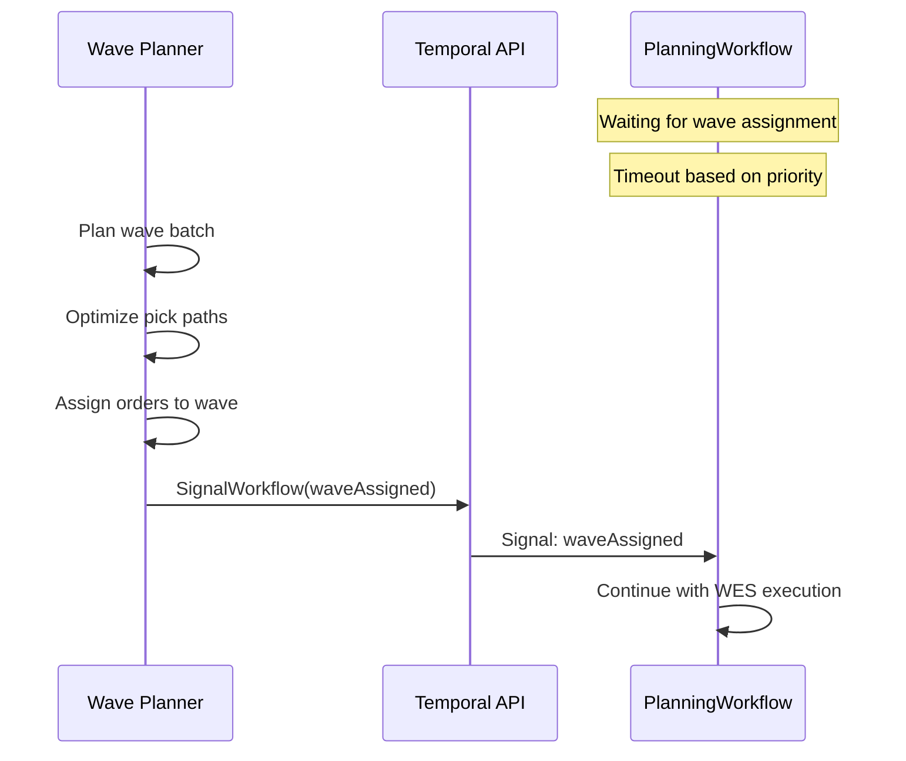
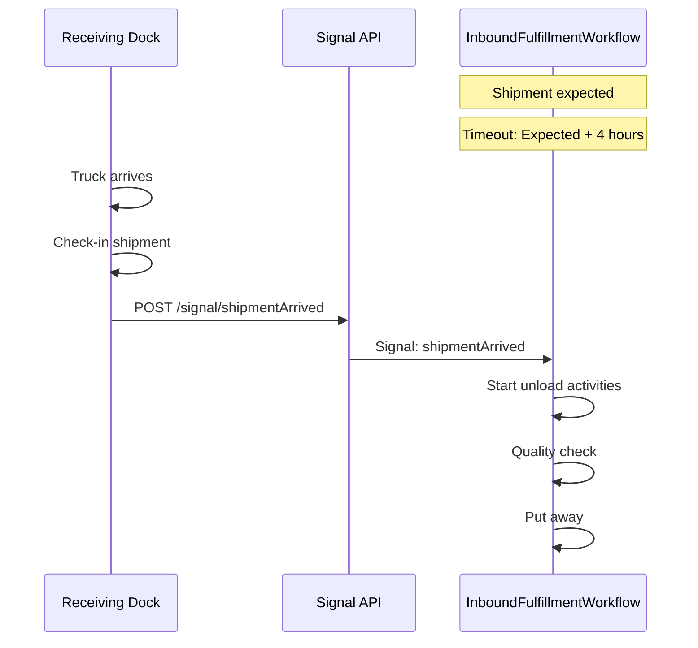
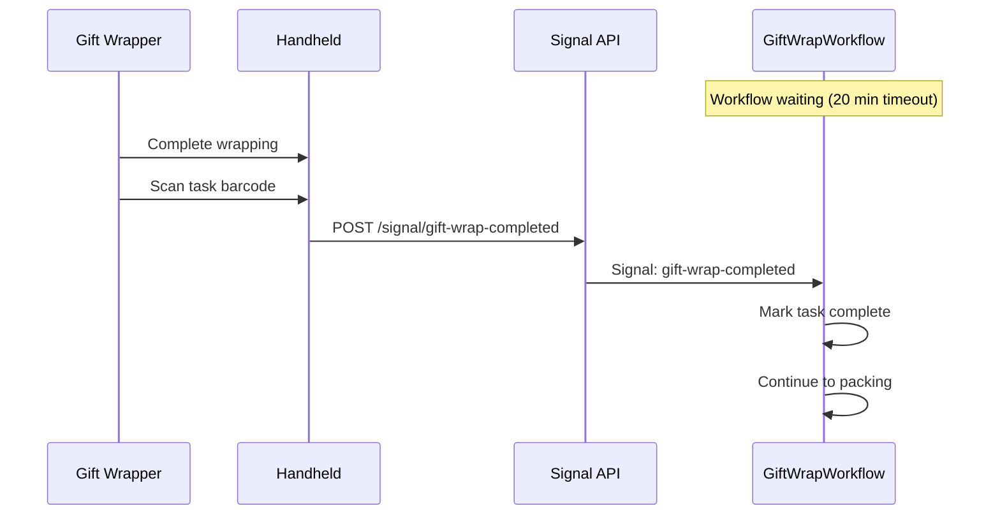
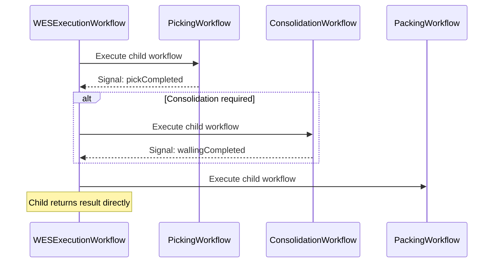

# Signal Flow Diagrams

Visual representation of signal timing and flow between workflows and external systems.

## Signal Overview



---

## Picking Signal Timeline



### Picking Signal Payloads

```go
// workerAssigned
type WorkerAssignment struct {
    WorkerID string `json:"workerId"`
    ToteID   string `json:"toteId"`
}

// itemPicked
type PickedItem struct {
    SKU        string `json:"sku"`
    LocationID string `json:"locationId"`
    Quantity   int    `json:"quantity"`
    ToteID     string `json:"toteId"`
}

// pickException
type PickException struct {
    SKU       string `json:"sku"`
    Reason    string `json:"reason"`     // not_found, damaged, quantity_mismatch
    Available int    `json:"available"`
}
```

---

## Consolidation Signal Timeline



### Consolidation Signal Payloads

```go
// toteArrived
type ToteArrivedSignal struct {
    ToteID     string `json:"toteId"`
    RouteID    string `json:"routeId"`
    RouteIndex int    `json:"routeIndex"`
    ArrivedAt  string `json:"arrivedAt"`
}

// stationAssigned
type StationInfo struct {
    Station        string `json:"station"`
    WorkerID       string `json:"workerId"`
    DestinationBin string `json:"destinationBin"`
}

// itemConsolidated
type ConsolidatedItem struct {
    SKU            string `json:"sku"`
    SourceToteID   string `json:"sourceToteId"`
    DestinationBin string `json:"destinationBin"`
}
```

---

## Packing Signal Timeline



### Packing Signal Payloads

```go
// packerAssigned
type PackerInfo struct {
    PackerID string `json:"packerId"`
    Station  string `json:"station"`
}

// itemVerified
type ItemVerification struct {
    SKU      string `json:"sku"`
    Verified bool   `json:"verified"`
}

// packageSealed
type PackageSealed struct {
    PackageID string  `json:"packageId"`
    Weight    float64 `json:"weight"`
}

// labelApplied
type LabelInfo struct {
    TrackingNumber string `json:"trackingNumber"`
    Carrier        string `json:"carrier"`
}
```

---

## Shipping Signal Timeline



### Shipping Signal Payloads

```go
// shipConfirmed
type ShipConfirmation struct {
    ShippedAt         time.Time  `json:"shippedAt"`
    EstimatedDelivery *time.Time `json:"estimatedDelivery,omitempty"`
}

// packageScanned (from carrier webhook)
type PackageScan struct {
    Location  string    `json:"location"`
    ScannedAt time.Time `json:"scannedAt"`
}
```

---

## Wave Assignment Signal



### Wave Assignment Payload

```go
type WaveAssignment struct {
    WaveID         string    `json:"waveId"`
    ScheduledStart time.Time `json:"scheduledStart"`
}
```

### Priority-Based Timeouts

| Priority | Timeout | Description |
|----------|---------|-------------|
| `same_day` | 30 minutes | Must ship today |
| `next_day` | 2 hours | Ship by tomorrow |
| `standard` | 4 hours | Standard shipping |

---

## Inbound Fulfillment Signal



### Inbound Signal Payload

```go
type ShipmentArrivalSignal struct {
    ShipmentID string    `json:"shipmentId"`
    DockID     string    `json:"dockId"`
    ArrivedAt  time.Time `json:"arrivedAt"`
}
```

---

## Gift Wrap Signal



### Gift Wrap Signal Payload

```go
type GiftWrapCompletedSignal struct {
    TaskID      string `json:"taskId"`
    WorkerID    string `json:"workerId"`
    CompletedAt string `json:"completedAt"`
}
```

---

## WES Completion Signals

Signals sent from child workflows back to WES:



### WES Signal Payloads

```go
// pickCompleted (to orchestrator)
type PickCompletedSignal struct {
    TaskID      string       `json:"taskId"`
    PickedItems []PickedItem `json:"pickedItems"`
    Success     bool         `json:"success"`
}

// wallingCompleted
type WallingCompletedSignal struct {
    TaskID      string   `json:"taskId"`
    RouteID     string   `json:"routeId"`
    SortedItems []string `json:"sortedItems"`
    Success     bool     `json:"success"`
}
```

---

## Signal Timeout Summary

| Workflow | Signal | Timeout | On Timeout |
|----------|--------|---------|------------|
| PlanningWorkflow | `waveAssigned` | 30min - 4h | Fail workflow |
| PickingWorkflow | `workerAssigned` | 30 min | Fail workflow |
| PickingWorkflow | `itemPicked` | Per item | Continue waiting |
| PickingWorkflow | `pickingComplete` | 30 min | Fail workflow |
| ConsolidationWorkflow | `toteArrived` | 30 min | Proceed partial |
| ConsolidationWorkflow | `stationAssigned` | 30 min | Fail workflow |
| PackingWorkflow | `packerAssigned` | 20 min | Fail workflow |
| PackingWorkflow | `packingComplete` | 1 hour | Fail workflow |
| ShippingWorkflow | `shipConfirmed` | Auto or signal | Auto-complete |
| GiftWrapWorkflow | `gift-wrap-completed` | 20 min | Poll status |
| InboundFulfillment | `shipmentArrived` | Expected + 4h | Alert |
| WESExecution | `wallingCompleted` | 15 min | Fail stage |

---

## Sending Signals

### Via Temporal SDK

```go
err := client.SignalWorkflow(ctx, workflowID, runID, "signalName", payload)
```

### Via HTTP Bridge

```bash
curl -X POST "http://temporal-bridge/signal" \
  -H "Content-Type: application/json" \
  -d '{
    "workflowId": "picking-ORD-123",
    "signalName": "itemPicked",
    "payload": {"sku": "SKU-001", "quantity": 1}
  }'
```

### Via tctl CLI

```bash
tctl workflow signal \
  --workflow_id "picking-ORD-123" \
  --name "itemPicked" \
  --input '{"sku":"SKU-001","quantity":1}'
```

## Related Documentation

- [Signals & Queries](../signals-queries) - Complete signal reference
- [Workflow Hierarchy](./workflow-hierarchy) - Parent-child relationships
- [Order Flow](./order-flow) - Complete order processing flow
