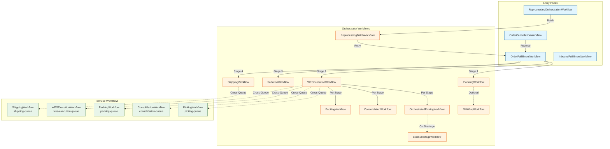
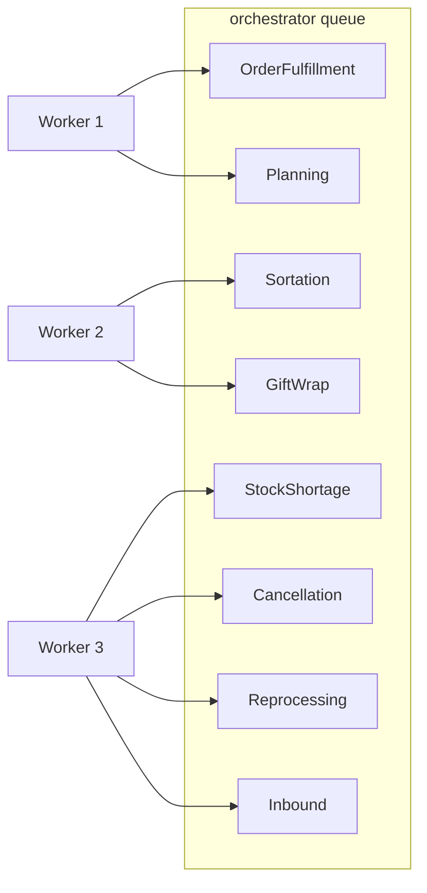
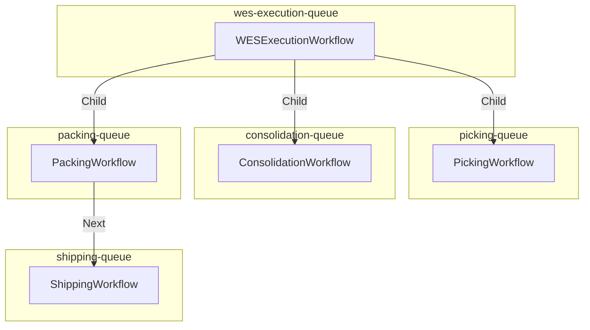
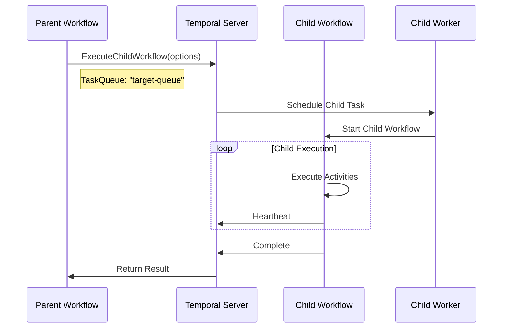

# Workflow Hierarchy

Visual representation of parent-child workflow relationships in the WMS Platform.

## Complete Workflow Hierarchy



---

## Orchestrator Task Queue

All orchestrator workflows run on the `orchestrator` task queue:



---

## Service Task Queues

Service workflows run on dedicated task queues for isolation:



---

## Child Workflow Execution Pattern



---

## Workflow Depth Levels

| Level | Workflows | Task Queue |
|-------|-----------|------------|
| 0 (Entry) | OrderFulfillment, Inbound, Reprocessing | orchestrator |
| 1 | Planning, WESExecution, Sortation, Shipping | orchestrator, wes-execution-queue |
| 2 | Picking, Consolidation, Packing, GiftWrap | Various service queues |
| 3 | Service-level workflows | Service-specific queues |

---

## Cross-Queue Communication

When parent workflows execute children on different queues:

```go
childOpts := workflow.ChildWorkflowOptions{
    TaskQueue:                "picking-queue",     // Different queue
    WorkflowExecutionTimeout: 4 * time.Hour,
    // No retry policy for child workflows
}
childCtx := workflow.WithChildOptions(ctx, childOpts)

err := workflow.ExecuteChildWorkflow(childCtx, "PickingWorkflow", input).Get(ctx, &result)
```

## Related Documentation

- [Task Queues](../task-queues) - Queue configuration details
- [Order Flow](./order-flow) - Complete order processing flow
- [Signal Flow](./signal-flow) - Signal timing between workflows
