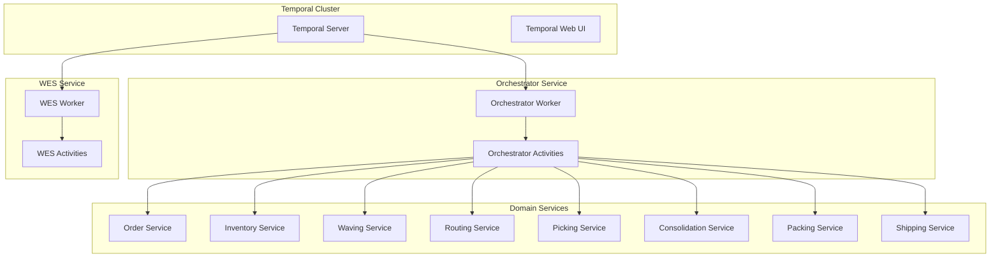

# Temporal Workflow Architecture

The WMS Platform uses [Temporal](https://temporal.io) as its workflow orchestration engine to coordinate complex, long-running business processes across distributed microservices.

## Architecture Overview

## Key Concepts

### Workflows

Workflows are the core building blocks that define business processes. They are:
- **Durable**: Survive process restarts and infrastructure failures
- **Deterministic**: Same inputs always produce the same sequence of events
- **Versioned**: Support safe deployment of breaking changes

### Activities

Activities are the individual units of work that interact with external systems:
- Database operations
- API calls to domain services
- External integrations (carriers, payment processors)

### Signals

Signals provide a way to send data into running workflows:
- Wave assignment notifications
- Pick completion events
- Shipment arrival notifications

### Task Queues

Task queues route work to appropriate workers:
- `orchestrator` - Main orchestration workflows and activities
- `wes-execution-queue` - Warehouse Execution System workflows

## Workflow Inventory

### Orchestrator Workflows (13)

| Workflow | Purpose | Child Workflows |
|----------|---------|-----------------|
| [OrderFulfillmentWorkflow](./workflows/order-fulfillment) | Main order fulfillment saga | Planning, WES, Sortation, Shipping |
| [PlanningWorkflow](./workflows/planning) | Process path and wave assignment | None |
| [OrchestratedPickingWorkflow](./workflows/picking) | Picking with inventory staging | None |
| [ConsolidationWorkflow](./workflows/consolidation) | Multi-route consolidation | None |
| [PackingWorkflow](./workflows/packing) | Packing operations | None |
| [ShippingWorkflow](./workflows/shipping) | Carrier handoff | None |
| [SortationWorkflow](./workflows/sortation) | Package sortation | None |
| [GiftWrapWorkflow](./workflows/gift-wrap) | Gift wrap processing | None |
| [InboundFulfillmentWorkflow](./workflows/inbound-fulfillment) | Receiving and stow | Receiving, Stow |
| [StockShortageWorkflow](./workflows/stock-shortage) | Shortage handling | None |
| [BackorderFulfillmentWorkflow](./workflows/stock-shortage#backorder) | Backorder processing | None |
| [OrderCancellationWorkflow](./workflows/cancellation) | Order cancellation | None |
| [ReprocessingBatchWorkflow](./workflows/reprocessing) | Failure retry orchestration | ReprocessingOrchestration |

### Service Workflows (5)

| Service | Workflow | Purpose |
|---------|----------|---------|
| [Picking Service](./workflows/service-picking) | PickingWorkflow | Service-level picking |
| [Packing Service](./workflows/service-packing) | PackingWorkflow | Service-level packing |
| [Shipping Service](./workflows/service-shipping) | ShippingWorkflow | Service-level shipping |
| [Consolidation Service](./workflows/service-consolidation) | ConsolidationWorkflow | Service-level consolidation |
| [WES Service](./workflows/wes-execution) | WESExecutionWorkflow | Warehouse execution |

## Activity Groups

| Category | Activities | Purpose |
|----------|------------|---------|
| [Order](./activities/order-activities) | 7 | Order lifecycle management |
| [Inventory](./activities/inventory-activities) | 8 | Inventory reservations and tracking |
| [Picking](./activities/picking-activities) | 5 | Pick task management |
| [Packing](./activities/packing-activities) | 9 | Pack task and labeling |
| [Shipping](./activities/shipping-activities) | 7 | Shipment and carrier operations |
| [Consolidation](./activities/consolidation-activities) | 4 | Item consolidation |
| [Receiving](./activities/receiving-activities) | 7 | Inbound receiving |
| [Sortation](./activities/sortation-activities) | 8 | Package sortation |
| [SLAM](./activities/slam-activities) | 6 | Scan, Label, Apply, Manifest |
| [Unit Tracking](./activities/unit-activities) | 11 | Unit-level tracking |
| [Process Path](./activities/process-path-activities) | 4 | Process path determination |

## Configuration

### Default Timeouts

| Configuration | Value |
|---------------|-------|
| Activity Timeout | 5 minutes |
| Child Workflow Timeout | 24 hours |
| Heartbeat Timeout | 30 seconds |

### Retry Policy Defaults

| Setting | Value |
|---------|-------|
| Initial Interval | 1 second |
| Backoff Coefficient | 2.0 |
| Maximum Interval | 1 minute |
| Maximum Attempts | 3 |

### Priority-Based Timeouts

| Priority | Wave Assignment | Picking | Packing |
|----------|-----------------|---------|---------|
| Same Day | 30 minutes | 15 minutes | 15 minutes |
| Next Day | 2 hours | 30 minutes | 30 minutes |
| Standard | 4 hours | 1 hour | 1 hour |

## Quick Links

- [Signals & Queries](./signals-queries) - Signal and query handler reference
- [Task Queues](./task-queues) - Task queue configuration
- [Retry Policies](./retry-policies) - Detailed retry configuration
- [Workflow Hierarchy](./diagrams/workflow-hierarchy) - Visual workflow relationships
- [Order Flow](./diagrams/order-flow) - Complete order fulfillment flow
- [Signal Flow](./diagrams/signal-flow) - Signal timing diagrams

## Related Documentation

- [Architecture Overview](/architecture/overview)
- [Orchestrator Service](/services/orchestrator)
- [Infrastructure - Temporal](/infrastructure/temporal)
