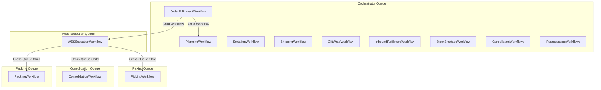

# Task Queues

Reference for all Temporal task queues used in the WMS Platform.

## Task Queue Overview

Task queues enable workflow and activity distribution to specific workers. The WMS Platform uses multiple task queues to:
- Route work to specialized services
- Enable horizontal scaling of specific operations
- Isolate workloads by domain

## Task Queue Reference

| Task Queue | Service | Purpose |
|------------|---------|---------|
| `orchestrator` | Orchestrator | Main orchestration workflows |
| `wes-execution-queue` | WES Service | Warehouse execution workflows |
| `picking-queue` | Picking Service | Picking operations |
| `consolidation-queue` | Consolidation Service | Consolidation operations |
| `packing-queue` | Packing Service | Packing operations |
| `shipping-queue` | Shipping Service | Shipping operations |

---

## Queue Topology



---

## Orchestrator Queue

**Queue Name:** `orchestrator`

**Workflows:**
- OrderFulfillmentWorkflow
- PlanningWorkflow
- SortationWorkflow
- ShippingWorkflow (orchestrator version)
- GiftWrapWorkflow
- InboundFulfillmentWorkflow
- StockShortageWorkflow
- BackorderFulfillmentWorkflow
- OrderCancellationWorkflow
- OrderCancellationWorkflowWithAllocations
- ReprocessingBatchWorkflow
- ReprocessingOrchestrationWorkflow

**Activities:**
- All orchestrator activities (OrderActivities, InventoryActivities, etc.)

**Worker Configuration:**
```go
worker.Options{
    TaskQueue:                "orchestrator",
    MaxConcurrentActivityTaskPollers: 10,
    MaxConcurrentWorkflowTaskPollers: 5,
}
```

---

## WES Execution Queue

**Queue Name:** `wes-execution-queue`

**Workflows:**
- WESExecutionWorkflow

**Characteristics:**
- Executes warehouse execution logic
- Coordinates cross-queue child workflows
- Long-running (up to 4 hours)

**Child Workflow Routing:**
```go
// WES routes to different queues
const (
    PickingTaskQueue       = "orchestrator-queue"
    ConsolidationTaskQueue = "consolidation-queue"
    PackingTaskQueue       = "packing-queue"
)
```

---

## Picking Queue

**Queue Name:** `picking-queue`

**Workflows:**
- PickingWorkflow (service-level)

**Characteristics:**
- Signal-based worker coordination
- Real-time item tracking
- Exception handling

---

## Consolidation Queue

**Queue Name:** `consolidation-queue`

**Workflows:**
- ConsolidationWorkflow (service-level)

**Characteristics:**
- Multi-tote coordination
- Put-wall operations
- Signal-based progress

---

## Packing Queue

**Queue Name:** `packing-queue`

**Workflows:**
- PackingWorkflow (service-level)

**Characteristics:**
- Signal-based packer assignment
- Material selection
- Label generation

---

## Shipping Queue

**Queue Name:** `shipping-queue`

**Workflows:**
- ShippingWorkflow (service-level)

**Characteristics:**
- SLAM process execution
- Carrier manifest integration
- Ship confirmation signals

---

## Cross-Queue Child Workflows

When executing child workflows on a different queue:

```go
childWorkflowOptions := workflow.ChildWorkflowOptions{
    TaskQueue: "picking-queue",  // Route to picking service
    RetryPolicy: &temporal.RetryPolicy{
        MaximumAttempts: 3,
    },
}
childCtx := workflow.WithChildOptions(ctx, childWorkflowOptions)

err := workflow.ExecuteChildWorkflow(childCtx, "PickingWorkflow", input).Get(ctx, &result)
```

---

## Activity Routing

Activities can be routed to specific queues:

```go
ao := workflow.ActivityOptions{
    TaskQueue:           "specialized-queue",  // Route to specific worker
    StartToCloseTimeout: 10 * time.Minute,
}
ctx = workflow.WithActivityOptions(ctx, ao)
```

---

## Scaling Considerations

| Queue | Typical Load | Scaling Strategy |
|-------|--------------|------------------|
| `orchestrator` | High | Horizontal (multiple workers) |
| `wes-execution-queue` | Medium | Horizontal |
| `picking-queue` | High | Per-zone workers |
| `consolidation-queue` | Medium | Per-station workers |
| `packing-queue` | High | Per-station workers |
| `shipping-queue` | Medium | Horizontal |

---

## Worker Registration

```go
// Orchestrator worker
w := worker.New(client, "orchestrator", worker.Options{})
w.RegisterWorkflow(OrderFulfillmentWorkflow)
w.RegisterWorkflow(PlanningWorkflow)
// ... register activities
w.Start()

// Picking service worker
w := worker.New(client, "picking-queue", worker.Options{})
w.RegisterWorkflow(PickingWorkflow)
// ... register activities
w.Start()
```

---

## Monitoring

Monitor queue metrics via Temporal UI or Prometheus:

| Metric | Description |
|--------|-------------|
| `temporal_workflow_task_schedule_to_start_latency` | Queue wait time |
| `temporal_activity_task_schedule_to_start_latency` | Activity queue wait |
| `temporal_worker_task_slots_available` | Available worker capacity |

## Related Documentation

- [WES Service Workflow](./workflows/service-wes) - Cross-queue execution
- [Retry Policies](./retry-policies) - Retry configuration
- [Overview](./overview) - Architecture overview
