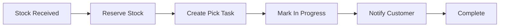
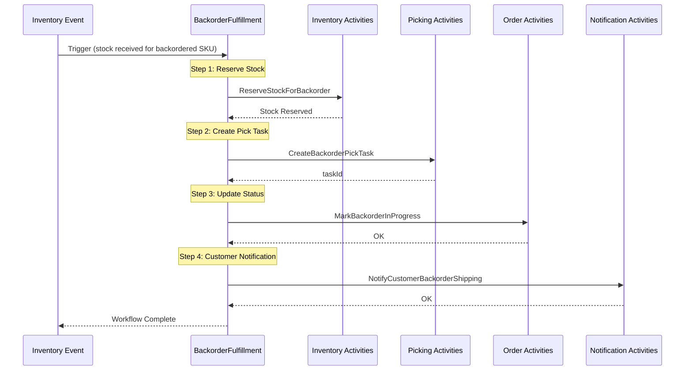
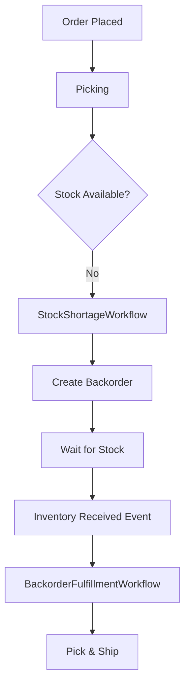

# BackorderFulfillmentWorkflow

Handles automatic fulfillment of backorders when stock becomes available. This workflow is triggered by inventory receiving events for backordered SKUs.

## Overview

The Backorder Fulfillment Workflow automates the process of fulfilling previously backordered items when new stock arrives:

1. Reserves incoming stock for the backorder
2. Creates a pick task linked to the original order
3. Updates backorder status to in-progress
4. Notifies the customer that their backorder is being shipped

## Configuration

| Property | Value |
|----------|-------|
| Task Queue | `orchestrator` |
| Execution Timeout | 10 minutes |
| Activity Timeout | 10 minutes |
| Retry Policy | 3 maximum attempts, exponential backoff |

## Input

```go
// Input is a map with the following fields:
map[string]interface{}{
    "backorderId":     string, // Backorder identifier
    "originalOrderId": string, // Original order that created the backorder
    "customerId":      string, // Customer to notify
}
```

## Workflow Steps

### Flow Diagram



### Detailed Sequence



## Activities Used

| Activity | Purpose | Error Handling |
|----------|---------|----------------|
| `ReserveStockForBackorder` | Reserves incoming stock for the backorder items | Fatal - workflow fails if reservation fails |
| `CreateBackorderPickTask` | Creates a new pick task linked to original order | Fatal - workflow fails if task creation fails |
| `MarkBackorderInProgress` | Updates backorder status to in_progress | Non-fatal - logged as warning |
| `NotifyCustomerBackorderShipping` | Sends notification to customer | Non-fatal - logged as warning |

## Error Handling

### Fatal Errors

These errors cause the workflow to fail and require manual intervention:

| Step | Error | Resolution |
|------|-------|------------|
| Reserve Stock | Insufficient stock | Check inventory levels, may need manual allocation |
| Create Pick Task | Task creation failed | Check picking service, retry workflow |

### Non-Fatal Errors

These errors are logged but don't stop the workflow:

| Step | Error | Impact |
|------|-------|--------|
| Mark In Progress | Status update failed | Backorder status may be out of sync |
| Notify Customer | Notification failed | Customer won't receive automated notification |

## Related Workflows

This workflow is typically triggered as part of the stock shortage handling flow:



## Usage Example

```go
// Typically triggered automatically by inventory events, but can be started manually:
options := client.StartWorkflowOptions{
    ID:        fmt.Sprintf("backorder-fulfillment-%s", backorderID),
    TaskQueue: "orchestrator",
}

input := map[string]interface{}{
    "backorderId":     "BO-12345",
    "originalOrderId": "ORD-67890",
    "customerId":      "CUST-001",
}

we, err := client.ExecuteWorkflow(ctx, options, workflows.BackorderFulfillmentWorkflow, input)
if err != nil {
    // Handle error
}

// Wait for completion
err = we.Get(ctx, nil)
```

## Integration Points

### Triggering Events

The workflow is triggered by:
- `InventoryReceivedEvent` when received SKUs match backordered items
- Manual trigger from supervisor dashboard for priority fulfillment

### Downstream Effects

When this workflow completes:
- New pick task appears in picker's queue
- Backorder status changes to `in_progress`
- Customer receives shipping notification email/SMS
- Original order status may update to `partially_shipped` or `shipping`

## Related Documentation

- [Stock Shortage Workflow](./stock-shortage) - Creates backorders
- [Picking Workflow](./picking) - Processes the pick task
- [Order Fulfillment Workflow](./order-fulfillment) - Main order flow
- [Inventory Activities](../activities/inventory-activities) - Stock operations
