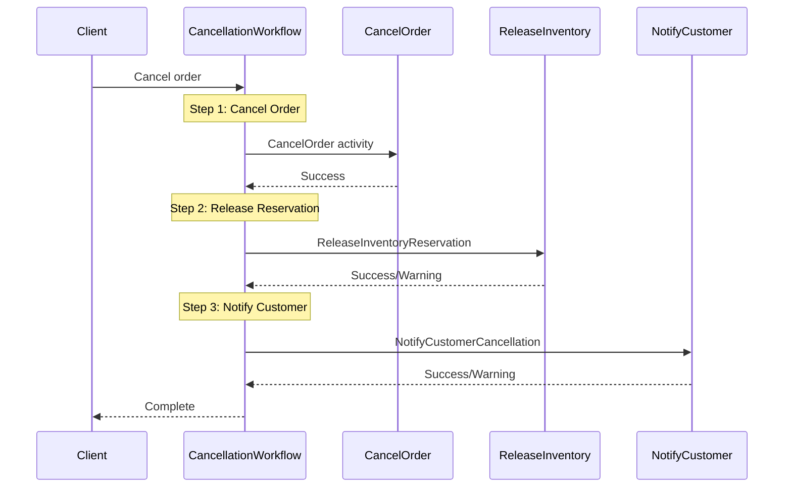
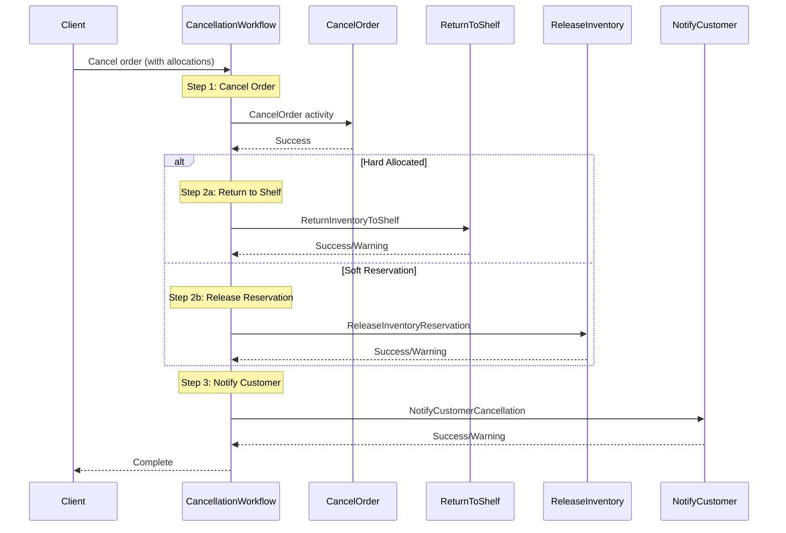
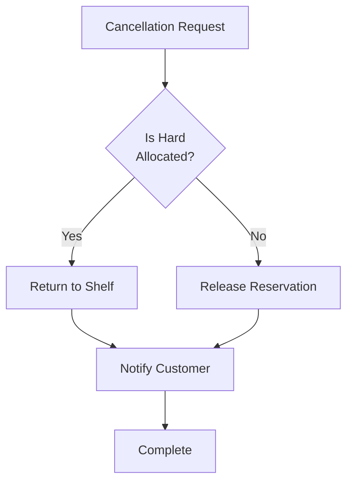

# Cancellation Workflows

Workflows for handling order cancellation with proper inventory compensation.

## Overview

Two cancellation workflows handle different inventory states:
- **OrderCancellationWorkflow**: For orders with soft reservations only
- **OrderCancellationWorkflowWithAllocations**: For orders with hard allocations (staged inventory)

## OrderCancellationWorkflow

Handles cancellation of orders that have soft inventory reservations but haven't been staged.

### Input

```go
// Simple input: orderID and reason
func OrderCancellationWorkflow(ctx workflow.Context, orderID string, reason string) error
```

### Workflow Steps



### Activities Used

| Activity | Purpose | On Failure |
|----------|---------|------------|
| `CancelOrder` | Updates order status to cancelled | Return error |
| `ReleaseInventoryReservation` | Releases soft reservation | Log warning, continue |
| `NotifyCustomerCancellation` | Sends cancellation notification | Log warning, continue |

---

## OrderCancellationWorkflowWithAllocations

Handles cancellation of orders where inventory has been physically staged (hard allocated).

### Input

```go
// OrderCancellationInput holds input for cancellation with allocations
type OrderCancellationInput struct {
    OrderID         string       `json:"orderId"`
    Reason          string       `json:"reason"`
    AllocationIDs   []string     `json:"allocationIds,omitempty"` // Hard allocations
    PickedItems     []PickedItem `json:"pickedItems,omitempty"`   // Items picked
    IsHardAllocated bool         `json:"isHardAllocated"`         // Inventory staged
}
```

### Workflow Steps



### Decision Logic



### Activities Used

| Activity | Purpose | On Failure |
|----------|---------|------------|
| `CancelOrder` | Updates order status | Return error |
| `ReturnInventoryToShelf` | Returns staged inventory to storage | Log warning, continue |
| `ReleaseInventoryReservation` | Releases soft reservation | Log warning, continue |
| `NotifyCustomerCancellation` | Sends notification | Log warning, continue |

## Configuration

| Property | Value |
|----------|-------|
| Task Queue | `orchestrator` |
| Activity Timeout | 5 minutes (15 min with retries) |
| Heartbeat Timeout | 30 seconds |

## Compensation Pattern

Both workflows implement **best-effort compensation**:
- Primary action (cancel order) must succeed
- Compensation actions (inventory, notification) continue on failure
- Failures are logged for manual reconciliation

## Non-Cancellable States

Orders cannot be cancelled after these states:

| State | Reason |
|-------|--------|
| `shipped` | Package handed to carrier |
| `delivered` | Customer received package |
| `packing_complete` | May require physical intervention |

## Usage Example

```go
// Simple cancellation (soft reservation only)
err := client.ExecuteWorkflow(ctx, options,
    workflows.OrderCancellationWorkflow,
    "ORD-123",
    "Customer requested")

// Cancellation with hard allocations
input := workflows.OrderCancellationInput{
    OrderID:         "ORD-456",
    Reason:          "Out of stock substitution",
    AllocationIDs:   []string{"ALLOC-001", "ALLOC-002"},
    PickedItems:     pickedItems,
    IsHardAllocated: true,
}
err := client.ExecuteWorkflow(ctx, options,
    workflows.OrderCancellationWorkflowWithAllocations,
    input)
```

## Related Documentation

- [Order Fulfillment Workflow](./order-fulfillment) - Main workflow
- [Order Activities](../activities/order-activities) - Order operations
- [Inventory Activities](../activities/inventory-activities) - Inventory compensation
