# ConsolidationWorkflow

Coordinates the consolidation of multi-item orders from multiple pick routes or totes.

## Overview

The Consolidation Workflow (also known as "Walling") handles:
1. Waiting for all totes from multi-route orders
2. Creating consolidation units
3. Physically consolidating items from different totes
4. Verifying all items are present
5. Unit-level consolidation tracking (when enabled)

## Configuration

| Property | Value |
|----------|-------|
| Task Queue | `orchestrator` |
| Execution Timeout | 4 hours |
| Activity Timeout | 15 minutes |
| Tote Arrival Timeout | 30 minutes |

## Input

```go
// ConsolidationWorkflowInput represents input for the consolidation workflow
type ConsolidationWorkflowInput struct {
    OrderID     string       `json:"orderId"`
    PickedItems []PickedItem `json:"pickedItems"`
    // Unit-level tracking fields
    UnitIDs []string `json:"unitIds,omitempty"` // Specific units to consolidate
    PathID  string   `json:"pathId,omitempty"`  // Process path ID for consistency
    // Multi-route support fields
    IsMultiRoute       bool     `json:"isMultiRoute,omitempty"`       // Flag for multi-route order
    ExpectedRouteCount int      `json:"expectedRouteCount,omitempty"` // Total routes to wait for
    ExpectedTotes      []string `json:"expectedTotes,omitempty"`      // Expected tote IDs from all routes
}
```

## Output

The workflow returns `nil` on success or an error on failure.

## Workflow Steps


## Signals

| Signal | Payload | Timeout | Purpose |
|--------|---------|---------|---------|
| `toteArrived` | `ToteArrivedSignal` | 30 minutes | Notifies workflow of tote arrival |

```go
// ToteArrivedSignal represents a tote arrival signal for multi-route orders
type ToteArrivedSignal struct {
    ToteID     string `json:"toteId"`
    RouteID    string `json:"routeId"`
    RouteIndex int    `json:"routeIndex"`
    ArrivedAt  string `json:"arrivedAt"`
}
```

## Multi-Route Tote Collection

For orders split across multiple picking routes:


### Consolidation Flow Diagram

```mermaid
flowchart TD
    START[📦 Start Consolidation] --> MULTI{Multi-Route?}

    MULTI -->|Yes| WAIT[⏳ Wait for Totes]
    MULTI -->|No| CREATE[Create Unit]

    WAIT --> SIGNAL{toteArrived<br/>Signal?}
    SIGNAL -->|Yes| TRACK[Track Tote<br/>X of Y received]
    SIGNAL -->|Timeout| PARTIAL_START[⚠️ Start with Partial]

    TRACK --> ALL{All Totes?}
    ALL -->|Yes| CREATE
    ALL -->|No| SIGNAL

    PARTIAL_START --> CREATE

    CREATE[🏷️ Create Consolidation Unit] --> ITEMS[📋 Consolidate Items]
    ITEMS --> VERIFY{Verify All<br/>Items Present?}

    VERIFY -->|Yes| COMPLETE[✅ Complete Consolidation]
    VERIFY -->|No| EXCEPTION[⚠️ Log Exception]

    EXCEPTION --> COMPLETE

    style COMPLETE fill:#c8e6c9
    style PARTIAL_START fill:#fff9c4
    style EXCEPTION fill:#fff9c4
```



### Put Wall Operation

```mermaid
flowchart LR
    subgraph Picking["Multiple Pick Routes"]
        R1[Route 1<br/>Zone A] --> T1[Tote 1]
        R2[Route 2<br/>Zone B] --> T2[Tote 2]
        R3[Route 3<br/>Zone C] --> T3[Tote 3]
    end

    subgraph PutWall["Put Wall Station"]
        T1 --> SCAN1[Scan Tote]
        T2 --> SCAN2[Scan Tote]
        T3 --> SCAN3[Scan Tote]

        SCAN1 --> WALL[🧱 Put Wall<br/>Order Slots]
        SCAN2 --> WALL
        SCAN3 --> WALL
    end

    subgraph Output["Consolidated"]
        WALL --> BIN[📦 Order Bin<br/>All Items Together]
    end
```



### Tote State Machine


### Multi-Order Consolidation Timeline


## Activities Used

| Activity | Purpose | On Failure |
|----------|---------|------------|
| `CreateConsolidationUnit` | Creates a consolidation container | Return error |
| `ConsolidateItems` | Physically moves items to consolidation container | Return error |
| `VerifyConsolidation` | Verifies all expected items are present | Return error |
| `CompleteConsolidation` | Marks consolidation as complete | Return error |
| `ConfirmUnitConsolidation` | Confirms unit-level consolidation (if tracking enabled) | Log warning, continue |

## Unit-Level Tracking

When `useUnitTracking` is enabled:

1. Each unit is confirmed individually via `ConfirmUnitConsolidation`
2. Uses consolidationID as the destination bin
3. Partial failures are logged but don't fail the workflow
4. Parent workflow handles partial failure scenarios

## Error Handling

| Scenario | Handling |
|----------|----------|
| Tote arrival timeout | Proceed with partial consolidation, log warning |
| Consolidation unit creation fails | Return error |
| Item consolidation fails | Return error |
| Verification fails | Return error |
| Unit confirmation fails | Log warning, continue with other units |

## When Consolidation is Required

| Condition | Consolidation Required |
|-----------|----------------------|
| 1-3 items, single zone | No |
| 4-20 items, single zone | Yes |
| Any item count, multi-zone | Yes |
| Multi-route order | Yes |

## Usage Example

```go
// Called from WES Execution Workflow
consolidationInput := map[string]interface{}{
    "orderId":            input.OrderID,
    "waveId":             input.WaveID,
    "pickedItems":        pickResult.PickedItems,
    "isMultiRoute":       input.IsMultiRoute,
    "expectedRouteCount": input.ExpectedRouteCount,
    "expectedTotes":      input.ExpectedTotes,
    "unitIds":            input.UnitIDs,
    "pathId":             input.PathID,
}

err := workflow.ExecuteActivity(ctx, "ConsolidationWorkflow", consolidationInput).Get(ctx, nil)
```

## Related Documentation

- [WES Execution Workflow](./wes-execution) - Parent workflow
- [Picking Workflow](./picking) - Previous step
- [Packing Workflow](./packing) - Next step
- [Consolidation Activities](../activities/consolidation-activities) - Activity details
