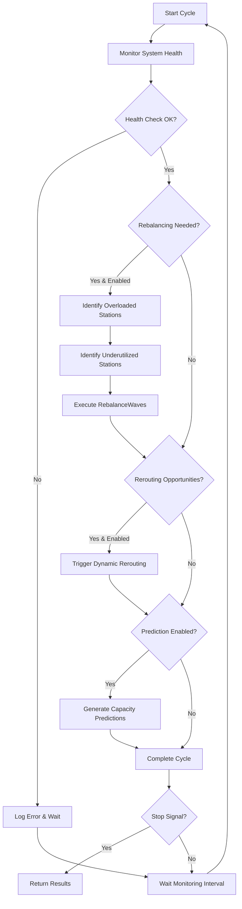
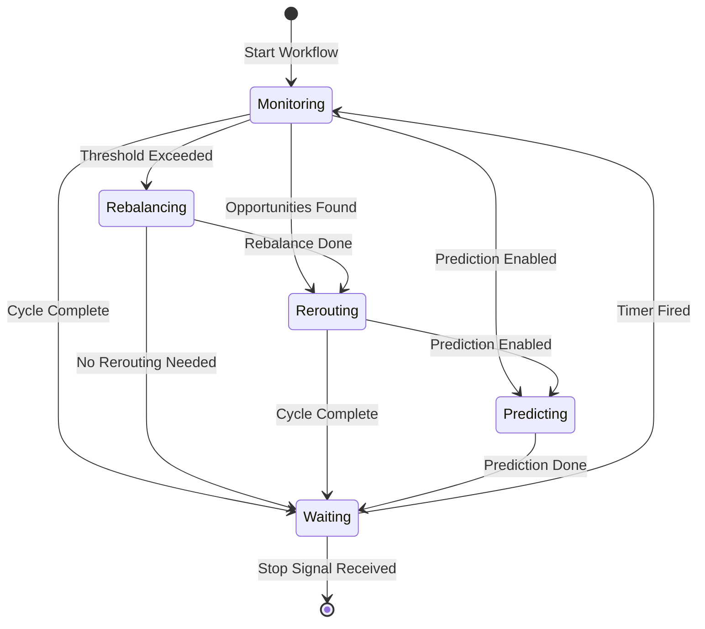

# ContinuousOptimizationWorkflow

A long-running workflow that continuously monitors and optimizes warehouse operations through automated health checks, rebalancing, and dynamic rerouting.

## Overview

The Continuous Optimization Workflow is a background process that:
1. Monitors system health at configurable intervals
2. Triggers automatic wave rebalancing when capacity thresholds are exceeded
3. Initiates dynamic rerouting for load balancing
4. Generates capacity predictions for proactive adjustments

This workflow runs indefinitely until explicitly stopped via the `stop-optimization` signal.

## Configuration

| Property | Value |
|----------|-------|
| Task Queue | `orchestrator` |
| Execution Timeout | Indefinite (until stopped) |
| Activity Timeout | 2 minutes |
| Retry Policy | 3 maximum attempts |

### Default Thresholds

| Threshold | Default Value | Description |
|-----------|---------------|-------------|
| Monitoring Interval | 5 minutes | Time between health checks |
| Capacity Threshold | 85% | Utilization level that triggers rebalancing |
| Underutilization Threshold | 30% | Level considered underutilized |
| Max Orders Per Rebalance | 50 | Maximum orders moved per cycle |

## Input

```go
type ContinuousOptimizationWorkflowInput struct {
    FacilityID                string  `json:"facilityId"`                // Required: Facility to optimize
    Zone                      string  `json:"zone,omitempty"`            // Optional: Specific zone to monitor
    MonitoringInterval        string  `json:"monitoringInterval"`        // e.g., "5m", "10m"
    CapacityThreshold         float64 `json:"capacityThreshold"`         // Trigger rebalancing above this %
    UnderutilizationThreshold float64 `json:"underutilizationThreshold"` // Consider underutilized below this %
    MaxOrdersPerRebalance     int     `json:"maxOrdersPerRebalance"`     // Max orders to move per cycle
    EnableAutoRebalancing     bool    `json:"enableAutoRebalancing"`     // Auto-trigger rebalancing
    EnableAutoRerouting       bool    `json:"enableAutoRerouting"`       // Auto-trigger rerouting
    EnableCapacityPrediction  bool    `json:"enableCapacityPrediction"`  // Generate capacity predictions
}
```

## Output

```go
type ContinuousOptimizationWorkflowResult struct {
    TotalCyclesRun         int       `json:"totalCyclesRun"`
    TotalRebalancingEvents int       `json:"totalRebalancingEvents"`
    TotalReroutingEvents   int       `json:"totalReroutingEvents"`
    TotalOrdersRebalanced  int       `json:"totalOrdersRebalanced"`
    TotalOrdersRerouted    int       `json:"totalOrdersRerouted"`
    AverageSystemHealth    string    `json:"averageSystemHealth"`
    StartTime              time.Time `json:"startTime"`
    LastCycleTime          time.Time `json:"lastCycleTime"`
}
```

## Workflow Steps

### Optimization Cycle Flow



### State Machine



## Signals

| Signal | Purpose |
|--------|---------|
| `stop-optimization` | Gracefully stops the optimization workflow |

### Stopping the Workflow

```go
// Send stop signal to gracefully terminate
signalErr := client.SignalWorkflow(ctx, workflowID, runID, "stop-optimization", "stop")
```

## Activities Used

| Activity | Purpose |
|----------|---------|
| `MonitorSystemHealth` | Monitors facility health metrics including station utilization |
| `RebalanceWaves` | Moves orders from overloaded to underutilized stations |
| `TriggerDynamicRerouting` | Reroutes orders from congested stations |
| `PredictCapacityNeeds` | Generates capacity predictions based on historical data |

## Error Handling

The workflow is designed to be resilient:

- **Health Monitoring Failures**: Logged and skipped, continues to next cycle
- **Rebalancing Failures**: Logged, does not block rerouting or prediction
- **Rerouting Failures**: Logged, does not block prediction
- **Prediction Failures**: Logged, cycle continues

The workflow only terminates on explicit stop signal, not on activity failures.

## Usage Example

```go
// Start continuous optimization
options := client.StartWorkflowOptions{
    ID:        fmt.Sprintf("continuous-optimization-%s", facilityID),
    TaskQueue: "orchestrator",
}

input := workflows.ContinuousOptimizationWorkflowInput{
    FacilityID:                "FAC-001",
    MonitoringInterval:        "5m",
    CapacityThreshold:         0.85,
    UnderutilizationThreshold: 0.30,
    MaxOrdersPerRebalance:     50,
    EnableAutoRebalancing:     true,
    EnableAutoRerouting:       true,
    EnableCapacityPrediction:  true,
}

we, err := client.ExecuteWorkflow(ctx, options, workflows.ContinuousOptimizationWorkflow, input)

// Later, to stop:
client.SignalWorkflow(ctx, we.GetID(), we.GetRunID(), "stop-optimization", "stop")

// Get final results
var result workflows.ContinuousOptimizationWorkflowResult
err = we.Get(ctx, &result)
```

## Monitoring

### Key Metrics to Track

- `totalCyclesRun`: Number of monitoring cycles completed
- `totalRebalancingEvents`: How often rebalancing was triggered
- `totalOrdersRebalanced`: Total orders moved between stations
- `totalReroutingEvents`: How often rerouting was triggered
- `averageSystemHealth`: Overall health indicator

### Alerts to Configure

1. **High Rebalancing Frequency**: More than 10 rebalancing events per hour
2. **Prediction Warnings**: Bottleneck predictions detected
3. **Health Degradation**: System health below "good" for extended periods

## Related Documentation

- [Continuous Optimization Activities](../activities/continuous-optimization-activities) - Activity implementations
- [Routing Optimizer Activities](../activities/routing-optimizer-activities) - Rerouting operations
- [Architecture - Data Flow](/architecture/system-diagrams/data-flow) - System-wide data flow
