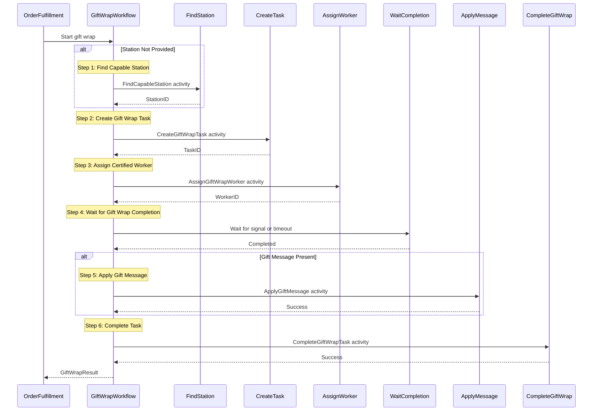
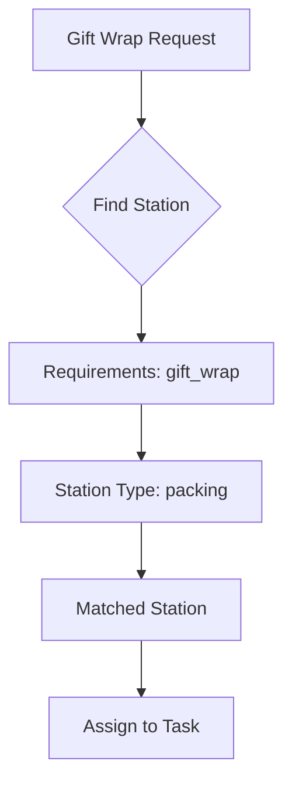
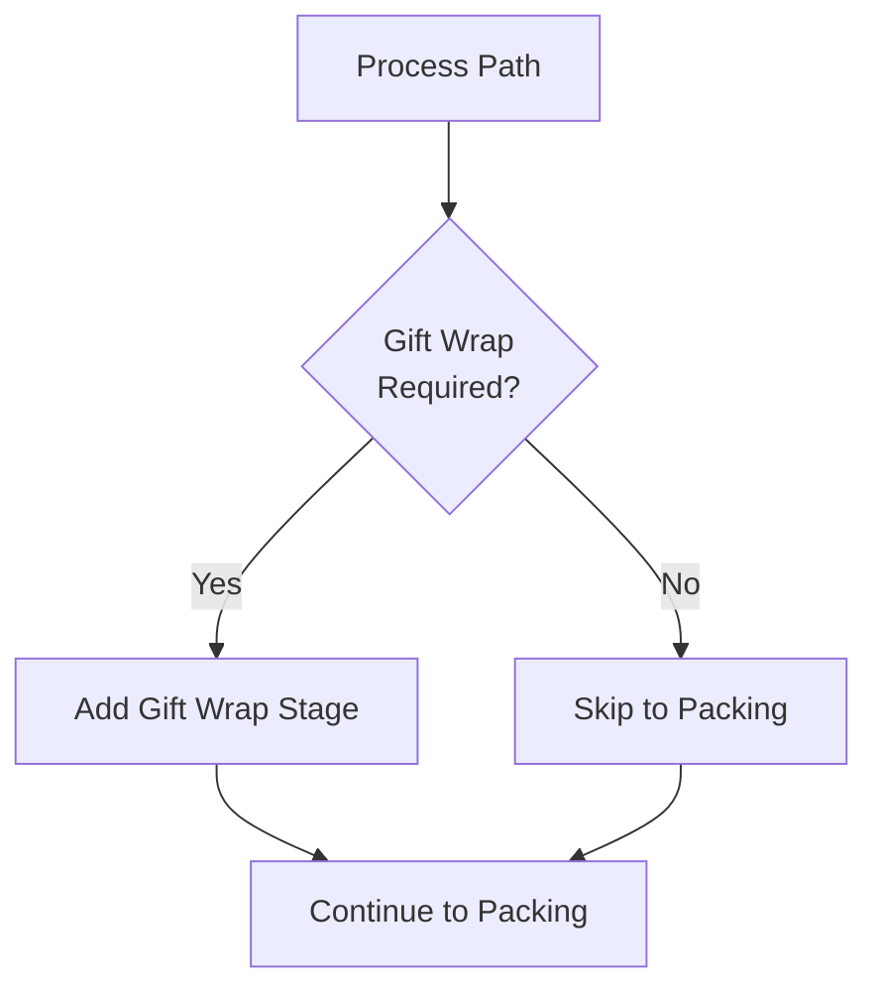

# GiftWrapWorkflow

Coordinates gift wrap processing for orders that require special packaging and gift messaging.

## Overview

The Gift Wrap Workflow handles:
1. Finding gift wrap capable stations
2. Creating and assigning gift wrap tasks
3. Waiting for physical gift wrap application
4. Applying gift messages
5. Completing the gift wrap process

## Configuration

| Property | Value |
|----------|-------|
| Task Queue | `orchestrator` |
| Execution Timeout | 4 hours |
| Activity Timeout | 30 minutes |
| Gift Wrap Timeout | 20 minutes |

## Input

```go
// GiftWrapInput represents input for the gift wrap workflow
type GiftWrapInput struct {
    OrderID     string           `json:"orderId"`
    WaveID      string           `json:"waveId"`
    Items       []GiftWrapItem   `json:"items"`
    WrapDetails GiftWrapDetails  `json:"wrapDetails"`
    StationID   string           `json:"stationId,omitempty"`
}

// GiftWrapItem represents an item to be gift wrapped
type GiftWrapItem struct {
    SKU      string `json:"sku"`
    Quantity int    `json:"quantity"`
}

// GiftWrapDetails contains gift wrap configuration
type GiftWrapDetails struct {
    WrapType    string `json:"wrapType"`    // standard, premium, eco
    GiftMessage string `json:"giftMessage"` // Optional message
    HidePrice   bool   `json:"hidePrice"`   // Hide pricing from recipient
}
```

## Output

```go
// GiftWrapResult represents the result of gift wrap processing
type GiftWrapResult struct {
    TaskID      string    `json:"taskId"`
    OrderID     string    `json:"orderId"`
    StationID   string    `json:"stationId"`
    WorkerID    string    `json:"workerId"`
    CompletedAt time.Time `json:"completedAt"`
    Success     bool      `json:"success"`
}
```

## Workflow Steps



## Signals

| Signal | Payload | Timeout | Purpose |
|--------|---------|---------|---------|
| `gift-wrap-completed` | `GiftWrapCompletedSignal` | 20 minutes | Notifies workflow of gift wrap completion |

```go
// GiftWrapCompletedSignal represents completion notification
type GiftWrapCompletedSignal struct {
    TaskID      string `json:"taskId"`
    WorkerID    string `json:"workerId"`
    CompletedAt string `json:"completedAt"`
}
```

## Activities Used

| Activity | Purpose | On Failure |
|----------|---------|------------|
| `FindCapableStation` | Finds station with gift wrap capability | Return error |
| `CreateGiftWrapTask` | Creates a gift wrap task | Return error |
| `AssignGiftWrapWorker` | Assigns certified gift wrap worker | Return error |
| `CheckGiftWrapStatus` | Polls task status if signal not received | Return error |
| `ApplyGiftMessage` | Attaches gift message to package | Log warning, continue |
| `CompleteGiftWrapTask` | Marks task as complete | Return error |

## Gift Wrap Types

| Type | Description |
|------|-------------|
| `standard` | Basic gift wrapping paper |
| `premium` | Premium wrapping with ribbon/bow |
| `eco` | Eco-friendly recyclable materials |

## Station Capability Matching



## Worker Certification

Gift wrap workers require certification:

```go
// FindCapableStation input
{
    "requirements": ["gift_wrap"],
    "stationType": "packing"
}
```

Workers assigned via `AssignGiftWrapWorker` are verified to have gift wrap certification.

## Timeout Handling

If the `gift-wrap-completed` signal is not received within 20 minutes:

1. Workflow polls task status via `CheckGiftWrapStatus`
2. If complete, continues to next step
3. If incomplete, returns timeout error

## Error Handling

| Scenario | Handling |
|----------|----------|
| Station not found | Return error |
| Task creation fails | Return error |
| Worker assignment fails | Return error |
| Gift wrap timeout | Poll status, then timeout error if incomplete |
| Gift message fails | Log warning, continue (non-fatal) |
| Task completion fails | Return error |

## Usage Example

```go
// Called from OrderFulfillmentWorkflow when order has gift wrap
giftWrapInput := map[string]interface{}{
    "orderId": input.OrderID,
    "waveId":  input.WaveID,
    "items":   giftWrapItems,
    "wrapDetails": map[string]interface{}{
        "wrapType":    "premium",
        "giftMessage": "Happy Birthday!",
        "hidePrice":   true,
    },
}

var giftWrapResult GiftWrapResult
err := workflow.ExecuteActivity(ctx, "GiftWrapWorkflow", giftWrapInput).Get(ctx, &giftWrapResult)
```

## Process Path Integration

Gift wrap is determined during planning:



## Related Documentation

- [Order Fulfillment Workflow](./order-fulfillment) - Parent workflow
- [Planning Workflow](./planning) - Determines gift wrap requirement
- [Packing Workflow](./packing) - Following step after gift wrap
